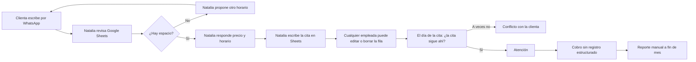
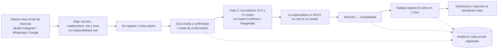

# NaturalSpa Manager — Documento de Diseño de Solución

> **Cliente:** NaturalSpa · **Propietaria:** Natalia · **Ubicación:** Santa Cruz de la Sierra, Bolivia
> **Versión del documento:** 1.0 · **Fecha:** 2026-09-22 · **Estado:** Propuesta para validación con cliente
> **Zona horaria del negocio:** `America/La_Paz` (UTC−4, sin horario de verano) · **Moneda:** Bolivianos (Bs / BOB)

---

## 1. Resumen ejecutivo

### 1.1 Contexto

NaturalSpa es un centro de estética y spa con 4 años de operación y 6 personas en el equipo. Atiende **~135 citas por semana (~580 al mes)**. Toda la operación funciona con **Google Sheets compartido + WhatsApp**. El modelo funcionó para arrancar, pero hoy genera cinco riesgos:

1. **Operativo:** citas que "desaparecen" sin rastro de quién las cambió.
2. **Comercial:** la base de clientes está expuesta a todo el personal, así que cualquiera puede llevársela.
3. **Clima laboral:** todas ven la agenda de todas, lo que genera comparaciones y conflictos.
4. **Ingresos:** entre el 10 % y el 20 % de las citas no se presentan (no-show) y no hay mecanismos para evitarlo.
5. **Dependencia de la dueña:** Natalia contesta disponibilidad y precios por WhatsApp incluso de noche y arma los reportes a mano.

### 1.2 Solución propuesta

**NaturalSpa Manager** es una plataforma web SaaS, *mobile-first*, que reemplaza por completo Google Sheets e integra:

| Pilar | Qué resuelve |
|---|---|
| **Agenda inteligente** | Agenda por colaboradora (día/semana/mes), motor de disponibilidad que evita doble reserva a nivel de base de datos. |
| **Reservas online 24/7** | Página pública de reservas: la clienta ve horarios reales, reserva y recibe confirmación sin intervención de Natalia. |
| **Privacidad por diseño** | Control de acceso por rol **y por alcance** (cada empleada ve solo lo suyo). Datos de contacto enmascarados. Sin exportaciones para empleadas. |
| **Auditoría inmutable** | Cada creación, cambio, cancelación o eliminación queda registrada con usuario, fecha, hora, módulo, valor anterior y valor nuevo. Nada se borra físicamente. |
| **Dashboard ejecutivo** | Ventas, ocupación, cancelaciones, no-show, reservas online y rendimiento por colaboradora, en tiempo real y sin trabajo manual. |
| **Base para crecer** | Arquitectura preparada para recordatorios automáticos, anticipos, pagos QR, WhatsApp, multisede y un futuro modelo SaaS multi-empresa. |

### 1.3 Decisiones clave

| Decisión | Elección | Motivo |
|---|---|---|
| Arquitectura | **Monolito modular** (API) + **SPA/SSR** (web) | Máxima velocidad de desarrollo, bajo costo operativo, módulos listos para extraerse si el negocio escala. |
| Frontend | Next.js + TypeScript + Tailwind + shadcn/ui | Ecosistema maduro, SSR para la página pública de reservas (SEO), PWA para móvil. |
| Backend | NestJS + TypeScript + Prisma | Estructura modular, guards de permisos, interceptores de auditoría nativos. |
| Base de datos | PostgreSQL | Transacciones, `EXCLUDE constraints` anti-solapamiento, JSONB para auditoría, RLS opcional. |
| Colas / caché | Redis + BullMQ | Recordatorios, bloqueo temporal de horarios, rate limiting. |
| Móvil | **PWA** (instalable) en MVP | Un solo código, sin tiendas de apps; nativa solo si la adopción lo justifica. |
| Multi-sede / SaaS | `organization_id` + `branch_id` **desde el día 1** | Cuesta casi nada hoy y es muy caro de agregar después. |

### 1.4 Alcance y tiempos

| Fase | Contenido | Duración estimada |
|---|---|---|
| **Fase 1 — MVP** | Login y seguridad, dashboard, usuarios, clientes, servicios, paquetes, agenda, horarios, reservas online, cobros básicos, reportes, auditoría. | **12 semanas** (6 sprints de 2 semanas + sprint 0) |
| **Fase 2 — Retención** | Portal cliente completo, recordatorios y confirmaciones automáticas (email + WhatsApp plantilla), lista de espera. | 6–8 semanas |
| **Fase 3 — Monetización y escala** | Pagos online (QR), anticipos, dashboard avanzado, multisede, WhatsApp bidireccional, facturación electrónica. | 10–14 semanas |

### 1.5 Impacto esperado a 6 meses del go-live

- **0 citas perdidas sin trazabilidad**: toda cita tiene historial completo.
- **No-show < 8 %**, desde 10–20 % (con recordatorios de la Fase 2).
- **≥ 40 % de reservas online** y menos del 30 % de las consultas por WhatsApp fuera de horario.
- **Reportes en < 1 minuto**, contra horas de trabajo manual.
- **Acceso a datos de contacto limitado a administración**, con registro de cada consulta.

---

## 2. Análisis de negocio

### 2.1 Perfil de la empresa

| Atributo | Valor |
|---|---|
| Rubro | Estética y spa (bienestar corporal, facial, uñas) |
| Antigüedad | 4 años |
| Sedes | 1 (Santa Cruz de la Sierra) |
| Horario | Martes a sábado, 09:00–19:00 (domingo y lunes cerrado) |
| Personal | 6 (1 administración/atención + 5 especialistas) |
| Canal de venta principal | WhatsApp |
| Herramientas actuales | Google Sheets (agenda y clientes), WhatsApp |

### 2.2 Equipo y especialidades

| Persona | Rol operativo | Servicios que realiza (a validar) | Rol en el sistema |
|---|---|---|---|
| Natalia | Propietaria, administración, recepción | — (eventualmente cualquiera) | ADMINISTRADOR |
| Andrea | Masajista | Masaje relajante, descontracturante, drenaje linfático* | EMPLEADA |
| Lucía | Masajista | Masaje relajante, descontracturante, drenaje linfático* | EMPLEADA |
| Katherine | Cosmetóloga | Limpieza facial, depilación | EMPLEADA |
| Especialista uñas 1 | Manicurista | Manicure, pedicure | EMPLEADA |
| Especialista uñas 2 | Manicurista | Manicure, pedicure | EMPLEADA |

\* *Supuesto: el drenaje linfático lo realizan las masajistas. El sistema lo modela con la tabla `staff_services` (qué colaboradora puede hacer qué servicio), así que corregirlo es solo configuración.*

### 2.3 Catálogo de servicios actual

| Categoría | Servicio | Duración típica (a validar) |
|---|---|---|
| Masajes | Masaje relajante | 60 min |
| Masajes | Masaje descontracturante | 60 min |
| Corporal | Drenaje linfático | 60 min |
| Facial | Limpieza facial | 60–75 min |
| Depilación | Depilación (por zona) | 15–45 min |
| Uñas | Manicure | 45 min |
| Uñas | Pedicure | 60 min |
| Paquetes | Día de Novia | 3–5 h (múltiples servicios y colaboradoras) |
| Paquetes | Combos (ej. mani + pedi) | Variable |

### 2.4 Volumen y capacidad

**Demanda actual:**

| Periodo | Citas |
|---|---|
| Martes–viernes | 20–25 / día → 80–100 / semana |
| Sábado | 35 |
| **Semana** | **115–135** |
| **Mes (≈4,3 semanas)** | **≈ 500–580** |
| **Año** | **≈ 6.000–7.000** |

**Capacidad teórica:**

- 10 h/día × 5 días = **50 h/semana por especialista**.
- 5 especialistas → **250 h-especialista/semana** (≈ 15.000 min).
- Con una duración media estimada de 55 min por cita y ~135 citas por semana, se usan ≈ **124 h**, es decir **≈ 50 % de ocupación promedio**. El sábado probablemente se acerca al 80–90 %.

**Lectura de negocio:** hay **capacidad ociosa entre semana** y **saturación el sábado**. El dashboard de ocupación va a medir esto con datos reales, y sirve de base para promociones de martes a jueves (Fase 3).

**Volumen técnico:** ~7.000 citas al año es una carga **muy baja** para cualquier base de datos moderna. El desafío del proyecto no es el volumen: es la **correctitud** (sin dobles reservas), la **privacidad** y la **trazabilidad**.

### 2.5 Impacto económico del no-show (estimación)

> ⚠️ **Supuesto:** ticket promedio de **Bs 150**. Hay que reemplazarlo con el dato real de Natalia.

| Escenario | Citas perdidas/mes | Ingreso perdido/mes | Ingreso perdido/año |
|---|---|---|---|
| No-show 10 % | ≈ 58 | ≈ Bs 8.700 | ≈ Bs 104.400 |
| No-show 20 % | ≈ 116 | ≈ Bs 17.400 | ≈ Bs 208.800 |
| **Meta 7 %** | ≈ 41 | ≈ Bs 6.150 | ≈ Bs 73.800 |

Bajar el no-show del 15 % (punto medio) al 7 % recupera aproximadamente **Bs 7.000 al mes** con el mismo supuesto. Esto justifica priorizar recordatorios automáticos y anticipos.

### 2.6 Stakeholders

| Stakeholder | Interés | Influencia | Necesidad principal |
|---|---|---|---|
| Natalia (dueña) | Muy alto | Muy alta | Control total, trazabilidad, reportes, dejar de responder WhatsApp de noche |
| Especialistas | Alto | Media | Ver su agenda del día desde el celular, privacidad frente a compañeras |
| Clientas | Alto | Media | Reservar fácil a cualquier hora, recordatorios, reagendar sin llamar |
| Equipo de desarrollo (Datly) | Alto | Alta | Requerimientos claros, producto reutilizable como SaaS |

### 2.7 Proceso actual (AS-IS)

**Puntos de dolor:** 1) todo pasa por Natalia; 2) Sheets no tiene permisos por fila ni historial útil; 3) no hay recordatorios; 4) el cobro no queda asociado a la cita; 5) los reportes son manuales.

### 2.8 Proceso futuro (TO-BE)

### 2.9 Modelo de valor

| Actor | Antes | Después |
|---|---|---|
| Natalia | ~2–3 h/día en WhatsApp y Sheets, reportes manuales | Solo gestiona excepciones; el dashboard muestra todo |
| Especialistas | Agenda en Sheets compartido, visible para todas | Su agenda privada en el celular |
| Clientas | Esperan respuesta por WhatsApp | Reservan en 60 segundos, 24/7 |
| Negocio | Ingresos perdidos por no-show y horas ociosas | Menos no-show y datos para llenar horas valle |

### 2.10 Supuestos y preguntas abiertas para validar con Natalia

| # | Pregunta | Por qué importa | Supuesto por defecto |
|---|---|---|---|
| Q1 | ¿Cuántas **cabinas o camillas** hay? ¿Dos masajes pueden coincidir en horario? | Si hay menos cabinas que especialistas, la cabina limita la disponibilidad. | Se modela `resources` (cabinas), pero en el MVP queda **desactivado**. |
| Q2 | ¿Hay **tiempo de preparación o limpieza** entre citas? | Afecta el cálculo de horarios libres. | 10 min configurables por servicio (`buffer_after_min`). |
| Q3 | ¿El precio varía según la especialista? | Define si el precio va en `services` o en `staff_services`. | Precio único por servicio, con override opcional por especialista. |
| Q4 | ¿Cuál es la **política de cancelación**? (horas mínimas) | Regla del portal cliente. | La clienta puede cancelar o reagendar hasta **12 h antes**. |
| Q5 | ¿Con cuánta anticipación se puede reservar online? | Evita reservas de último minuto que no se pueden atender. | Mínimo 2 h y máximo 60 días. |
| Q6 | ¿Qué **medios de pago** se usan? | Módulo de cobros. | Efectivo, QR, transferencia, tarjeta. |
| Q7 | ¿Las especialistas cobran **comisión**? | Reporte de personal (Fase 2/3). | Fuera del MVP; los datos quedan listos. |
| Q8 | ¿Se emite **factura** (SIN)? | Integración fiscal. | Fuera del MVP; se evalúa en Fase 3. |
| Q9 | ¿Qué datos del cliente debe ver la especialista? | Diseño de privacidad. | Nombre, alergias, preferencias, observaciones técnicas e historial **con ella**. **Nunca** teléfono ni email. |
| Q10 | ¿Cómo funciona hoy "Día de Novia"? (servicios, orden, especialistas) | Modelado de paquetes. | Secuencia de servicios con colaboradora asignada por servicio. |
| Q11 | ¿Las empleadas pueden crear o mover citas? | Permisos. | **No** en el MVP. Solo marcan estados de sus citas (en curso, completada, no asistió). |
| Q12 | ¿Qué feriados se cierran? | Tabla de festivos. | Feriados nacionales de Bolivia más los departamentales de Santa Cruz (24 de septiembre), cargados por Natalia. |

### 2.11 Oportunidad SaaS

El dominio del usuario de pruebas (`@datly.local`) sugiere que el proveedor tecnológico (Datly) podría **comercializar la plataforma a otros spas, salones y centros estéticos**. Por eso el diseño incluye desde el inicio:

- `organization_id` en todas las tablas de negocio (multi-tenant lógico).
- `branch_id` (sede) en agenda, horarios y citas.
- Rol **SUPER ADMIN** (proveedor) separado de **ADMINISTRADOR** (dueña del negocio).
- Configuración por organización: política de cancelación, anticipación, recordatorios, marca.

---

## 3. Problemas detectados

### 3.1 Problemas declarados por el cliente

| # | Problema | Causa raíz | Impacto | Solución en el sistema | Módulo | Indicador de éxito |
|---|---|---|---|---|---|---|
| P1 | **Pérdida de citas** | Sheets permite editar y borrar a cualquiera sin historial legible ni responsables | Clientas molestas, reputación, conflictos internos | Eliminación **lógica** (soft delete), historial de estados y **auditoría inmutable** (quién, qué, cuándo, antes/después) | Agenda, Auditoría | 0 citas sin trazabilidad; auditoría consultable en < 10 s |
| P2 | **Falta de privacidad entre empleadas** | Un único documento compartido | Comparaciones, reclamos, mal clima | RBAC con **alcance**: `appointments.read_own` vs `read_all`, aplicado en backend (no solo ocultado en pantalla) | Seguridad, Agenda | 0 accesos de una empleada a agenda ajena (verificado en tests y auditoría) |
| P3 | **Riesgo de fuga de clientes** | Todas acceden a nombre, teléfono y correo | Pérdida del activo principal del negocio | Contacto **enmascarado**; empleadas solo ven clientes de sus citas y sin contacto; sin exportación; límite de consultas; registro de accesos a datos sensibles | Clientes, Seguridad | Solo ADMIN ve contacto; 100 % de las revelaciones auditadas |
| P4 | **Reservas manuales por WhatsApp** | No hay canal de autoservicio | Natalia trabaja de noche; se pierden reservas no respondidas | **Reservas online 24/7** con disponibilidad real | Reservas online | ≥ 40 % de reservas online a los 6 meses |
| P5 | **No-show del 10–20 %** | Sin recordatorios ni compromiso previo | ≈ Bs 8.700–17.400/mes perdidos (estimado) | MVP: confirmación por email y marcado de no-show. Fase 2: recordatorios automáticos con confirmación. Fase 3: anticipos | Notificaciones, Pagos | No-show < 8 % |
| P6 | **Reportes inexistentes** | Datos dispersos y sin estructura | Decisiones a ciegas, horas de trabajo manual | Dashboard ejecutivo y reportes automáticos exportables (solo ADMIN) | Dashboard, Reportes | Reportes disponibles en tiempo real |

### 3.2 Problemas adicionales detectados en el análisis

| # | Problema | Riesgo | Recomendación |
|---|---|---|---|
| P7 | **Alergias y contraindicaciones sin registro estructurado** | Riesgo de salud (reacción a productos o aceites) y riesgo legal | Campo estructurado de alergias y contraindicaciones con **alerta visible** al abrir la cita |
| P8 | **Cobros no vinculados a la cita** | "Ventas del día" imposible de calcular; posibles descuadres de caja | Módulo mínimo de **cobros** en el MVP (necesario para los KPIs de ventas) |
| P9 | **Dependencia total de Natalia** | Si Natalia se enferma, la operación se detiene | Reservas autoservicio y opción futura de rol **RECEPCIÓN** |
| P10 | **Link de Sheets compartido sin control** | Exfiltración trivial; exempleadas pueden conservar el acceso | Usuarios individuales, desactivación inmediata al salir y sesiones revocables |
| P11 | **Sin respaldo formal de datos** | Pérdida de información | Backups automáticos diarios con restauración probada |
| P12 | **Doble reserva posible** | Dos clientas a la misma hora con la misma especialista | Restricción de **exclusión en PostgreSQL** a nivel de base de datos |
| P13 | **Sin consentimiento de datos** | Riesgo reputacional y legal | Aceptación de política de privacidad y consentimiento de comunicaciones al registrarse |

---

## 4. Objetivos

### 4.1 Objetivo general

Implementar una plataforma web segura, *mobile-first* y auditable que **reemplace por completo Google Sheets** y la gestión manual por WhatsApp en NaturalSpa. Debe centralizar agenda, clientes, servicios, personal, reservas online, cobros y reportes, con privacidad por rol y trazabilidad total de cada operación.

### 4.2 Objetivos específicos (SMART)

| # | Objetivo | Métrica | Meta | Plazo |
|---|---|---|---|---|
| O1 | Garantizar la trazabilidad de todas las citas | % de operaciones sobre citas con registro de auditoría | 100 % | Desde el go-live |
| O2 | Eliminar las dobles reservas | Solapamientos detectados | 0 | Desde el go-live |
| O3 | Aislar la información por colaboradora | Accesos indebidos (tests de seguridad y auditoría) | 0 | Desde el go-live |
| O4 | Proteger la base de clientes | Usuarios no ADMIN con acceso a contacto o exportación | 0 | Desde el go-live |
| O5 | Digitalizar las reservas | % de reservas creadas online | ≥ 25 % a 3 meses, ≥ 40 % a 6 meses | 6 meses |
| O6 | Reducir el no-show | Tasa de no-show mensual | < 12 % a 3 meses (MVP), < 8 % a 6 meses (Fase 2) | 6 meses |
| O7 | Automatizar los reportes | Tiempo para obtener el reporte mensual | < 1 min | Desde el go-live |
| O8 | Reducir la carga operativa de Natalia | Mensajes de WhatsApp sobre disponibilidad y precio | −60 % | 6 meses |
| O9 | Migrar los datos históricos | % de clientes migrados desde Sheets sin duplicados | ≥ 98 % | Antes del go-live |
| O10 | Lograr adopción del equipo | Especialistas que usan su agenda en el sistema a diario | 5/5 | 1 mes post go-live |

### 4.3 Criterios de éxito del proyecto

- El MVP está en producción en ≤ 12–13 semanas desde el kick-off.
- Google Sheets queda en **solo lectura** (archivo histórico) al finalizar la primera semana de operación.
- Natalia aprueba el UAT (pruebas de aceptación) de todos los módulos del MVP.
- No hay incidentes de seguridad ni pérdida de datos en los primeros 90 días.
