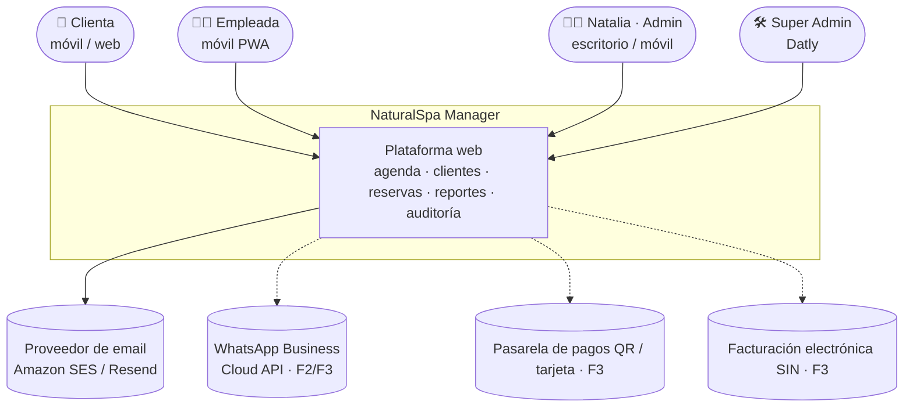
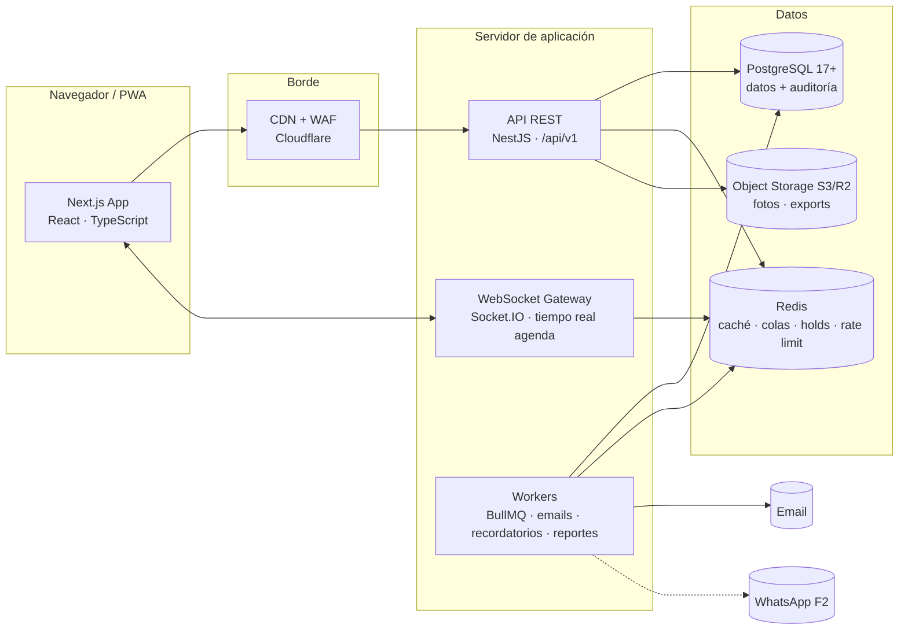
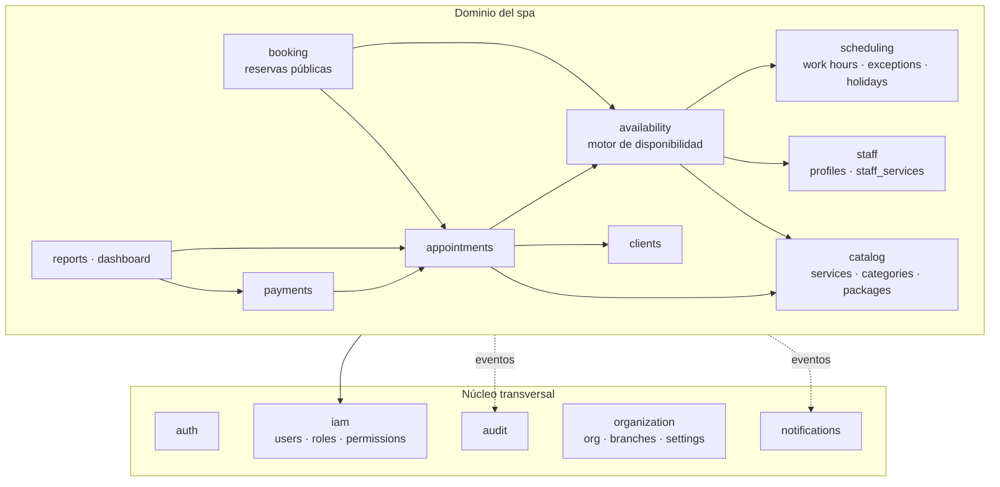
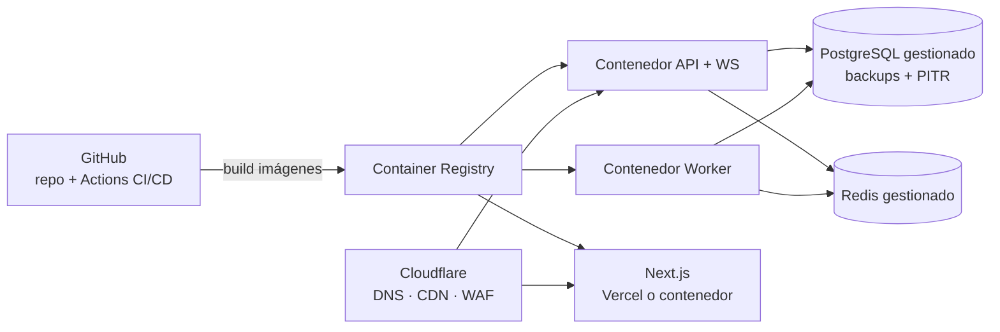

# 7–8. Arquitectura y stack tecnológico

---

## 7. Arquitectura recomendada

### 7.1 Estilo arquitectónico: monolito modular

Para una operación de ~7.000 citas al año con proyección SaaS, la mejor relación valor/complejidad la da un **monolito modular**:

- **Un solo backend desplegable** (NestJS), organizado en **módulos de dominio con límites estrictos**: cada módulo expone servicios públicos y no accede a las tablas de otro.
- **Un frontend** (Next.js) que sirve tres superficies:
  - **Backoffice** (`/app/*`): ADMIN, EMPLEADA, SUPER_ADMIN.
  - **Reservas públicas** (`/reservar/*`): SSR/SEO, sin login inicial.
  - **Portal cliente** (`/mi-cuenta/*`): reservas de la clienta.
- **PostgreSQL** como fuente única de verdad; **Redis** para caché, colas, *slot holds* y rate limiting.
- **Workers** (mismo código, otro proceso) para emails, recordatorios y reportes pesados.

**¿Por qué no microservicios?** El equipo es pequeño, el dominio es acotado y el volumen es bajo. Los microservicios multiplicarían costos (infraestructura, observabilidad, consistencia distribuida) sin beneficio. Los límites modulares permiten **extraer** un módulo (por ejemplo, Notificaciones) a un servicio independiente cuando haga falta (ver §21).

### 7.2 Diagrama de contexto (C4 — nivel 1)



### 7.3 Diagrama de contenedores (C4 — nivel 2)



### 7.4 Módulos del backend (límites de dominio)



| Módulo | Responsabilidad | Depende de |
|---|---|---|
| `auth` | Login, logout, tokens, refresh, recuperación y cambio de contraseña, bloqueo por intentos | `iam`, `audit`, `notifications` |
| `iam` | Usuarios, roles, permisos, guard de autorización, políticas de alcance | `audit` |
| `organization` | Organización, sedes, horario del negocio, configuración y políticas | — |
| `clients` | Fichas, búsqueda, enmascaramiento, consentimientos, importación, fusión | `iam` |
| `catalog` | Categorías, servicios, paquetes | — |
| `staff` | Perfil de colaboradora, servicios que realiza, color | `iam`, `catalog` |
| `scheduling` | Horarios semanales, excepciones (vacaciones, permisos, bloqueos), festivos | `staff` |
| `availability` | Cálculo de huecos libres (**puro**, sin efectos secundarios) | `scheduling`, `staff`, `catalog`, `appointments` (lectura) |
| `appointments` | Ciclo de vida de citas, validación, historial de estados | `availability`, `clients`, `catalog` |
| `booking` | Flujo público: holds, registro, confirmación, autogestión | `availability`, `appointments`, `clients` |
| `payments` | Cobros, anulaciones, cierre de caja | `appointments` |
| `reports` | KPIs, dashboard, reportes, exportaciones | Lectura de todo (vistas SQL) |
| `audit` | Registro inmutable, consulta y diff | — |
| `notifications` | Plantillas, envío por canal, programación de recordatorios | `organization` |

**Reglas de dependencia:**

1. Un módulo solo importa el **servicio público** de otro módulo, nunca su repositorio ni su tabla.
2. Las dependencias forman un grafo sin ciclos; se verifican en CI con `dependency-cruiser`.
3. La comunicación "hacia afuera" (auditoría, notificaciones, tiempo real) se hace con **eventos de dominio** (`AppointmentCreated`, `AppointmentRescheduled`, …) mediante un *event bus* interno. Para no perder eventos, se aplica el patrón **Outbox**: el evento se guarda en la misma transacción y un worker lo publica.

### 7.5 Arquitectura interna de cada módulo (capas)

```
módulo/
├── api/            ← Controllers REST, DTOs (Zod), mapeo HTTP ⇄ dominio
├── application/    ← Casos de uso (CreateAppointment, RescheduleAppointment…), orquestación, transacciones
├── domain/         ← Entidades, value objects, reglas puras (sin framework), eventos de dominio
└── infrastructure/ ← Repositorios Prisma, adaptadores externos (email, WhatsApp)
```

- La **lógica crítica** (disponibilidad, transiciones de estado, reglas de cancelación) vive en `domain/`, sin dependencias de framework, y es 100 % testeable con pruebas unitarias.
- Los **casos de uso** abren la transacción, validan permisos de alcance, invocan el dominio, persisten y emiten eventos.

### 7.6 Flujo de una petición (ejemplo: reagendar una cita)

```mermaid
sequenceDiagram
    autonumber
    participant U as Natalia (web)
    participant API as API NestJS
    participant G as AuthGuard + PermissionGuard
    participant UC as RescheduleAppointment (caso de uso)
    participant AV as AvailabilityService
    participant DB as PostgreSQL
    participant AU as AuditInterceptor
    participant WS as WebSocket
    participant Q as Cola (BullMQ)

    U->>API: PATCH /api/v1/appointments/{id}/reschedule<br/>If-Match: version=7
    API->>G: Valida JWT, permiso appointments.reschedule y alcance
    G-->>API: OK
    API->>UC: execute(cmd)
    UC->>DB: BEGIN; SELECT … FOR UPDATE (cita v7)
    UC->>AV: isSlotAvailable(staff, nuevo rango)
    AV->>DB: horarios + excepciones + citas activas
    AV-->>UC: disponible
    UC->>DB: UPDATE appointment_items …, version=8
    Note over DB: EXCLUDE constraint garantiza<br/>no solapamiento incluso en carrera
    UC->>DB: INSERT appointment_status_history + outbox_events
    UC->>DB: INSERT audit_logs (antes/después)
    UC->>DB: COMMIT
    API-->>U: 200 OK (cita v8)
    Q-->>WS: evento AppointmentRescheduled
    WS-->>U: actualiza agenda de Natalia y de la especialista
    Q-->>Q: email a la clienta con el nuevo horario
```

### 7.7 Motor de disponibilidad (diseño)

Es el corazón del sistema. Es una **función pura**:

```
disponibilidad(servicio | paquete, colaboradora | "cualquiera", fecha, sede)
  = horario_negocio(fecha)
  ∩ horario_laboral(colaboradora, fecha)
  − festivos(fecha)
  − excepciones(colaboradora, fecha)          // vacaciones, permisos, bloqueos
  − citas_activas(colaboradora, fecha)        // PENDIENTE, CONFIRMADA, EN_CURSO
  − holds_temporales(colaboradora, fecha)     // Redis, TTL 10 min
  → dividir en slots cada {intervalo} min (15 por defecto)
  → mantener solo slots donde cabe duración + buffer_after
  → aplicar reglas: anticipación mínima/máxima, hora actual
```

**Paquetes:** se resuelven como una secuencia de ítems. Para cada hora de inicio candidata se busca una asignación válida de colaboradora para cada ítem (en orden o en paralelo según el paquete). Se usa búsqueda con retroceso (*backtracking*) limitada; con 5 especialistas es trivial.

**"Cualquiera disponible":** se une la disponibilidad de todas las colaboradoras que realizan el servicio. Al confirmar, la cita se asigna a la de **menor ocupación del día** (balanceo de carga justo), con desempate aleatorio.

**Garantías de consistencia (doble reserva imposible):**

| Capa | Mecanismo |
|---|---|
| UX | Solo se muestran slots libres; *hold* de 10 min en Redis al elegir hora (`SET NX PX`). |
| Aplicación | Revalidación dentro de la transacción antes de insertar. |
| Base de datos | `EXCLUDE USING gist (staff_id WITH =, tstzrange(start_at, end_at) WITH &&) WHERE (blocks_calendar)`. Si dos peticiones compiten, **una falla** con error `23P01` → la API responde `409 SLOT_TAKEN`. |

### 7.8 Manejo de fechas y horas

- Base de datos: `timestamptz` (UTC). Horarios semanales: `time` + día de la semana (hora local).
- Todo cálculo de disponibilidad se hace en la zona horaria de la **sede** (`branches.timezone = 'America/La_Paz'`) con `date-fns-tz` o `Temporal`.
- Bolivia no tiene horario de verano, pero el código lo soporta igual (necesario para el SaaS en otros países).

### 7.9 Tiempo real

- Canal WebSocket (Socket.IO con adaptador Redis) con **salas por alcance**: `branch:{id}:admin` y `staff:{id}`.
- Una especialista **solo** se une a su sala `staff:{su_id}`. El servidor decide la sala según el token; el cliente no puede elegirla. Esto evita que se filtren eventos de otras agendas.

### 7.10 Procesos en segundo plano (BullMQ)

| Cola | Jobs | Fase |
|---|---|---|
| `email` | Confirmaciones, cambios, cancelaciones, recuperación de contraseña | F1 |
| `outbox` | Publicación de eventos de dominio | F1 |
| `holds` | Limpieza de holds expirados (respaldo del TTL) | F1 |
| `reports` | Exportaciones XLSX/PDF pesadas | F1 |
| `appointments` | Marcado automático de NO_SHOW sugerido (cita CONFIRMADA sin iniciar a los +30 min → alerta a ADMIN) | F1 |
| `reminders` | Recordatorios 24 h / 2 h (jobs diferidos) | F2 |
| `whatsapp` | Envío de plantillas y procesamiento de webhooks de estado | F2 |
| `analytics` | Refresco de vistas materializadas de KPIs | F1 |

Reintentos con *backoff* exponencial; tras 5 fallos, el job pasa a la *dead-letter queue* y se genera una alerta.

### 7.11 Entornos y despliegue

| Entorno | Propósito | Datos |
|---|---|---|
| `local` | Desarrollo (Docker Compose: Postgres, Redis, Mailpit, MinIO) | Seed de prueba |
| `staging` | QA y UAT con Natalia | Datos anonimizados |
| `production` | Operación | Reales |

**Infraestructura recomendada (MVP):**



- **Región:** la más cercana a Bolivia con servicios gestionados; por ejemplo **AWS sa-east-1 (São Paulo)**, con latencia típica de 40–70 ms desde Santa Cruz. Alternativas con menor costo: Railway o Render (con Postgres gestionado) o un VPS con Docker y Postgres gestionado.
- **Costo estimado del MVP:** USD 40–120/mes según proveedor (Postgres gestionado pequeño, Redis pequeño, 2 contenedores, email transaccional con capa gratuita).

**CI/CD (GitHub Actions):**

1. PR → lint + typecheck + tests unitarios + tests de integración (Postgres en contenedor) + SCA de dependencias.
2. Merge a `main` → build → despliegue automático a **staging** → E2E con Playwright.
3. Tag `vX.Y.Z` → aprobación manual → **producción** (migraciones primero, compatibles hacia atrás).

---

## 8. Stack tecnológico recomendado

### 8.1 Resumen

| Capa | Tecnología | Justificación | Alternativa |
|---|---|---|---|
| Lenguaje | **TypeScript** (end-to-end) | Un solo lenguaje, tipos compartidos front/back, gran disponibilidad de talento | — |
| Monorepo | **pnpm workspaces + Turborepo** | Paquetes compartidos (tipos, validaciones), builds incrementales | Nx |
| Frontend | **Next.js (App Router)** + React | SSR para la página pública (SEO y velocidad en 4G), rutas por superficie, PWA | Vite + React Router (SPA pura) |
| UI | **Tailwind CSS + shadcn/ui (Radix)** | Componentes accesibles y personalizables; estética SaaS moderna | Mantine, MUI |
| Iconos | **Lucide** | Consistente con shadcn/ui | Phosphor |
| Estado servidor | **TanStack Query** | Caché, reintentos, invalidación, *optimistic updates* en la agenda | SWR |
| Formularios | **React Hook Form + Zod** | Validación compartida con el backend | Formik |
| Calendario | **FullCalendar** (vistas día/semana/mes + *resource view* con licencia Premium) | Agenda por colaboradora madura, drag & drop, móvil | Componente propio sobre CSS Grid, o `react-big-calendar` (sin costo de licencia) |
| Gráficas | **Recharts** | Declarativo, liviano, buen aspecto | Apache ECharts |
| Tablas | **TanStack Table** | Ordenamiento, filtros, paginación server-side | AG Grid |
| Fechas | **date-fns + date-fns-tz** | Zonas horarias correctas | Luxon, Temporal (cuando esté disponible nativamente) |
| Backend | **NestJS** | Arquitectura modular, guards, interceptores (auditoría), DI, OpenAPI | Fastify puro, Hono |
| ORM | **Prisma** (+ SQL crudo en migraciones para `EXCLUDE`, triggers y vistas) | Tipado fuerte, migraciones, DX | Drizzle ORM |
| Validación | **Zod** (paquete compartido) | Un único esquema para front, back y OpenAPI | class-validator |
| Base de datos | **PostgreSQL 17+** | ACID, `EXCLUDE` con `btree_gist`, JSONB, RLS, vistas materializadas | — |
| Caché / colas | **Redis 7 + BullMQ** | Holds, rate limiting, jobs diferidos (recordatorios) | pg-boss (solo Postgres) |
| Tiempo real | **Socket.IO** (adaptador Redis) | Salas por alcance, reconexión | Server-Sent Events |
| Auth | Implementación propia con **Passport + JWT** (access 15 min) + **refresh token rotativo** en cookie `httpOnly` + **Argon2id** | Control total de roles y alcances; sin costo por usuario | Keycloak, Auth0, Clerk |
| Email | **Amazon SES** o **Resend** + plantillas **React Email** | Bajo costo, buena entregabilidad | Postmark |
| WhatsApp (F2/F3) | **WhatsApp Business Cloud API** (Meta) directa o vía BSP | Canal principal de las clientas en Bolivia | Twilio, 360dialog |
| Archivos | **S3 / Cloudflare R2** | Fotos, exportaciones con URL firmada temporal | MinIO (self-hosted) |
| PDF / Excel | **ExcelJS**, **Playwright/Chromium headless** para PDF | Reportes con formato | pdfmake |
| Observabilidad | **Sentry** + **OpenTelemetry** + **pino** (logs JSON) + **Grafana/Better Stack** | Trazas, errores y alertas | Datadog |
| Testing | **Vitest** (unit), **Supertest + Testcontainers** (integración), **Playwright** (E2E) | Pirámide de pruebas completa | Jest, Cypress |
| Calidad | ESLint, Prettier, `dependency-cruiser`, Husky + lint-staged, Commitlint | Estándares automáticos | Biome |
| Infra | Docker, GitHub Actions, Cloudflare (DNS/CDN/WAF), Postgres y Redis gestionados | Despliegue repetible y seguro | Kubernetes (innecesario ahora) |

### 8.2 Por qué este stack para NaturalSpa

1. **Velocidad al MVP:** TypeScript end-to-end y esquemas Zod compartidos eliminan duplicación y errores de contrato entre front y back.
2. **Correctitud:** PostgreSQL garantiza a nivel de motor que **no haya dobles reservas** y que la auditoría sea inmutable.
3. **Privacidad:** los guards e interceptores de NestJS centralizan la autorización y la auditoría, así ningún endpoint las "olvida".
4. **Costo:** todo es open source salvo servicios de consumo (email, hosting). La única licencia opcional es FullCalendar Premium (*resource views*, ≈ USD 480/año), que puede reemplazarse por un componente propio.
5. **Futuro SaaS:** el stack escala horizontalmente sin reescritura.

---

## Estructura de carpetas (monorepo)

```
naturalspa/
├── apps/
│   ├── web/                                # Next.js (backoffice + reservas + portal)
│   │   ├── app/
│   │   │   ├── (public)/
│   │   │   │   ├── reservar/               # Flujo de reserva online
│   │   │   │   │   ├── page.tsx            # Paso 1: servicio
│   │   │   │   │   ├── [serviceSlug]/      # Pasos 2–4: colaboradora, fecha, hora
│   │   │   │   │   └── confirmar/          # Paso 5–6: datos y confirmación
│   │   │   │   └── legal/                  # Privacidad, términos
│   │   │   ├── (auth)/
│   │   │   │   ├── login/
│   │   │   │   ├── recuperar/
│   │   │   │   └── restablecer/[token]/
│   │   │   ├── (client)/mi-cuenta/         # Portal cliente
│   │   │   │   ├── reservas/
│   │   │   │   └── perfil/
│   │   │   └── (backoffice)/app/
│   │   │       ├── layout.tsx              # Sidebar oscuro + topbar
│   │   │       ├── dashboard/
│   │   │       ├── agenda/
│   │   │       ├── clientes/[id]/
│   │   │       ├── servicios/
│   │   │       ├── paquetes/
│   │   │       ├── colaboradoras/[id]/horario/
│   │   │       ├── horarios/               # Festivos, bloqueos, solicitudes
│   │   │       ├── cobros/
│   │   │       ├── reportes/
│   │   │       ├── auditoria/
│   │   │       ├── usuarios/
│   │   │       └── configuracion/
│   │   ├── components/
│   │   │   ├── ui/                         # shadcn/ui (Button, Dialog, Sheet…)
│   │   │   ├── layout/                     # Sidebar, Topbar, MobileNav
│   │   │   ├── agenda/                     # Calendar, AppointmentCard, AppointmentSheet
│   │   │   ├── dashboard/                  # KpiCard, SalesChart…
│   │   │   ├── clients/
│   │   │   └── shared/                     # MaskedField, Can (permisos), EmptyState
│   │   ├── features/                       # Hooks y lógica por módulo (TanStack Query)
│   │   ├── lib/                            # api-client, auth, permissions, dates, format
│   │   ├── public/                         # manifest.webmanifest, íconos PWA
│   │   └── tests/e2e/                      # Playwright
│   │
│   └── api/                                # NestJS
│       ├── src/
│       │   ├── main.ts
│       │   ├── app.module.ts
│       │   ├── common/
│       │   │   ├── guards/                 # JwtAuthGuard, PermissionGuard
│       │   │   ├── decorators/             # @RequirePermission, @CurrentUser, @Audit
│       │   │   ├── interceptors/           # AuditInterceptor, RequestIdInterceptor
│       │   │   ├── filters/                # ProblemDetailsFilter (RFC 9457)
│       │   │   ├── pipes/                  # ZodValidationPipe
│       │   │   └── context/                # RequestContext (AsyncLocalStorage)
│       │   ├── infrastructure/
│       │   │   ├── prisma/                 # PrismaService, extensión de auditoría
│       │   │   ├── redis/
│       │   │   ├── queue/
│       │   │   ├── mail/
│       │   │   ├── storage/
│       │   │   └── realtime/               # Socket.IO gateway
│       │   └── modules/
│       │       ├── auth/
│       │       ├── iam/
│       │       ├── organization/
│       │       ├── clients/
│       │       ├── catalog/
│       │       ├── staff/
│       │       ├── scheduling/
│       │       ├── availability/
│       │       │   ├── domain/availability.engine.ts      # función pura
│       │       │   └── domain/availability.engine.spec.ts
│       │       ├── appointments/
│       │       │   ├── api/
│       │       │   ├── application/
│       │       │   ├── domain/appointment-state-machine.ts
│       │       │   └── infrastructure/
│       │       ├── booking/
│       │       ├── payments/
│       │       ├── reports/
│       │       ├── audit/
│       │       └── notifications/
│       ├── prisma/
│       │   ├── schema.prisma
│       │   ├── migrations/                 # incluye SQL crudo: EXCLUDE, triggers, vistas
│       │   └── seed/
│       │       ├── index.ts
│       │       ├── permissions.seed.ts
│       │       ├── roles.seed.ts
│       │       ├── super-admin.seed.ts     # admin@datly.local
│       │       └── demo-data.seed.ts       # solo local/staging
│       ├── worker.ts                       # entrypoint de workers
│       └── test/                           # integración (Testcontainers)
│
├── packages/
│   ├── shared/                             # Tipos, enums, esquemas Zod, catálogo de permisos
│   │   ├── src/permissions.ts
│   │   ├── src/schemas/
│   │   └── src/enums.ts
│   ├── ui-tokens/                          # Design tokens (colores, tipografía)
│   ├── emails/                             # Plantillas React Email
│   └── config/                             # tsconfig, eslint, prettier compartidos
│
├── infra/
│   ├── docker/
│   │   ├── docker-compose.yml              # postgres, redis, mailpit, minio
│   │   ├── api.Dockerfile
│   │   └── web.Dockerfile
│   └── scripts/
│       ├── import-google-sheets.ts         # migración inicial
│       └── backup-verify.sh
│
├── docs/                                   # Este documento, ADRs, runbooks
│   └── adr/
├── .github/workflows/                      # ci.yml, deploy-staging.yml, deploy-prod.yml
├── turbo.json
├── pnpm-workspace.yaml
└── README.md
```
