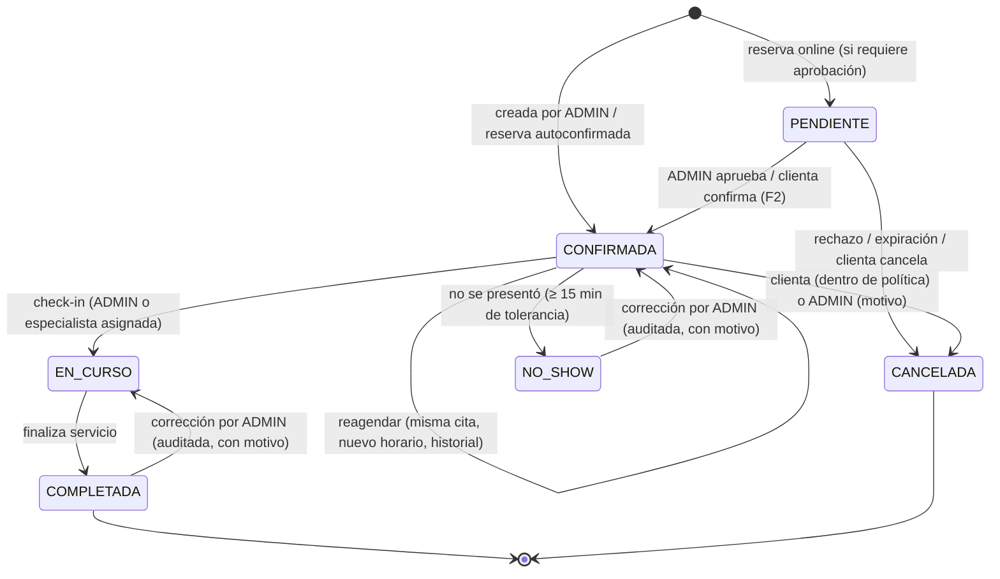

# 9. Diseño de base de datos

**Motor:** PostgreSQL 17+ · **Extensiones:** `pgcrypto`, `citext`, `btree_gist`, `pg_trgm`

---

## 9.1 Convenciones

| Convención | Regla |
|---|---|
| Nombres | `snake_case`, tablas en plural, en inglés (código) con comentarios en español |
| Claves primarias | `uuid` (generado en la app como **UUIDv7**, ordenable por tiempo; `gen_random_uuid()` como respaldo) |
| Multi-tenant | `organization_id` en toda tabla de negocio; `branch_id` en todo lo que depende de la sede |
| Fechas | `timestamptz` (UTC). Horarios recurrentes: `time` + `weekday` en hora local de la sede |
| Dinero | `numeric(12,2)` + `currency char(3)` (por defecto `BOB`) |
| Soft delete | `deleted_at`, `deleted_by`, `delete_reason` en entidades de negocio. **Nunca `DELETE` físico** en citas, clientes, cobros ni usuarios |
| Trazabilidad por fila | `created_at`, `created_by`, `updated_at`, `updated_by` |
| Concurrencia | `version int` en entidades editables concurrentemente (citas) para bloqueo optimista |
| Snapshots | Precio, duración y nombre del servicio se **copian** a la cita (cambiar el catálogo no altera el histórico) |
| Auditoría | Tabla `audit_logs` **append-only**, particionada por mes |

---

## 9.2 Diagrama entidad-relación

```mermaid
erDiagram
    ORGANIZATIONS ||--o{ BRANCHES : tiene
    ORGANIZATIONS ||--o{ USERS : emplea
    ORGANIZATIONS ||--o{ ROLES : define
    ROLES ||--o{ ROLE_PERMISSIONS : otorga
    PERMISSIONS ||--o{ ROLE_PERMISSIONS : incluida_en
    USERS ||--o{ USER_ROLES : tiene
    ROLES ||--o{ USER_ROLES : asignado
    USERS ||--o{ SESSIONS : abre
    USERS ||--o{ PASSWORD_RESET_TOKENS : solicita

    BRANCHES ||--o{ BUSINESS_HOURS : abre
    BRANCHES ||--o{ HOLIDAYS : cierra
    BRANCHES ||--o{ RESOURCES : dispone
    BRANCHES ||--o{ STAFF_PROFILES : aloja

    USERS ||--o| STAFF_PROFILES : "es colaboradora"
    STAFF_PROFILES ||--o{ WORK_SCHEDULES : trabaja
    STAFF_PROFILES ||--o{ SCHEDULE_EXCEPTIONS : ausencia
    STAFF_PROFILES ||--o{ STAFF_SERVICES : realiza
    SERVICES ||--o{ STAFF_SERVICES : realizado_por

    SERVICE_CATEGORIES ||--o{ SERVICES : agrupa
    PACKAGES ||--o{ PACKAGE_ITEMS : contiene
    SERVICES ||--o{ PACKAGE_ITEMS : parte_de

    USERS ||--o| CLIENTS : "cuenta portal"
    CLIENTS ||--o{ APPOINTMENTS : reserva
    CLIENTS ||--o{ CLIENT_CONSENTS : otorga
    BRANCHES ||--o{ APPOINTMENTS : ocurre_en
    PACKAGES ||--o{ APPOINTMENTS : origina
    APPOINTMENTS ||--|{ APPOINTMENT_ITEMS : compuesta_por
    SERVICES ||--o{ APPOINTMENT_ITEMS : se_presta
    STAFF_PROFILES ||--o{ APPOINTMENT_ITEMS : atiende
    RESOURCES ||--o{ APPOINTMENT_ITEMS : usa
    APPOINTMENTS ||--o{ APPOINTMENT_STATUS_HISTORY : registra
    APPOINTMENTS ||--o{ PAYMENTS : cobra
    CLIENTS ||--o{ PAYMENTS : paga
    BRANCHES ||--o{ CASH_CLOSURES : cierra

    APPOINTMENTS ||--o{ NOTIFICATIONS : dispara
    NOTIFICATION_TEMPLATES ||--o{ NOTIFICATIONS : usa
    USERS ||--o{ AUDIT_LOGS : ejecuta
    USERS ||--o{ EXPORT_JOBS : solicita

    ORGANIZATIONS {
        uuid id PK
        text name
        text slug UK
        text tax_id
        text timezone
        char currency
        jsonb settings
    }
    BRANCHES {
        uuid id PK
        uuid organization_id FK
        text name
        text timezone
        bool is_active
    }
    USERS {
        uuid id PK
        uuid organization_id FK
        citext email UK
        text password_hash
        text first_name
        text last_name
        user_status status
        bool must_change_password
        timestamptz locked_until
    }
    ROLES {
        uuid id PK
        uuid organization_id FK
        text code
        bool is_system
    }
    PERMISSIONS {
        uuid id PK
        text code UK
        text module
    }
    STAFF_PROFILES {
        uuid id PK
        uuid user_id FK
        uuid branch_id FK
        text display_name
        text color
        bool is_bookable_online
    }
    WORK_SCHEDULES {
        uuid id PK
        uuid staff_id FK
        smallint weekday
        time start_time
        time end_time
        date valid_from
        date valid_to
    }
    SCHEDULE_EXCEPTIONS {
        uuid id PK
        uuid staff_id FK
        exception_type type
        timestamptz start_at
        timestamptz end_at
        exception_status status
    }
    SERVICES {
        uuid id PK
        uuid category_id FK
        text name
        int duration_min
        int buffer_after_min
        numeric price
        bool is_active
        bool is_online_bookable
    }
    PACKAGES {
        uuid id PK
        text name
        numeric price
        bool is_active
    }
    PACKAGE_ITEMS {
        uuid id PK
        uuid package_id FK
        uuid service_id FK
        int sequence
        int parallel_group
    }
    CLIENTS {
        uuid id PK
        uuid user_id FK
        text first_name
        text last_name
        text phone_e164
        citext email
        text allergies
        text preferences
        text internal_notes
    }
    APPOINTMENTS {
        uuid id PK
        text code UK
        uuid client_id FK
        uuid branch_id FK
        appointment_status status
        appointment_source source
        timestamptz start_at
        timestamptz end_at
        numeric total
        int version
        timestamptz deleted_at
    }
    APPOINTMENT_ITEMS {
        uuid id PK
        uuid appointment_id FK
        uuid service_id FK
        uuid staff_id FK
        timestamptz start_at
        timestamptz end_at
        timestamptz blocked_until
        bool blocks_calendar
        numeric price
    }
    APPOINTMENT_STATUS_HISTORY {
        uuid id PK
        uuid appointment_id FK
        appointment_status from_status
        appointment_status to_status
        uuid changed_by FK
        text reason
    }
    PAYMENTS {
        uuid id PK
        uuid appointment_id FK
        payment_type type
        payment_method method
        numeric amount
        payment_status status
    }
    AUDIT_LOGS {
        bigint id PK
        timestamptz occurred_at PK
        uuid actor_user_id FK
        text action
        text module
        text entity_type
        uuid entity_id
        jsonb old_values
        jsonb new_values
        text_arr changed_fields
        inet ip
    }
```



---

## 9.3 Diccionario de datos (resumen por tabla)

| Tabla | Propósito | Registros estimados (año 1) |
|---|---|---|
| `organizations` | Empresa (NaturalSpa). Base del modelo SaaS | 1 |
| `branches` | Sedes | 1 |
| `users` | Cuentas de acceso (personal y clientas con portal) | 6 personal + ~1.500 clientas |
| `roles`, `permissions`, `role_permissions`, `user_roles` | RBAC | ~5 / ~60 / ~150 / ~1.500 |
| `sessions` | Refresh tokens activos (rotativos) | Variable |
| `password_reset_tokens`, `verification_codes` | Recuperación y OTP | Variable (se purgan) |
| `staff_profiles` | Datos operativos de cada colaboradora | 5 |
| `work_schedules` | Horario semanal por colaboradora | ~30 |
| `schedule_exceptions` | Vacaciones, permisos, bloqueos | ~200 |
| `holidays` | Feriados | ~15/año |
| `business_hours` | Horario del negocio | 5 |
| `resources` | Cabinas o camillas (opcional) | 3–5 |
| `service_categories`, `services`, `staff_services` | Catálogo | 5 / ~20 / ~40 |
| `packages`, `package_items` | Paquetes | ~5 / ~20 |
| `clients`, `client_consents` | Clientas | ~2.000 |
| `appointments`, `appointment_items` | Citas | ~7.000 / ~8.000 |
| `appointment_status_history` | Transiciones de estado | ~20.000 |
| `payments`, `cash_closures` | Cobros y cierres | ~7.500 / ~250 |
| `notification_templates`, `notifications` | Comunicaciones | ~15 / ~20.000 |
| `outbox_events` | Eventos de dominio pendientes | Se purga a 30 días |
| `audit_logs` | Auditoría inmutable | ~60.000–100.000 |
| `export_jobs`, `import_jobs` | Exportaciones e importaciones controladas | ~100 |

---

## 9.4 DDL completo (PostgreSQL)

```sql
-- =====================================================================
--  NaturalSpa Manager — Esquema inicial
-- =====================================================================
CREATE EXTENSION IF NOT EXISTS pgcrypto;
CREATE EXTENSION IF NOT EXISTS citext;
CREATE EXTENSION IF NOT EXISTS btree_gist;
CREATE EXTENSION IF NOT EXISTS pg_trgm;

-- ---------------------------------------------------------------------
--  Tipos enumerados
-- ---------------------------------------------------------------------
CREATE TYPE user_status        AS ENUM ('ACTIVE','INACTIVE','LOCKED','PENDING_VERIFICATION');
CREATE TYPE appointment_status AS ENUM ('PENDIENTE','CONFIRMADA','EN_CURSO','COMPLETADA','CANCELADA','NO_SHOW');
CREATE TYPE appointment_source AS ENUM ('ADMIN','ONLINE','WHATSAPP','TELEFONO','WALK_IN');
CREATE TYPE cancelled_by_type  AS ENUM ('CLIENTE','SPA','SISTEMA');
CREATE TYPE exception_type     AS ENUM ('VACACIONES','PERMISO','BLOQUEO','EXTRA');
CREATE TYPE exception_status   AS ENUM ('SOLICITADA','APROBADA','RECHAZADA','CANCELADA');
CREATE TYPE payment_type       AS ENUM ('COBRO','ANTICIPO','REEMBOLSO');
CREATE TYPE payment_method     AS ENUM ('EFECTIVO','QR','TRANSFERENCIA','TARJETA','OTRO');
CREATE TYPE payment_status     AS ENUM ('REGISTRADO','ANULADO');
CREATE TYPE notif_channel      AS ENUM ('EMAIL','WHATSAPP','SMS','INTERNAL');
CREATE TYPE notif_status       AS ENUM ('PROGRAMADA','ENVIADA','ENTREGADA','LEIDA','FALLIDA','CANCELADA');
CREATE TYPE job_status         AS ENUM ('PENDIENTE','PROCESANDO','COMPLETADO','FALLIDO','EXPIRADO');

-- ---------------------------------------------------------------------
--  Función genérica updated_at
-- ---------------------------------------------------------------------
CREATE OR REPLACE FUNCTION set_updated_at() RETURNS trigger AS $$
BEGIN
  NEW.updated_at := now();
  RETURN NEW;
END $$ LANGUAGE plpgsql;

-- =====================================================================
--  ORGANIZACIÓN
-- =====================================================================
CREATE TABLE organizations (
  id            uuid PRIMARY KEY DEFAULT gen_random_uuid(),
  name          text        NOT NULL,
  legal_name    text,
  slug          text        NOT NULL UNIQUE,
  tax_id        text,                                   -- NIT
  email         citext,
  phone         text,
  logo_url      text,
  timezone      text        NOT NULL DEFAULT 'America/La_Paz',
  currency      char(3)     NOT NULL DEFAULT 'BOB',
  locale        text        NOT NULL DEFAULT 'es-BO',
  settings      jsonb       NOT NULL DEFAULT '{}'::jsonb, -- ver §9.7
  is_active     boolean     NOT NULL DEFAULT true,
  created_at    timestamptz NOT NULL DEFAULT now(),
  updated_at    timestamptz NOT NULL DEFAULT now()
);
CREATE TRIGGER trg_org_updated BEFORE UPDATE ON organizations FOR EACH ROW EXECUTE FUNCTION set_updated_at();

CREATE TABLE branches (
  id              uuid PRIMARY KEY DEFAULT gen_random_uuid(),
  organization_id uuid        NOT NULL REFERENCES organizations(id),
  name            text        NOT NULL,
  slug            text        NOT NULL,
  address         text,
  city            text        DEFAULT 'Santa Cruz de la Sierra',
  phone           text,
  latitude        numeric(9,6),
  longitude       numeric(9,6),
  timezone        text        NOT NULL DEFAULT 'America/La_Paz',
  settings        jsonb       NOT NULL DEFAULT '{}'::jsonb,
  is_active       boolean     NOT NULL DEFAULT true,
  created_at      timestamptz NOT NULL DEFAULT now(),
  updated_at      timestamptz NOT NULL DEFAULT now(),
  UNIQUE (organization_id, slug)
);
CREATE TRIGGER trg_branch_updated BEFORE UPDATE ON branches FOR EACH ROW EXECUTE FUNCTION set_updated_at();

-- Horario del negocio (varios tramos por día permitidos). weekday ISO: 1=lunes … 7=domingo
CREATE TABLE business_hours (
  id          uuid PRIMARY KEY DEFAULT gen_random_uuid(),
  branch_id   uuid     NOT NULL REFERENCES branches(id),
  weekday     smallint NOT NULL CHECK (weekday BETWEEN 1 AND 7),
  open_time   time     NOT NULL,
  close_time  time     NOT NULL,
  CHECK (open_time < close_time)
);
CREATE INDEX ix_business_hours_branch ON business_hours(branch_id, weekday);

CREATE TABLE holidays (
  id          uuid PRIMARY KEY DEFAULT gen_random_uuid(),
  branch_id   uuid    NOT NULL REFERENCES branches(id),
  date        date    NOT NULL,
  name        text    NOT NULL,
  is_closed   boolean NOT NULL DEFAULT true,   -- false = apertura parcial
  open_time   time,
  close_time  time,
  created_at  timestamptz NOT NULL DEFAULT now(),
  created_by  uuid,
  UNIQUE (branch_id, date),
  CHECK (is_closed OR (open_time IS NOT NULL AND close_time IS NOT NULL AND open_time < close_time))
);

-- Cabinas / camillas (opcional en MVP; ver pregunta Q1)
CREATE TABLE resources (
  id          uuid PRIMARY KEY DEFAULT gen_random_uuid(),
  branch_id   uuid    NOT NULL REFERENCES branches(id),
  name        text    NOT NULL,             -- "Cabina 1"
  type        text    NOT NULL,             -- 'CABINA_MASAJE','SILLON_UNAS'…
  is_active   boolean NOT NULL DEFAULT true,
  created_at  timestamptz NOT NULL DEFAULT now()
);

-- =====================================================================
--  IDENTIDAD Y ACCESO
-- =====================================================================
CREATE TABLE users (
  id                    uuid PRIMARY KEY DEFAULT gen_random_uuid(),
  organization_id       uuid REFERENCES organizations(id),   -- NULL solo para SUPER_ADMIN de plataforma
  email                 citext      NOT NULL UNIQUE,
  password_hash         text        NOT NULL,                -- Argon2id
  first_name            text        NOT NULL,
  last_name             text        NOT NULL DEFAULT '',
  phone_e164            text,
  avatar_url            text,
  status                user_status NOT NULL DEFAULT 'ACTIVE',
  must_change_password  boolean     NOT NULL DEFAULT false,
  email_verified_at     timestamptz,
  failed_login_count    int         NOT NULL DEFAULT 0,
  locked_until          timestamptz,
  last_login_at         timestamptz,
  password_changed_at   timestamptz,
  mfa_enabled           boolean     NOT NULL DEFAULT false,
  mfa_secret_enc        bytea,                               -- cifrado a nivel de aplicación
  created_at            timestamptz NOT NULL DEFAULT now(),
  created_by            uuid REFERENCES users(id),
  updated_at            timestamptz NOT NULL DEFAULT now(),
  updated_by            uuid REFERENCES users(id),
  deleted_at            timestamptz,
  deleted_by            uuid REFERENCES users(id)
);
CREATE INDEX ix_users_org_status ON users(organization_id, status) WHERE deleted_at IS NULL;
CREATE TRIGGER trg_users_updated BEFORE UPDATE ON users FOR EACH ROW EXECUTE FUNCTION set_updated_at();

CREATE TABLE roles (
  id              uuid PRIMARY KEY DEFAULT gen_random_uuid(),
  organization_id uuid REFERENCES organizations(id),   -- NULL = rol de sistema
  code            text    NOT NULL,                     -- SUPER_ADMIN, ADMIN, EMPLEADA, CLIENTE
  name            text    NOT NULL,
  description     text,
  is_system       boolean NOT NULL DEFAULT false,       -- no editable / no eliminable
  created_at      timestamptz NOT NULL DEFAULT now(),
  UNIQUE NULLS NOT DISTINCT (organization_id, code)
);

CREATE TABLE permissions (
  id          uuid PRIMARY KEY DEFAULT gen_random_uuid(),
  code        text NOT NULL UNIQUE,     -- 'appointments.read_own'
  module      text NOT NULL,            -- 'appointments'
  description text NOT NULL,
  is_sensitive boolean NOT NULL DEFAULT false
);

CREATE TABLE role_permissions (
  role_id       uuid NOT NULL REFERENCES roles(id) ON DELETE CASCADE,
  permission_id uuid NOT NULL REFERENCES permissions(id) ON DELETE CASCADE,
  granted_at    timestamptz NOT NULL DEFAULT now(),
  granted_by    uuid REFERENCES users(id),
  PRIMARY KEY (role_id, permission_id)
);

CREATE TABLE user_roles (
  user_id    uuid NOT NULL REFERENCES users(id),
  role_id    uuid NOT NULL REFERENCES roles(id),
  branch_id  uuid REFERENCES branches(id),             -- NULL = todas las sedes
  granted_at timestamptz NOT NULL DEFAULT now(),
  granted_by uuid REFERENCES users(id),
  PRIMARY KEY (user_id, role_id)
);

CREATE TABLE sessions (
  id                  uuid PRIMARY KEY DEFAULT gen_random_uuid(),
  user_id             uuid        NOT NULL REFERENCES users(id),
  family_id           uuid        NOT NULL,        -- detecta reutilización de refresh token
  refresh_token_hash  text        NOT NULL UNIQUE, -- SHA-256 del token
  user_agent          text,
  ip                  inet,
  device_label        text,
  created_at          timestamptz NOT NULL DEFAULT now(),
  last_used_at        timestamptz NOT NULL DEFAULT now(),
  expires_at          timestamptz NOT NULL,
  revoked_at          timestamptz,
  revoked_reason      text,
  replaced_by         uuid REFERENCES sessions(id)
);
CREATE INDEX ix_sessions_user_active ON sessions(user_id) WHERE revoked_at IS NULL;

CREATE TABLE password_reset_tokens (
  id          uuid PRIMARY KEY DEFAULT gen_random_uuid(),
  user_id     uuid        NOT NULL REFERENCES users(id),
  token_hash  text        NOT NULL UNIQUE,
  expires_at  timestamptz NOT NULL,
  used_at     timestamptz,
  requested_ip inet,
  created_at  timestamptz NOT NULL DEFAULT now()
);

-- OTP para verificar email/teléfono en reservas online
CREATE TABLE verification_codes (
  id          uuid PRIMARY KEY DEFAULT gen_random_uuid(),
  target      text        NOT NULL,        -- email o teléfono normalizado
  purpose     text        NOT NULL,        -- 'BOOKING_VERIFY','EMAIL_VERIFY'
  code_hash   text        NOT NULL,
  attempts    int         NOT NULL DEFAULT 0,
  expires_at  timestamptz NOT NULL,
  consumed_at timestamptz,
  created_at  timestamptz NOT NULL DEFAULT now()
);
CREATE INDEX ix_verif_target ON verification_codes(target, purpose) WHERE consumed_at IS NULL;

-- =====================================================================
--  PERSONAL
-- =====================================================================
CREATE TABLE staff_profiles (
  id                  uuid PRIMARY KEY DEFAULT gen_random_uuid(),
  organization_id     uuid    NOT NULL REFERENCES organizations(id),
  branch_id           uuid    NOT NULL REFERENCES branches(id),
  user_id             uuid    NOT NULL UNIQUE REFERENCES users(id),
  display_name        text    NOT NULL,             -- "Andrea"
  color               text    NOT NULL DEFAULT '#7C9A82',
  bio                 text,
  photo_url           text,
  is_bookable_online  boolean NOT NULL DEFAULT true,
  sort_order          int     NOT NULL DEFAULT 0,
  hired_at            date,
  is_active           boolean NOT NULL DEFAULT true,
  created_at          timestamptz NOT NULL DEFAULT now(),
  created_by          uuid REFERENCES users(id),
  updated_at          timestamptz NOT NULL DEFAULT now(),
  updated_by          uuid REFERENCES users(id)
);
CREATE TRIGGER trg_staff_updated BEFORE UPDATE ON staff_profiles FOR EACH ROW EXECUTE FUNCTION set_updated_at();

CREATE TABLE work_schedules (
  id          uuid PRIMARY KEY DEFAULT gen_random_uuid(),
  staff_id    uuid     NOT NULL REFERENCES staff_profiles(id),
  weekday     smallint NOT NULL CHECK (weekday BETWEEN 1 AND 7),
  start_time  time     NOT NULL,
  end_time    time     NOT NULL,
  valid_from  date     NOT NULL DEFAULT current_date,
  valid_to    date,                                  -- NULL = indefinido
  created_at  timestamptz NOT NULL DEFAULT now(),
  created_by  uuid REFERENCES users(id),
  CHECK (start_time < end_time),
  CHECK (valid_to IS NULL OR valid_to >= valid_from)
);
CREATE INDEX ix_work_sched_staff ON work_schedules(staff_id, weekday);

CREATE TABLE schedule_exceptions (
  id              uuid PRIMARY KEY DEFAULT gen_random_uuid(),
  organization_id uuid             NOT NULL REFERENCES organizations(id),
  branch_id       uuid             NOT NULL REFERENCES branches(id),
  staff_id        uuid             REFERENCES staff_profiles(id),  -- NULL = aplica a toda la sede
  type            exception_type   NOT NULL,
  status          exception_status NOT NULL DEFAULT 'APROBADA',
  start_at        timestamptz      NOT NULL,
  end_at          timestamptz      NOT NULL,
  all_day         boolean          NOT NULL DEFAULT false,
  reason          text,
  requested_by    uuid REFERENCES users(id),
  approved_by     uuid REFERENCES users(id),
  approved_at     timestamptz,
  rejection_reason text,
  created_at      timestamptz NOT NULL DEFAULT now(),
  created_by      uuid REFERENCES users(id),
  updated_at      timestamptz NOT NULL DEFAULT now(),
  updated_by      uuid REFERENCES users(id),
  deleted_at      timestamptz,
  CHECK (start_at < end_at)
);
CREATE INDEX ix_exc_staff_range ON schedule_exceptions USING gist (staff_id, tstzrange(start_at, end_at))
  WHERE deleted_at IS NULL AND status = 'APROBADA';
CREATE TRIGGER trg_exc_updated BEFORE UPDATE ON schedule_exceptions FOR EACH ROW EXECUTE FUNCTION set_updated_at();

-- =====================================================================
--  CATÁLOGO
-- =====================================================================
CREATE TABLE service_categories (
  id              uuid PRIMARY KEY DEFAULT gen_random_uuid(),
  organization_id uuid    NOT NULL REFERENCES organizations(id),
  name            text    NOT NULL,
  slug            text    NOT NULL,
  color           text,
  icon            text,
  sort_order      int     NOT NULL DEFAULT 0,
  is_active       boolean NOT NULL DEFAULT true,
  UNIQUE (organization_id, slug)
);

CREATE TABLE services (
  id                  uuid PRIMARY KEY DEFAULT gen_random_uuid(),
  organization_id     uuid          NOT NULL REFERENCES organizations(id),
  category_id         uuid          NOT NULL REFERENCES service_categories(id),
  name                text          NOT NULL,
  slug                text          NOT NULL,
  description         text,
  duration_min        int           NOT NULL CHECK (duration_min BETWEEN 5 AND 600),
  buffer_before_min   int           NOT NULL DEFAULT 0 CHECK (buffer_before_min >= 0),
  buffer_after_min    int           NOT NULL DEFAULT 10 CHECK (buffer_after_min >= 0),
  price               numeric(12,2) NOT NULL CHECK (price >= 0),
  currency            char(3)       NOT NULL DEFAULT 'BOB',
  resource_type       text,                            -- requiere cabina de este tipo (opcional)
  image_url           text,
  is_active           boolean       NOT NULL DEFAULT true,
  is_online_bookable  boolean       NOT NULL DEFAULT true,
  sort_order          int           NOT NULL DEFAULT 0,
  created_at          timestamptz   NOT NULL DEFAULT now(),
  created_by          uuid REFERENCES users(id),
  updated_at          timestamptz   NOT NULL DEFAULT now(),
  updated_by          uuid REFERENCES users(id),
  deleted_at          timestamptz,
  UNIQUE (organization_id, slug)
);
CREATE TRIGGER trg_services_updated BEFORE UPDATE ON services FOR EACH ROW EXECUTE FUNCTION set_updated_at();

CREATE TABLE staff_services (
  staff_id            uuid NOT NULL REFERENCES staff_profiles(id),
  service_id          uuid NOT NULL REFERENCES services(id),
  custom_price        numeric(12,2) CHECK (custom_price >= 0),
  custom_duration_min int CHECK (custom_duration_min > 0),
  PRIMARY KEY (staff_id, service_id)
);
CREATE INDEX ix_staff_services_service ON staff_services(service_id);

CREATE TABLE packages (
  id                  uuid PRIMARY KEY DEFAULT gen_random_uuid(),
  organization_id     uuid          NOT NULL REFERENCES organizations(id),
  name                text          NOT NULL,          -- "Día de Novia"
  slug                text          NOT NULL,
  description         text,
  price               numeric(12,2) NOT NULL CHECK (price >= 0),
  currency            char(3)       NOT NULL DEFAULT 'BOB',
  image_url           text,
  is_active           boolean       NOT NULL DEFAULT true,
  is_online_bookable  boolean       NOT NULL DEFAULT false,
  created_at          timestamptz   NOT NULL DEFAULT now(),
  created_by          uuid REFERENCES users(id),
  updated_at          timestamptz   NOT NULL DEFAULT now(),
  updated_by          uuid REFERENCES users(id),
  deleted_at          timestamptz,
  UNIQUE (organization_id, slug)
);
CREATE TRIGGER trg_packages_updated BEFORE UPDATE ON packages FOR EACH ROW EXECUTE FUNCTION set_updated_at();

-- sequence define el orden; ítems con el mismo parallel_group se realizan simultáneamente
CREATE TABLE package_items (
  id              uuid PRIMARY KEY DEFAULT gen_random_uuid(),
  package_id      uuid NOT NULL REFERENCES packages(id) ON DELETE CASCADE,
  service_id      uuid NOT NULL REFERENCES services(id),
  sequence        int  NOT NULL,
  parallel_group  int  NOT NULL,
  UNIQUE (package_id, sequence)
);

-- =====================================================================
--  CLIENTES
-- =====================================================================
CREATE TABLE clients (
  id                    uuid PRIMARY KEY DEFAULT gen_random_uuid(),
  organization_id       uuid    NOT NULL REFERENCES organizations(id),
  user_id               uuid    UNIQUE REFERENCES users(id),   -- cuenta del portal (opcional)
  first_name            text    NOT NULL,
  last_name             text    NOT NULL DEFAULT '',
  phone_e164            text,                                   -- SENSIBLE
  email                 citext,                                 -- SENSIBLE
  birth_date            date,
  gender                text,
  -- Datos visibles a la especialista asignada:
  preferences           text,          -- "presión fuerte, música suave, aceite sin aroma"
  allergies             text,          -- SENSIBLE (salud) — visible a la especialista para su seguridad
  contraindications     text,          -- SENSIBLE (salud)
  -- Solo administración:
  internal_notes        text,          -- observaciones administrativas
  source                text,          -- 'INSTAGRAM','REFERIDO','GOOGLE','WALK_IN','MIGRACION'
  tags                  text[]  NOT NULL DEFAULT '{}',
  preferred_staff_id    uuid REFERENCES staff_profiles(id),
  marketing_opt_in      boolean NOT NULL DEFAULT false,
  -- Métricas desnormalizadas (actualizadas por eventos)
  first_visit_at        timestamptz,
  last_visit_at         timestamptz,
  visits_count          int           NOT NULL DEFAULT 0,
  no_show_count         int           NOT NULL DEFAULT 0,
  total_spent           numeric(12,2) NOT NULL DEFAULT 0,
  is_active             boolean       NOT NULL DEFAULT true,
  merged_into_id        uuid REFERENCES clients(id),
  anonymized_at         timestamptz,
  created_at            timestamptz NOT NULL DEFAULT now(),
  created_by            uuid REFERENCES users(id),
  updated_at            timestamptz NOT NULL DEFAULT now(),
  updated_by            uuid REFERENCES users(id),
  deleted_at            timestamptz,
  deleted_by            uuid REFERENCES users(id),
  delete_reason         text
);
CREATE UNIQUE INDEX ux_clients_phone ON clients(organization_id, phone_e164)
  WHERE deleted_at IS NULL AND merged_into_id IS NULL AND phone_e164 IS NOT NULL;
CREATE UNIQUE INDEX ux_clients_email ON clients(organization_id, email)
  WHERE deleted_at IS NULL AND merged_into_id IS NULL AND email IS NOT NULL;
CREATE INDEX ix_clients_name_trgm ON clients USING gin ((first_name || ' ' || last_name) gin_trgm_ops); -- requiere pg_trgm
CREATE TRIGGER trg_clients_updated BEFORE UPDATE ON clients FOR EACH ROW EXECUTE FUNCTION set_updated_at();

CREATE TABLE client_consents (
  id              uuid PRIMARY KEY DEFAULT gen_random_uuid(),
  client_id       uuid        NOT NULL REFERENCES clients(id),
  consent_type    text        NOT NULL,     -- 'PRIVACY_POLICY','TERMS','MARKETING','WHATSAPP'
  granted         boolean     NOT NULL,
  policy_version  text,
  channel         text,                     -- 'ONLINE','PRESENCIAL'
  ip              inet,
  created_at      timestamptz NOT NULL DEFAULT now(),
  created_by      uuid REFERENCES users(id)
);

-- =====================================================================
--  CITAS
-- =====================================================================
CREATE SEQUENCE appointment_code_seq;

CREATE TABLE appointments (
  id                    uuid PRIMARY KEY DEFAULT gen_random_uuid(),
  organization_id       uuid               NOT NULL REFERENCES organizations(id),
  branch_id             uuid               NOT NULL REFERENCES branches(id),
  code                  text               NOT NULL UNIQUE
                         DEFAULT ('NS-' || to_char(now(),'YYYY') || '-' || lpad(nextval('appointment_code_seq')::text, 6, '0')),
  client_id             uuid               NOT NULL REFERENCES clients(id),
  package_id            uuid               REFERENCES packages(id),
  status                appointment_status NOT NULL DEFAULT 'CONFIRMADA',
  source                appointment_source NOT NULL,
  start_at              timestamptz        NOT NULL,     -- min(items.start_at)
  end_at                timestamptz        NOT NULL,     -- max(items.end_at)
  subtotal              numeric(12,2)      NOT NULL DEFAULT 0,
  discount              numeric(12,2)      NOT NULL DEFAULT 0 CHECK (discount >= 0),
  total                 numeric(12,2)      NOT NULL DEFAULT 0 CHECK (total >= 0),
  currency              char(3)            NOT NULL DEFAULT 'BOB',
  client_notes          text,              -- lo que escribió la clienta al reservar
  internal_notes        text,              -- solo administración
  is_overbooking        boolean            NOT NULL DEFAULT false,  -- sobre-turno forzado por ADMIN
  overbooking_reason    text,
  confirmed_at          timestamptz,
  checked_in_at         timestamptz,
  completed_at          timestamptz,
  cancelled_at          timestamptz,
  cancelled_by          uuid REFERENCES users(id),
  cancelled_by_type     cancelled_by_type,
  cancel_reason         text,
  no_show_at            timestamptz,
  reschedule_count      int                NOT NULL DEFAULT 0,
  manage_token_hash     text,              -- enlace "gestionar mi reserva" (email)
  version               int                NOT NULL DEFAULT 1,
  created_at            timestamptz        NOT NULL DEFAULT now(),
  created_by            uuid REFERENCES users(id),
  updated_at            timestamptz        NOT NULL DEFAULT now(),
  updated_by            uuid REFERENCES users(id),
  deleted_at            timestamptz,
  deleted_by            uuid REFERENCES users(id),
  delete_reason         text,
  CHECK (start_at < end_at),
  CHECK (status <> 'CANCELADA' OR (cancelled_at IS NOT NULL AND cancel_reason IS NOT NULL)),
  CHECK (deleted_at IS NULL OR delete_reason IS NOT NULL),
  CHECK (NOT is_overbooking OR overbooking_reason IS NOT NULL)
);
CREATE INDEX ix_appt_branch_start ON appointments(branch_id, start_at) WHERE deleted_at IS NULL;
CREATE INDEX ix_appt_client       ON appointments(client_id, start_at DESC);
CREATE INDEX ix_appt_status       ON appointments(organization_id, status, start_at);
CREATE TRIGGER trg_appt_updated BEFORE UPDATE ON appointments FOR EACH ROW EXECUTE FUNCTION set_updated_at();

CREATE TABLE appointment_items (
  id                    uuid PRIMARY KEY DEFAULT gen_random_uuid(),
  organization_id       uuid          NOT NULL REFERENCES organizations(id),
  appointment_id        uuid          NOT NULL REFERENCES appointments(id),
  service_id            uuid          NOT NULL REFERENCES services(id),
  staff_id              uuid          NOT NULL REFERENCES staff_profiles(id),
  resource_id           uuid          REFERENCES resources(id),
  start_at              timestamptz   NOT NULL,
  end_at                timestamptz   NOT NULL,           -- fin del servicio
  blocked_until         timestamptz   NOT NULL,           -- end_at + buffer_after (bloquea agenda)
  -- snapshots
  service_name          text          NOT NULL,
  duration_min          int           NOT NULL,
  price                 numeric(12,2) NOT NULL,
  -- sincronizado por trigger desde appointments.status / deleted_at
  blocks_calendar       boolean       NOT NULL DEFAULT true,
  created_at            timestamptz   NOT NULL DEFAULT now(),
  updated_at            timestamptz   NOT NULL DEFAULT now(),
  CHECK (start_at < end_at AND end_at <= blocked_until),
  -- ★ GARANTÍA ANTI DOBLE RESERVA A NIVEL DE MOTOR ★
  CONSTRAINT ex_staff_no_overlap EXCLUDE USING gist (
    staff_id WITH =,
    tstzrange(start_at, blocked_until, '[)') WITH &&
  ) WHERE (blocks_calendar),
  CONSTRAINT ex_resource_no_overlap EXCLUDE USING gist (
    resource_id WITH =,
    tstzrange(start_at, blocked_until, '[)') WITH &&
  ) WHERE (blocks_calendar AND resource_id IS NOT NULL)
);
CREATE INDEX ix_items_staff_start ON appointment_items(staff_id, start_at) WHERE blocks_calendar;
CREATE INDEX ix_items_appt ON appointment_items(appointment_id);
CREATE TRIGGER trg_items_updated BEFORE UPDATE ON appointment_items FOR EACH ROW EXECUTE FUNCTION set_updated_at();

-- Nota: los sobre-turnos (is_overbooking) se registran con blocks_calendar = false
-- en el ítem forzado, para no violar la restricción, y se muestran igualmente en la agenda.

-- Sincroniza blocks_calendar de los ítems con el estado de la cita
CREATE OR REPLACE FUNCTION sync_items_blocking() RETURNS trigger AS $$
BEGIN
  IF NEW.status IS DISTINCT FROM OLD.status OR NEW.deleted_at IS DISTINCT FROM OLD.deleted_at THEN
    UPDATE appointment_items
       SET blocks_calendar = (NEW.deleted_at IS NULL
                              AND NEW.status IN ('PENDIENTE','CONFIRMADA','EN_CURSO')
                              AND NOT NEW.is_overbooking)
     WHERE appointment_id = NEW.id;
  END IF;
  RETURN NEW;
END $$ LANGUAGE plpgsql;
CREATE TRIGGER trg_appt_sync_items AFTER UPDATE OF status, deleted_at ON appointments
  FOR EACH ROW EXECUTE FUNCTION sync_items_blocking();

CREATE TABLE appointment_status_history (
  id              uuid PRIMARY KEY DEFAULT gen_random_uuid(),
  appointment_id  uuid               NOT NULL REFERENCES appointments(id),
  from_status     appointment_status,
  to_status       appointment_status NOT NULL,
  changed_by      uuid REFERENCES users(id),
  actor_type      text               NOT NULL,   -- 'USER','CLIENT','SYSTEM'
  reason          text,
  metadata        jsonb,                          -- ej. {"old_start": "...", "new_start": "..."} en reagendamientos
  created_at      timestamptz        NOT NULL DEFAULT now()
);
CREATE INDEX ix_status_hist_appt ON appointment_status_history(appointment_id, created_at);

-- =====================================================================
--  COBROS
-- =====================================================================
CREATE TABLE payments (
  id              uuid PRIMARY KEY DEFAULT gen_random_uuid(),
  organization_id uuid           NOT NULL REFERENCES organizations(id),
  branch_id       uuid           NOT NULL REFERENCES branches(id),
  appointment_id  uuid           REFERENCES appointments(id),
  client_id       uuid           REFERENCES clients(id),
  type            payment_type   NOT NULL DEFAULT 'COBRO',
  method          payment_method NOT NULL,
  amount          numeric(12,2)  NOT NULL CHECK (amount > 0),
  currency        char(3)        NOT NULL DEFAULT 'BOB',
  reference       text,          -- nro. de transacción QR / voucher
  status          payment_status NOT NULL DEFAULT 'REGISTRADO',
  notes           text,
  received_by     uuid           NOT NULL REFERENCES users(id),
  paid_at         timestamptz    NOT NULL DEFAULT now(),
  voided_at       timestamptz,
  voided_by       uuid REFERENCES users(id),
  void_reason     text,
  external_provider text,        -- F3: pasarela
  external_id     text,          -- F3
  created_at      timestamptz    NOT NULL DEFAULT now(),
  CHECK (status <> 'ANULADO' OR (voided_at IS NOT NULL AND void_reason IS NOT NULL))
);
CREATE INDEX ix_payments_branch_paid ON payments(branch_id, paid_at) WHERE status = 'REGISTRADO';
CREATE INDEX ix_payments_appt ON payments(appointment_id);

CREATE TABLE cash_closures (
  id              uuid PRIMARY KEY DEFAULT gen_random_uuid(),
  branch_id       uuid          NOT NULL REFERENCES branches(id),
  business_date   date          NOT NULL,
  expected_totals jsonb         NOT NULL,   -- {"EFECTIVO": 850.00, "QR": 1200.00, …}
  counted_totals  jsonb         NOT NULL,
  difference      numeric(12,2) NOT NULL,
  notes           text,
  closed_by       uuid          NOT NULL REFERENCES users(id),
  closed_at       timestamptz   NOT NULL DEFAULT now(),
  UNIQUE (branch_id, business_date)
);

-- =====================================================================
--  NOTIFICACIONES Y EVENTOS
-- =====================================================================
CREATE TABLE notification_templates (
  id              uuid PRIMARY KEY DEFAULT gen_random_uuid(),
  organization_id uuid          REFERENCES organizations(id),   -- NULL = plantilla por defecto
  code            text          NOT NULL,   -- 'APPOINTMENT_CONFIRMED','REMINDER_24H'…
  channel         notif_channel NOT NULL,
  locale          text          NOT NULL DEFAULT 'es-BO',
  subject         text,
  body            text          NOT NULL,   -- con variables {{client_first_name}}, {{start_time}}…
  provider_template_name text,              -- nombre de la plantilla aprobada en WhatsApp
  is_active       boolean       NOT NULL DEFAULT true,
  version         int           NOT NULL DEFAULT 1,
  updated_at      timestamptz   NOT NULL DEFAULT now(),
  UNIQUE NULLS NOT DISTINCT (organization_id, code, channel, locale)
);

CREATE TABLE notifications (
  id                  uuid PRIMARY KEY DEFAULT gen_random_uuid(),
  organization_id     uuid          NOT NULL REFERENCES organizations(id),
  channel             notif_channel NOT NULL,
  template_code       text          NOT NULL,
  recipient_user_id   uuid REFERENCES users(id),
  recipient_client_id uuid REFERENCES clients(id),
  recipient_address   text,         -- email / teléfono (se purga a los 90 días)
  appointment_id      uuid REFERENCES appointments(id),
  payload             jsonb         NOT NULL DEFAULT '{}'::jsonb,
  status              notif_status  NOT NULL DEFAULT 'PROGRAMADA',
  scheduled_at        timestamptz   NOT NULL DEFAULT now(),
  sent_at             timestamptz,
  delivered_at        timestamptz,
  read_at             timestamptz,
  attempts            int           NOT NULL DEFAULT 0,
  last_error          text,
  provider_message_id text,
  created_at          timestamptz   NOT NULL DEFAULT now()
);
CREATE INDEX ix_notif_due ON notifications(status, scheduled_at) WHERE status = 'PROGRAMADA';
CREATE INDEX ix_notif_inbox ON notifications(recipient_user_id, created_at DESC) WHERE channel = 'INTERNAL';

CREATE TABLE outbox_events (
  id              bigserial PRIMARY KEY,
  organization_id uuid        NOT NULL,
  aggregate_type  text        NOT NULL,   -- 'Appointment'
  aggregate_id    uuid        NOT NULL,
  event_type      text        NOT NULL,   -- 'AppointmentCreated'
  payload         jsonb       NOT NULL,
  created_at      timestamptz NOT NULL DEFAULT now(),
  published_at    timestamptz,
  attempts        int         NOT NULL DEFAULT 0
);
CREATE INDEX ix_outbox_pending ON outbox_events(id) WHERE published_at IS NULL;

-- =====================================================================
--  EXPORTACIONES / IMPORTACIONES CONTROLADAS
-- =====================================================================
CREATE TABLE export_jobs (
  id              uuid PRIMARY KEY DEFAULT gen_random_uuid(),
  organization_id uuid        NOT NULL REFERENCES organizations(id),
  requested_by    uuid        NOT NULL REFERENCES users(id),
  export_type     text        NOT NULL,   -- 'CLIENTS','SALES_REPORT'…
  filters         jsonb       NOT NULL DEFAULT '{}'::jsonb,
  reason          text        NOT NULL,   -- motivo obligatorio
  format          text        NOT NULL,   -- 'XLSX','PDF','CSV'
  status          job_status  NOT NULL DEFAULT 'PENDIENTE',
  row_count       int,
  file_key        text,                   -- ruta en object storage
  expires_at      timestamptz,            -- URL firmada válida 15 min; archivo se borra a las 24 h
  downloaded_at   timestamptz,
  created_at      timestamptz NOT NULL DEFAULT now()
);

CREATE TABLE import_jobs (
  id              uuid PRIMARY KEY DEFAULT gen_random_uuid(),
  organization_id uuid        NOT NULL REFERENCES organizations(id),
  requested_by    uuid        NOT NULL REFERENCES users(id),
  import_type     text        NOT NULL,   -- 'CLIENTS','APPOINTMENTS'
  status          job_status  NOT NULL DEFAULT 'PENDIENTE',
  total_rows      int,
  imported_rows   int,
  duplicate_rows  int,
  error_rows      int,
  report          jsonb,                  -- detalle fila a fila
  created_at      timestamptz NOT NULL DEFAULT now(),
  finished_at     timestamptz
);

-- =====================================================================
--  AUDITORÍA (append-only, particionada por mes)
-- =====================================================================
CREATE TABLE audit_logs (
  id              bigserial,
  occurred_at     timestamptz NOT NULL DEFAULT now(),
  organization_id uuid,
  branch_id       uuid,
  actor_user_id   uuid,                 -- NULL si es SISTEMA o anónimo
  actor_type      text        NOT NULL, -- 'USER','CLIENT','SYSTEM','ANONYMOUS'
  actor_role      text,                 -- rol en el momento de la acción
  actor_name      text,                 -- snapshot del nombre (por si el usuario cambia)
  action          text        NOT NULL, -- ver catálogo §20
  module          text        NOT NULL, -- 'appointments','clients','auth'…
  entity_type     text,                 -- 'Appointment'
  entity_id       uuid,
  entity_label    text,                 -- 'NS-2026-000123'
  old_values      jsonb,
  new_values      jsonb,
  changed_fields  text[],
  reason          text,
  ip              inet,
  user_agent      text,
  request_id      text,
  session_id      uuid,
  prev_hash       bytea,                -- F2: encadenamiento
  hash            bytea,                -- F2
  PRIMARY KEY (id, occurred_at)
) PARTITION BY RANGE (occurred_at);

-- Particiones mensuales (creadas automáticamente por un job con pg_partman o script)
CREATE TABLE audit_logs_2026_10 PARTITION OF audit_logs
  FOR VALUES FROM ('2026-10-01') TO ('2026-11-01');

CREATE INDEX ix_audit_entity  ON audit_logs(entity_type, entity_id, occurred_at DESC);
CREATE INDEX ix_audit_actor   ON audit_logs(actor_user_id, occurred_at DESC);
CREATE INDEX ix_audit_module  ON audit_logs(organization_id, module, action, occurred_at DESC);

-- Inmutabilidad: bloquea UPDATE y DELETE incluso para el rol dueño de la tabla
CREATE OR REPLACE FUNCTION audit_logs_immutable() RETURNS trigger AS $$
BEGIN
  RAISE EXCEPTION 'audit_logs es append-only: % no permitido', TG_OP
    USING ERRCODE = 'insufficient_privilege';
END $$ LANGUAGE plpgsql;
CREATE TRIGGER trg_audit_no_update BEFORE UPDATE OR DELETE ON audit_logs
  FOR EACH ROW EXECUTE FUNCTION audit_logs_immutable();
-- TRUNCATE tampoco:
CREATE TRIGGER trg_audit_no_truncate BEFORE TRUNCATE ON audit_logs
  FOR EACH STATEMENT EXECUTE FUNCTION audit_logs_immutable();

-- =====================================================================
--  ROLES DE BASE DE DATOS (mínimo privilegio)
-- =====================================================================
-- naturalspa_migrator : dueño del esquema, solo usado por migraciones en CI/CD
-- naturalspa_app      : usado por la API
-- naturalspa_readonly : reportes / BI
--
-- REVOKE UPDATE, DELETE, TRUNCATE ON audit_logs FROM naturalspa_app;
-- GRANT INSERT, SELECT ON audit_logs TO naturalspa_app;
-- REVOKE DELETE ON appointments, clients, payments, users FROM naturalspa_app;  -- solo soft delete
```

> **Nota:** el orden real de creación lo gestionan las migraciones de Prisma, con SQL crudo para `EXCLUDE`, triggers, particiones y vistas.

---

## 9.5 Vistas para reportes y dashboard

```sql
-- Hechos de cita (una fila por ítem) — base de todos los reportes
CREATE VIEW v_appointment_facts AS
SELECT
  a.organization_id, a.branch_id, a.id AS appointment_id, a.code, a.status, a.source,
  (a.start_at AT TIME ZONE b.timezone)::date AS local_date,
  i.staff_id, sp.display_name AS staff_name,
  i.service_id, i.service_name, s.category_id,
  i.duration_min, i.price,
  a.client_id, a.created_at, a.cancelled_by_type
FROM appointments a
JOIN appointment_items i ON i.appointment_id = a.id
JOIN branches b          ON b.id = a.branch_id
JOIN staff_profiles sp   ON sp.id = i.staff_id
JOIN services s          ON s.id = i.service_id
WHERE a.deleted_at IS NULL;

-- Ventas diarias (vista materializada, refrescada cada 5 min y en cada cobro)
CREATE MATERIALIZED VIEW mv_daily_sales AS
SELECT p.organization_id, p.branch_id,
       (p.paid_at AT TIME ZONE 'America/La_Paz')::date AS local_date,
       p.method,
       sum(CASE WHEN p.type = 'REEMBOLSO' THEN -p.amount ELSE p.amount END) AS amount,
       count(*) AS payments
FROM payments p
WHERE p.status = 'REGISTRADO'
GROUP BY 1,2,3,4;
CREATE UNIQUE INDEX ux_mv_daily_sales ON mv_daily_sales(organization_id, branch_id, local_date, method);
```

La **ocupación** se calcula en la capa de aplicación con el mismo motor de disponibilidad: minutos disponibles (horario − excepciones − festivos) contra minutos reservados (ítems activos o completados). El resultado se cachea por día y colaboradora en Redis y se invalida con cada evento de cita u horario.

---

## 9.6 Máquina de estados de la cita



**Reglas:**

- **Reagendar no crea una cita nueva**: modifica la misma, incrementa `reschedule_count` y `version`, y deja el horario anterior en `appointment_status_history.metadata` y en `audit_logs`.
- Toda transición inválida se rechaza con `422 INVALID_STATE_TRANSITION`.
- `CANCELADA`, `NO_SHOW` y `COMPLETADA` liberan (o no ocupan) el calendario; el trigger `sync_items_blocking` lo garantiza.

---

## 9.7 Configuración (`organizations.settings`)

```json
{
  "booking": {
    "enabled": true,
    "slot_interval_min": 15,
    "min_lead_time_min": 120,
    "max_advance_days": 60,
    "auto_confirm": true,
    "max_active_bookings_per_client": 3,
    "hold_ttl_sec": 600,
    "require_otp_first_booking": true
  },
  "cancellation": {
    "client_can_cancel_until_hours": 12,
    "client_can_reschedule_until_hours": 12,
    "max_reschedules_per_appointment": 2
  },
  "no_show": {
    "grace_minutes": 15,
    "flag_client_after_count": 2
  },
  "privacy": {
    "staff_client_visibility_months": 12,
    "mask_contact_for_admin": true
  },
  "reminders": {
    "enabled": false,
    "hours_before": [24, 2],
    "channels": ["EMAIL", "WHATSAPP"]
  },
  "security": {
    "session_idle_hours_staff": 8,
    "max_failed_logins": 5,
    "lockout_minutes": 15,
    "require_mfa_for_admin": false
  }
}
```

---

## 9.8 Datos semilla (seed)

| Entidad | Datos |
|---|---|
| Permisos | Catálogo completo (ver §11) |
| Roles de sistema | `SUPER_ADMIN`, `ADMIN`, `EMPLEADA`, `CLIENTE` con sus permisos |
| **Usuario de pruebas** | **Nombre:** Super Admin · **Email:** `admin@datly.local` · **Password:** `Admin123*` · **Rol:** SUPER_ADMIN · **Estado:** ACTIVE |
| Organización | NaturalSpa (slug `naturalspa`, `America/La_Paz`, BOB) |
| Sede | NaturalSpa Central |
| Horario negocio | Mar–Sáb 09:00–19:00 |
| Categorías | Masajes, Corporal, Facial, Depilación, Uñas |
| Servicios | Los 7 servicios actuales (precios a completar por Natalia) |
| Paquete | Día de Novia (ítems a validar) |
| Plantillas | Emails de confirmación, cambio, cancelación y recuperación |
| Demo (solo local/staging) | 5 colaboradoras, 50 clientas ficticias, 300 citas |

```ts
// apps/api/prisma/seed/super-admin.seed.ts
import { hash } from '@node-rs/argon2';

export async function seedSuperAdmin(prisma: PrismaClient) {
  const email = 'admin@datly.local';
  const role = await prisma.role.findFirstOrThrow({ where: { code: 'SUPER_ADMIN', organizationId: null } });

  const user = await prisma.user.upsert({
    where: { email },
    update: {},                                    // idempotente: no pisa cambios posteriores
    create: {
      email,
      firstName: 'Super',
      lastName: 'Admin',
      passwordHash: await hash('Admin123*', { algorithm: 2 /* Argon2id */ }),
      status: 'ACTIVE',
      organizationId: null,                        // usuario de plataforma
      mustChangePassword: process.env.NODE_ENV === 'production',
    },
  });

  await prisma.userRole.upsert({
    where: { userId_roleId: { userId: user.id, roleId: role.id } },
    update: {},
    create: { userId: user.id, roleId: role.id },
  });
}
```

> ⚠️ **Seguridad del usuario de pruebas:** en `local` y `staging` se crea tal cual. En **producción** se crea con `must_change_password = true` y el pipeline de despliegue **verifica** que la contraseña por defecto ya no sea válida después del primer despliegue (ver §19.9). El dominio `.local` no recibe emails, así que la recuperación de contraseña para esta cuenta se hace por CLI.

---

## 9.9 Retención y purga de datos

| Dato | Retención | Acción |
|---|---|---|
| Citas, cobros | Indefinida (mín. 5 años por respaldo contable) | — |
| Auditoría | 5 años en caliente; luego archivo frío (S3 Glacier) | Desprender partición y archivar |
| Sesiones revocadas o expiradas | 30 días | Purga diaria |
| Tokens de recuperación y OTP | 7 días | Purga diaria |
| `notifications.recipient_address` | 90 días | Se anula el campo |
| `outbox_events` publicados | 30 días | Purga |
| Exportaciones | 24 h | Se borra el archivo; queda el registro del job |
| Clientas anonimizadas | Inmediato | Datos personales reemplazados; métricas conservadas |
