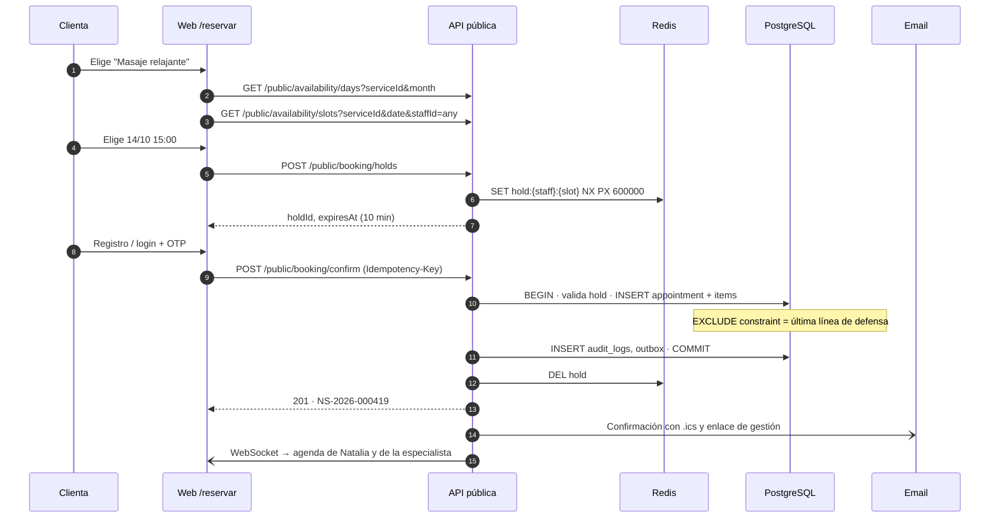

# Diseño de APIs

---

## 1. Convenciones generales

| Aspecto | Decisión |
|---|---|
| Estilo | REST sobre JSON, recursos en plural y en inglés |
| Base URL | `https://api.naturalspa.app/api/v1` (backoffice y cliente) · `…/api/v1/public` (reservas sin login) |
| Versionado | En la ruta (`/v1`). Cambios incompatibles → `/v2`, con convivencia mínima de 6 meses |
| Documentación | OpenAPI 3.1 generado desde los esquemas Zod; Swagger UI en `/api/docs` (deshabilitado en producción o protegido) |
| Formato de fechas | ISO 8601 con zona (`2026-10-14T15:00:00-04:00`); los `date` locales como `YYYY-MM-DD` |
| Dinero | String decimal (`"150.00"`) + `currency` para evitar errores de coma flotante |
| IDs | UUID v7 |
| Paginación | Por cursor: `?limit=25&cursor=…` → `{ data, pageInfo: { nextCursor, hasMore } }`. Tablas del backoffice: `?page=&pageSize=` con `total` |
| Filtros | `?status=CONFIRMADA,PENDIENTE&staffId=…&from=…&to=…` |
| Ordenamiento | `?sort=-startAt,lastName` |
| Campos parciales | `?fields=id,code,startAt` (opcional) |
| Idempotencia | Header `Idempotency-Key` **obligatorio** en `POST` de citas, reservas y cobros (se guarda 24 h en Redis) |
| Concurrencia | `ETag` / `If-Match` con la `version` de la cita → `412 PRECONDITION_FAILED` si cambió |
| Trazabilidad | Header `X-Request-Id` (se genera si no viene) devuelto en toda respuesta y guardado en auditoría |
| Rate limiting | Headers `RateLimit-Limit`, `RateLimit-Remaining`, `RateLimit-Reset`; `429` al excederse |
| Compresión | gzip/br |
| CORS | Solo los orígenes propios (web y dominio de reservas) |

### 1.1 Autenticación

- **Access token** JWT (firmado con **EdDSA/ES256**), 15 minutos, en el header `Authorization: Bearer …`. Claims: `sub`, `org`, `roles`, `perms_v` (versión de permisos), `sid` (sesión).
- **Refresh token** opaco (256 bits), rotativo, en cookie `__Host-ns_rt` (`HttpOnly; Secure; SameSite=Strict; Path=/api/v1/auth`).
- Los **permisos no viajan completos en el JWT**: se resuelven en el servidor y se cachean en Redis por usuario. Así, revocar un permiso tiene efecto inmediato (se invalida `perms_v`).
- La reutilización de un refresh token ya rotado se interpreta como robo: se revoca **toda la familia** de sesiones y se audita `SESSION_HIJACK_SUSPECTED`.

### 1.2 Formato de error (RFC 9457 — Problem Details)

```json
{
  "type": "https://docs.naturalspa.app/errors/slot-taken",
  "title": "El horario ya no está disponible",
  "status": 409,
  "code": "SLOT_TAKEN",
  "detail": "Andrea ya tiene una cita entre 15:00 y 16:10.",
  "instance": "/api/v1/appointments",
  "requestId": "01J9Z…",
  "errors": [
    { "field": "items[0].startAt", "code": "SLOT_TAKEN", "message": "Horario ocupado" }
  ],
  "suggestions": [
    { "staffId": "…", "startAt": "2026-10-14T16:15:00-04:00" }
  ]
}
```

| HTTP | `code` | Cuándo |
|---|---|---|
| 400 | `VALIDATION_ERROR` | Payload inválido |
| 401 | `UNAUTHENTICATED`, `TOKEN_EXPIRED` | Sin sesión o token vencido |
| 403 | `FORBIDDEN`, `OUT_OF_SCOPE` | Sin permiso, o recurso fuera de su alcance |
| 404 | `NOT_FOUND` | No existe **o no es visible para el usuario** (no se revela la existencia de recursos ajenos) |
| 409 | `SLOT_TAKEN`, `DUPLICATE_CLIENT`, `IDEMPOTENCY_CONFLICT` | Conflictos de negocio |
| 412 | `VERSION_CONFLICT` | `If-Match` no coincide |
| 422 | `INVALID_STATE_TRANSITION`, `OUTSIDE_WORKING_HOURS`, `CANCELLATION_WINDOW_EXPIRED`, `STAFF_CANNOT_PERFORM_SERVICE` | Reglas de negocio |
| 423 | `ACCOUNT_LOCKED` | Bloqueo por intentos fallidos |
| 429 | `RATE_LIMITED` | Exceso de peticiones |
| 500 | `INTERNAL_ERROR` | Error inesperado (sin detalles internos) |

> **Privacidad:** cuando una empleada pide una cita que no es suya, la API responde **404**, no 403, para no confirmar que existe.

### 1.3 Autorización declarativa (NestJS)

```ts
@Controller('appointments')
export class AppointmentsController {
  @Get()
  @RequirePermission('appointments.read_own', 'appointments.read_all') // cualquiera de los dos
  list(@CurrentUser() user: AuthUser, @Query() q: ListAppointmentsQuery) {
    // El servicio aplica el alcance: si solo tiene read_own → WHERE staff_id = user.staffId
    return this.appointments.list(user, q);
  }

  @Patch(':id/reschedule')
  @RequirePermission('appointments.reschedule')
  @Audit({ module: 'appointments', action: 'RESCHEDULE', entity: 'Appointment' })
  reschedule(@Param('id') id: string, @Body() dto: RescheduleDto, @IfMatch() version: number) { … }
}
```

---

## 2. Catálogo de endpoints

**Leyenda de alcance:** `own` = solo registros propios; `all` = todos los de la organización; `pub` = público; `self` = la propia clienta.

### 2.1 Auth — `/auth`

| Método | Ruta | Descripción | Permiso / acceso |
|---|---|---|---|
| POST | `/auth/login` | Email + contraseña → access token + cookie refresh | pub (rate limit 5/min/IP+email) |
| POST | `/auth/refresh` | Rota el refresh token | cookie válida |
| POST | `/auth/logout` | Revoca la sesión actual | autenticado |
| POST | `/auth/logout-all` | Revoca todas las sesiones del usuario | autenticado |
| POST | `/auth/forgot-password` | Envía un enlace de recuperación (responde siempre 202) | pub (3/h/email) |
| POST | `/auth/reset-password` | Token + nueva contraseña | pub |
| POST | `/auth/change-password` | Contraseña actual + nueva | autenticado |
| GET | `/auth/me` | Perfil, roles, **permisos efectivos**, `staffId`, preferencias | autenticado |
| GET | `/auth/sessions` | Sesiones activas propias | autenticado |
| DELETE | `/auth/sessions/{id}` | Cierra una sesión propia | autenticado |
| POST | `/auth/mfa/setup` · `/auth/mfa/verify` | TOTP (F2) | autenticado |

**Ejemplo — login**

```http
POST /api/v1/auth/login
Content-Type: application/json

{ "email": "admin@datly.local", "password": "Admin123*" }
```

```json
200 OK
Set-Cookie: __Host-ns_rt=…; HttpOnly; Secure; SameSite=Strict; Path=/api/v1/auth

{
  "accessToken": "eyJ…",
  "expiresIn": 900,
  "user": {
    "id": "0192…",
    "firstName": "Super",
    "lastName": "Admin",
    "email": "admin@datly.local",
    "roles": ["SUPER_ADMIN"],
    "mustChangePassword": false
  }
}
```

### 2.2 Usuarios — `/users`

| Método | Ruta | Descripción | Permiso |
|---|---|---|---|
| GET | `/users` | Lista (filtros: rol, estado, búsqueda) | `users.read` |
| POST | `/users` | Crear usuario (con perfil de colaboradora si el rol es EMPLEADA) | `users.create` |
| GET | `/users/{id}` | Detalle | `users.read` |
| PATCH | `/users/{id}` | Editar | `users.update` |
| POST | `/users/{id}/deactivate` | Desactivar + revocar sesiones | `users.deactivate` |
| POST | `/users/{id}/activate` | Reactivar | `users.deactivate` |
| POST | `/users/{id}/force-password-reset` | Obliga a cambiar la contraseña | `users.reset_password` |
| GET | `/users/{id}/sessions` | Sesiones del usuario | `users.read` |
| DELETE | `/users/{id}/sessions` | Cierra todas sus sesiones | `users.deactivate` |

### 2.3 Roles y permisos — `/roles`, `/permissions`

| Método | Ruta | Descripción | Permiso |
|---|---|---|---|
| GET | `/permissions` | Catálogo de permisos | `roles.read` |
| GET | `/roles` | Lista de roles | `roles.read` |
| POST | `/roles` | Crear rol personalizado | `roles.manage` |
| PUT | `/roles/{id}/permissions` | Reemplaza los permisos del rol (no permitido en roles de sistema salvo SUPER_ADMIN) | `roles.manage` |

### 2.4 Clientes — `/clients`

| Método | Ruta | Descripción | Permiso / alcance |
|---|---|---|---|
| GET | `/clients` | Lista y búsqueda (`?q=`). La EMPLEADA recibe solo **sus** clientes, sin contacto | `clients.read_all` \| `clients.read_assigned` (máx. 20 resultados, 30 búsquedas/h) |
| POST | `/clients` | Crear (valida duplicados por teléfono y email) | `clients.create` |
| GET | `/clients/{id}` | Ficha; los campos se filtran según permisos | `read_all` \| `read_assigned` |
| PATCH | `/clients/{id}` | Editar | `clients.update` |
| PATCH | `/clients/{id}/service-notes` | La especialista actualiza preferencias (sin tocar otros campos) | `clients.update_service_notes` (own) |
| POST | `/clients/{id}/reveal-contact` | Devuelve teléfono y email completos; **audita `VIEW_SENSITIVE`** | `clients.view_contact` |
| GET | `/clients/{id}/appointments` | Historial (EMPLEADA: solo las citas con ella) | idem lectura |
| GET | `/clients/{id}/payments` | Historial de pagos | `payments.read_all` |
| POST | `/clients/{id}/merge` | Fusionar con otro cliente `{ targetId }` | `clients.merge` |
| DELETE | `/clients/{id}` | Soft delete con motivo | `clients.delete` |
| POST | `/clients/{id}/anonymize` | Derecho al olvido | `clients.anonymize` |
| POST | `/clients/import` | Carga CSV → `import_job` | `clients.import` |
| POST | `/clients/export` | Crea un `export_job` (motivo obligatorio) | `clients.export` |

**Respuesta de ficha según rol:**

```jsonc
// ADMIN
{
  "id": "…", "firstName": "María", "lastName": "Rojas",
  "phone": "+591 7••••••21", "email": "m••••@gmail.com",   // enmascarado hasta reveal-contact
  "allergies": "Alergia a frutos secos (aceite de almendras)",
  "preferences": "Presión media, sin música",
  "internalNotes": "Clienta VIP, prefiere sábados",
  "stats": { "visits": 14, "noShows": 1, "totalSpent": "2310.00", "lastVisitAt": "…" }
}

// EMPLEADA (clienta con cita asignada a ella)
{
  "id": "…", "firstName": "María", "lastName": "R.",
  "allergies": "Alergia a frutos secos (aceite de almendras)",
  "preferences": "Presión media, sin música",
  "stats": { "visitsWithMe": 6, "lastVisitWithMeAt": "…" }
  // sin phone, email, internalNotes, totalSpent ni birthDate
}
```

### 2.5 Catálogo — `/service-categories`, `/services`, `/packages`

| Método | Ruta | Descripción | Permiso |
|---|---|---|---|
| GET | `/service-categories` | Lista | `services.read` |
| POST / PATCH | `/service-categories[/{id}]` | Crear / editar | `services.manage` |
| GET | `/services` | Lista (`?categoryId=&active=`) | `services.read` |
| POST | `/services` | Crear | `services.manage` |
| GET / PATCH | `/services/{id}` | Detalle / editar | `services.read` / `services.manage` |
| POST | `/services/{id}/deactivate` | Desactivar (no se borra si tiene citas) | `services.manage` |
| PUT | `/services/{id}/staff` | Define qué colaboradoras lo realizan `[{staffId, customPrice?}]` | `services.manage` |
| GET | `/packages` · POST · PATCH `/packages/{id}` | CRUD de paquetes con `items[]` | `packages.read` / `packages.manage` |

### 2.6 Colaboradoras y horarios — `/staff`, `/schedules`

| Método | Ruta | Descripción | Permiso / alcance |
|---|---|---|---|
| GET | `/staff` | Lista de colaboradoras (EMPLEADA: solo se ve a sí misma) | `staff.read_all` \| own |
| GET / PATCH | `/staff/{id}` | Perfil (color, servicios, visibilidad online) | `staff.manage` |
| GET | `/staff/{id}/work-schedule` | Horario semanal vigente | `schedules.read_all` \| own |
| PUT | `/staff/{id}/work-schedule` | Reemplaza el horario semanal `{ validFrom, blocks:[{weekday,start,end}] }` | `schedules.manage` |
| GET | `/schedule-exceptions` | Lista (`?staffId=&from=&to=&type=&status=`) | `schedules.read_all` \| own |
| POST | `/schedule-exceptions` | Crear vacaciones, permiso o bloqueo. Responde con `affectedAppointments[]` | `schedules.manage` |
| POST | `/schedule-exceptions/requests` | La EMPLEADA solicita vacaciones o permiso | `schedules.request` (own) |
| POST | `/schedule-exceptions/{id}/approve` · `/reject` | Aprobar o rechazar | `schedules.approve` |
| DELETE | `/schedule-exceptions/{id}` | Soft delete | `schedules.manage` |
| GET / POST / DELETE | `/holidays[/{id}]` | Feriados | `schedules.manage` |
| GET / PUT | `/branches/{id}/business-hours` | Horario del negocio | `settings.manage` |

### 2.7 Disponibilidad — `/availability`

| Método | Ruta | Descripción | Permiso |
|---|---|---|---|
| GET | `/availability/slots` | Slots libres. Query: `serviceId` \| `packageId`, `staffId?` (o `any`), `date` \| `from&to`, `branchId` | `appointments.create` |
| GET | `/availability/check` | Verifica un horario puntual (para arrastrar y soltar) | `appointments.create` |
| GET | `/public/availability/slots` | Versión pública (sin nombres internos; aplica reglas de anticipación) | pub (60/min/IP) |
| GET | `/public/availability/days` | Días con disponibilidad del mes (para pintar el calendario) | pub |

**Ejemplo**

```http
GET /api/v1/availability/slots?serviceId=srv_masaje_relajante&staffId=any&date=2026-10-14
```

```json
{
  "date": "2026-10-14",
  "timezone": "America/La_Paz",
  "service": { "id": "…", "name": "Masaje relajante", "durationMin": 60 },
  "slots": [
    { "startAt": "2026-10-14T09:00:00-04:00", "endAt": "2026-10-14T10:00:00-04:00", "staff": [ { "id": "…", "name": "Andrea" }, { "id": "…", "name": "Lucía" } ] },
    { "startAt": "2026-10-14T09:15:00-04:00", "endAt": "2026-10-14T10:15:00-04:00", "staff": [ { "id": "…", "name": "Lucía" } ] }
  ]
}
```

### 2.8 Citas — `/appointments`

| Método | Ruta | Descripción | Permiso / alcance |
|---|---|---|---|
| GET | `/appointments` | Lista por rango (`from`, `to`, `staffId`, `status`, `clientId`). **Filtra por alcance** | `appointments.read_all` \| `read_own` |
| GET | `/appointments/calendar` | Formato optimizado para la vista de agenda (día/semana/mes) | idem |
| POST | `/appointments` | Crear cita (servicio o paquete) | `appointments.create` + `Idempotency-Key` |
| GET | `/appointments/{id}` | Detalle (404 si está fuera de alcance) | idem lectura |
| PATCH | `/appointments/{id}` | Editar notas, servicio o colaboradora | `appointments.update` + `If-Match` |
| POST | `/appointments/{id}/reschedule` | Reagendar `{ items:[{itemId, staffId, startAt}], reason? }` | `appointments.reschedule` + `If-Match` |
| POST | `/appointments/{id}/confirm` | PENDIENTE → CONFIRMADA | `appointments.update` |
| POST | `/appointments/{id}/check-in` | → EN_CURSO | `appointments.update_status` (own o all) |
| POST | `/appointments/{id}/complete` | → COMPLETADA | `appointments.update_status` (own o all) |
| POST | `/appointments/{id}/no-show` | → NO_SHOW | `appointments.update_status` (own o all) |
| POST | `/appointments/{id}/cancel` | → CANCELADA `{ reason, cancelledByType }` | `appointments.cancel` |
| POST | `/appointments/{id}/revert-status` | Corrección de estado (motivo obligatorio) | `appointments.revert_status` |
| DELETE | `/appointments/{id}` | Soft delete (`{ reason }` obligatorio) | `appointments.delete` |
| POST | `/appointments/{id}/restore` | Restaurar una cita eliminada | `appointments.delete` |
| GET | `/appointments/{id}/history` | Línea de tiempo (estados + auditoría resumida) | `appointments.read_all` \| own (sin datos de otras) |

**Ejemplo — crear cita**

```http
POST /api/v1/appointments
Idempotency-Key: 5a0b1c7e-…
Content-Type: application/json

{
  "branchId": "…",
  "clientId": "…",
  "source": "WHATSAPP",
  "items": [
    { "serviceId": "…masaje-relajante", "staffId": "…andrea", "startAt": "2026-10-14T15:00:00-04:00" }
  ],
  "clientNotes": "Primera vez",
  "internalNotes": "Llegará 5 min tarde",
  "overbooking": null
}
```

```json
201 Created
ETag: "1"
Location: /api/v1/appointments/0192…

{
  "id": "0192…",
  "code": "NS-2026-000418",
  "status": "CONFIRMADA",
  "startAt": "2026-10-14T15:00:00-04:00",
  "endAt": "2026-10-14T16:00:00-04:00",
  "client": { "id": "…", "name": "María Rojas" },
  "items": [
    { "id": "…", "service": "Masaje relajante", "staff": { "id": "…", "name": "Andrea" },
      "startAt": "2026-10-14T15:00:00-04:00", "endAt": "2026-10-14T16:00:00-04:00", "price": "180.00" }
  ],
  "total": "180.00",
  "currency": "BOB",
  "version": 1
}
```

**Ejemplo — sobre-turno forzado por ADMIN**

```json
{ "overbooking": { "reason": "Clienta VIP, Andrea aceptó extender turno" } }
```

### 2.9 Reservas públicas y portal cliente — `/public/booking`, `/me`

| Método | Ruta | Descripción | Acceso |
|---|---|---|---|
| GET | `/public/booking/catalog` | Categorías, servicios y paquetes reservables (precio, duración, imagen) | pub |
| GET | `/public/booking/staff?serviceId=` | Colaboradoras que realizan el servicio (nombre de pila + foto) | pub |
| POST | `/public/booking/holds` | Reserva temporal de un slot (10 min) → `{ holdId, expiresAt }` | pub (10/h/IP) |
| DELETE | `/public/booking/holds/{holdId}` | Libera el hold | pub |
| POST | `/public/booking/verify/send` | Envía OTP al email o teléfono | pub (3/h/destino) |
| POST | `/public/booking/verify/check` | Valida OTP → token de verificación | pub |
| POST | `/public/auth/register` | Registro de clienta (+ consentimientos) | pub |
| POST | `/public/booking/confirm` | `{ holdId, clientToken \| verificationToken, notes }` → crea la cita | pub + `Idempotency-Key` |
| GET | `/public/booking/manage/{token}` | Ver la reserva desde el enlace del email (sin login) | token firmado |
| GET | `/me/appointments` | Mis reservas (próximas e historial) | CLIENTE (self) |
| POST | `/me/appointments/{id}/reschedule` | Reagendar dentro de la política | CLIENTE (self) |
| POST | `/me/appointments/{id}/cancel` | Cancelar dentro de la política | CLIENTE (self) |
| GET / PATCH | `/me/profile` | Mis datos y preferencias de comunicación | CLIENTE (self) |

**Secuencia de reserva online**



### 2.10 Cobros — `/payments`, `/cash-closures`

| Método | Ruta | Descripción | Permiso |
|---|---|---|---|
| GET | `/payments` | Lista (`from`, `to`, `method`, `staffId`) | `payments.read_all` |
| POST | `/payments` | Registrar cobro `{ appointmentId, method, amount, reference }` | `payments.create` + `Idempotency-Key` |
| POST | `/payments/{id}/void` | Anular con motivo | `payments.void` |
| GET | `/cash-closures/preview?date=` | Totales esperados del día por método | `payments.close_cash` |
| POST | `/cash-closures` | Cerrar caja con montos contados | `payments.close_cash` |

### 2.11 Dashboard y reportes — `/dashboard`, `/reports`

| Método | Ruta | Descripción | Permiso |
|---|---|---|---|
| GET | `/dashboard/summary?from&to&branchId` | KPIs: ventas día/mes, citas, ocupación, cancelaciones, no-show, online | `dashboard.view_global` |
| GET | `/dashboard/charts/sales?from&to&groupBy=day` | Serie de ventas + periodo anterior | `dashboard.view_global` |
| GET | `/dashboard/charts/top-services` | Top servicios (cantidad e ingreso) | `dashboard.view_global` |
| GET | `/dashboard/charts/staff-occupancy` | Ocupación por colaboradora | `dashboard.view_global` |
| GET | `/dashboard/charts/new-clients?groupBy=week` | Nuevos clientes | `dashboard.view_global` |
| GET | `/dashboard/me` | "Mi día" de la especialista | `dashboard.view_own` |
| GET | `/reports/sales` | Reporte de ventas | `reports.view_global` |
| GET | `/reports/services` | Reporte de servicios | `reports.view_global` |
| GET | `/reports/clients` | Nuevos, recurrentes, inactivos, top | `reports.view_global` |
| GET | `/reports/staff` | Desempeño por colaboradora | `reports.view_global` |
| GET | `/reports/cancellations` | Cancelaciones y no-show con motivos | `reports.view_global` |
| GET | `/reports/me` | Reporte personal de la especialista | `reports.view_own` |
| POST | `/reports/{type}/export` | Crea un `export_job` (XLSX/PDF) | `reports.export` |
| GET | `/exports/{id}` | Estado + URL firmada (15 min) | dueño del job |

**Ejemplo — resumen del dashboard**

```json
{
  "period": { "from": "2026-10-01", "to": "2026-10-14" },
  "kpis": {
    "salesToday":       { "value": "2840.00", "deltaPct": 12.5 },
    "salesMonth":       { "value": "38210.00", "deltaPct": 8.1, "comparedTo": "2026-09-01..2026-09-14" },
    "appointmentsToday":{ "value": 24, "byStatus": { "CONFIRMADA": 15, "EN_CURSO": 2, "COMPLETADA": 6, "NO_SHOW": 1 } },
    "occupancy":        { "todayPct": 72.4, "weekPct": 58.9 },
    "cancellations":    { "count": 17, "pct": 6.2 },
    "noShow":           { "count": 21, "pct": 7.7 },
    "onlineBookings":   { "count": 96, "pct": 35.2 }
  }
}
```

### 2.12 Auditoría — `/audit-logs`

| Método | Ruta | Descripción | Permiso |
|---|---|---|---|
| GET | `/audit-logs` | Búsqueda: `actorId`, `module`, `action`, `entityType`, `entityId`, `from`, `to`, `q` | `audit.read` |
| GET | `/audit-logs/{id}` | Detalle con diff | `audit.read` |
| GET | `/audit-logs/entity/{type}/{id}` | Historial completo de una entidad | `audit.read` |
| POST | `/audit-logs/export` | Exportación (auditada a su vez) | `audit.export` |
| GET | `/audit-logs/verify?from&to` | Verifica la cadena de hashes (F2) | `audit.read` (SUPER_ADMIN) |

*No existen `PUT`, `PATCH` ni `DELETE` sobre auditoría.*

### 2.13 Notificaciones y configuración

| Método | Ruta | Descripción | Permiso |
|---|---|---|---|
| GET | `/notifications/inbox` | Notificaciones internas del usuario | autenticado |
| POST | `/notifications/inbox/{id}/read` · `/read-all` | Marcar como leídas | autenticado |
| GET / PUT | `/notification-templates[/{id}]` | Plantillas (F2) | `settings.manage` |
| GET / PATCH | `/settings` | Configuración de la organización | `settings.manage` |
| GET / PATCH | `/branches/{id}` | Datos de la sede | `settings.manage` |
| POST | `/webhooks/whatsapp` | Estados de entrega y respuestas (F2/F3); valida la firma de Meta | firma HMAC |
| POST | `/webhooks/payments/{provider}` | Confirmaciones de pago (F3) | firma del proveedor |

### 2.14 Tiempo real (WebSocket `/ws`)

| Evento (servidor → cliente) | Sala | Payload |
|---|---|---|
| `appointment.created` | `branch:{id}:admin`, `staff:{id}` | Cita (filtrada según el rol del receptor) |
| `appointment.updated` | idem | Cita + campos cambiados |
| `appointment.cancelled` | idem | id, motivo |
| `schedule.changed` | `staff:{id}`, `branch:{id}:admin` | Rango afectado |
| `notification.new` | `user:{id}` | Notificación interna |

---

## 3. Límites de tasa (rate limiting)

| Recurso | Límite | Clave |
|---|---|---|
| `POST /auth/login` | 5 / min · 20 / h | IP + email |
| `POST /auth/forgot-password` | 3 / h | email |
| `/public/availability/*` | 60 / min | IP |
| `POST /public/booking/holds` | 10 / h | IP |
| `POST /public/booking/verify/send` | 3 / h | destino |
| `GET /clients?q=` (EMPLEADA) | 30 / h | usuario |
| `POST /clients/{id}/reveal-contact` | 50 / día | usuario (alerta a SUPER_ADMIN si se excede) |
| API autenticada general | 300 / min | usuario |
