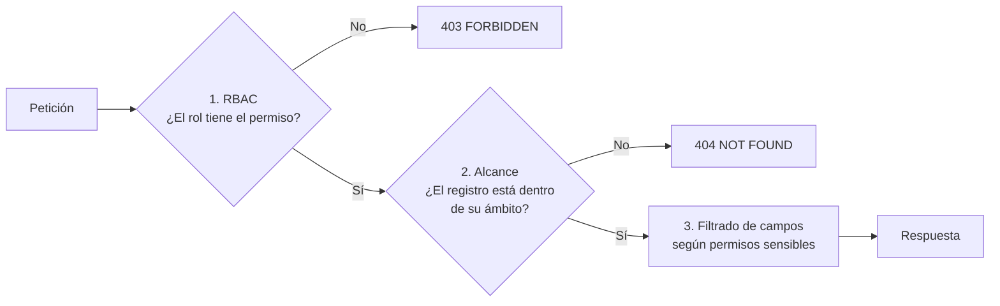

# 11. Roles y permisos (modelo de permisos)

---

## 11.1 Modelo: RBAC + alcance (scope) + filtrado de campos

La autorización se decide en **tres capas**, todas en el backend:



1. **RBAC (qué acción):** permisos granulares `modulo.accion[_alcance]` asignados a roles.
2. **Alcance (sobre qué registros):** `own` (propios), `assigned` (asignados vía citas), `branch` (su sede, F3), `all` (toda la organización), `self` (la clienta sobre sí misma). Se implementa con **políticas** que inyectan condiciones en las consultas (`WHERE staff_id = :currentStaffId`), no filtrando después de leer.
3. **Campos:** serializadores por rol eliminan campos sensibles (`phone`, `email`, `internal_notes`, montos) si el usuario no tiene el permiso correspondiente.

**Defensa en profundidad (opcional, recomendado en F2):** Row-Level Security (RLS) de PostgreSQL con `SET LOCAL app.user_id / app.staff_id / app.role` por transacción, para que un error de programación en la capa de aplicación no pueda exponer citas ajenas.

```sql
ALTER TABLE appointment_items ENABLE ROW LEVEL SECURITY;
CREATE POLICY staff_own_items ON appointment_items
  USING (
    current_setting('app.scope', true) = 'all'
    OR staff_id = nullif(current_setting('app.staff_id', true), '')::uuid
  );
```

---

## 11.2 Roles

| Rol | Descripción | Ámbito | ¿Editable? |
|---|---|---|---|
| **SUPER_ADMIN** | Proveedor de la plataforma (Datly). Acceso total, incluida la configuración de roles y organizaciones | Plataforma | No (sistema) |
| **ADMIN** | Dueña o administración del negocio (Natalia). Todo lo operativo y administrativo de su organización | Organización | Permisos ajustables solo por SUPER_ADMIN |
| **EMPLEADA** | Especialista. Solo su agenda, sus citas y las clientas asignadas, sin contacto | Propio | Permisos ajustables por SUPER_ADMIN / ADMIN (dentro de límites) |
| **CLIENTE** | Clienta final. Reservar y autogestionar sus reservas | Self | No |
| *RECEPCIÓN* (futuro) | Agenda completa y creación de clientas, sin reportes financieros ni auditoría | Sede | Rol personalizado sugerido |

---

## 11.3 Catálogo de permisos

| Permiso | Descripción | Sensible |
|---|---|---|
| **Plataforma** | | |
| `platform.manage` | Gestionar organizaciones, planes y sedes (SaaS) | ✅ |
| **Usuarios y roles** | | |
| `users.read` | Ver usuarios | |
| `users.create` | Crear usuarios | ✅ |
| `users.update` | Editar usuarios | ✅ |
| `users.deactivate` | Activar, desactivar y cerrar sesiones | ✅ |
| `users.reset_password` | Forzar cambio de contraseña | ✅ |
| `roles.read` | Ver roles y permisos | |
| `roles.manage` | Crear y editar roles y permisos | ✅ |
| **Dashboard y reportes** | | |
| `dashboard.view_global` | Dashboard ejecutivo con montos | ✅ |
| `dashboard.view_own` | "Mi día" | |
| `reports.view_global` | Reportes globales | ✅ |
| `reports.view_own` | Reporte personal | |
| `reports.export` | Exportar reportes | ✅ |
| **Clientes** | | |
| `clients.read_all` | Ver y buscar todas las clientas | ✅ |
| `clients.read_assigned` | Ver clientas con citas asignadas (sin contacto) | |
| `clients.create` | Crear clientas | |
| `clients.update` | Editar ficha completa | |
| `clients.update_service_notes` | Editar preferencias de servicio | |
| `clients.view_contact` | Revelar teléfono y email (auditado) | ✅ |
| `clients.view_internal_notes` | Ver observaciones internas | ✅ |
| `clients.merge` | Fusionar duplicados | ✅ |
| `clients.delete` | Eliminar (soft) | ✅ |
| `clients.anonymize` | Anonimizar | ✅ |
| `clients.import` | Importar | ✅ |
| `clients.export` | Exportar | ✅ |
| **Catálogo** | | |
| `services.read` / `services.manage` | Servicios y categorías | |
| `packages.read` / `packages.manage` | Paquetes | |
| **Personal y horarios** | | |
| `staff.read_all` | Ver todas las colaboradoras | |
| `staff.manage` | Editar perfiles de colaboradoras | |
| `schedules.read_all` | Ver horarios y ausencias de todas | |
| `schedules.read_own` | Ver su horario y ausencias | |
| `schedules.manage` | Editar horarios, ausencias, bloqueos y feriados | |
| `schedules.request` | Solicitar vacaciones o permisos | |
| `schedules.approve` | Aprobar o rechazar solicitudes | |
| **Citas** | | |
| `appointments.read_all` | Ver todas las citas | |
| `appointments.read_own` | Ver sus citas | |
| `appointments.create` | Crear citas | |
| `appointments.update` | Editar citas | |
| `appointments.reschedule` | Reagendar | |
| `appointments.update_status_all` | Cambiar estado de cualquier cita | |
| `appointments.update_status_own` | Check-in, completar o no-show de sus citas | |
| `appointments.cancel` | Cancelar | |
| `appointments.revert_status` | Corregir estados finales | ✅ |
| `appointments.delete` | Eliminar (soft) y restaurar | ✅ |
| `appointments.overbook` | Forzar sobre-turno | ✅ |
| **Cobros** | | |
| `payments.read_all` | Ver cobros | ✅ |
| `payments.create` | Registrar cobros | |
| `payments.void` | Anular cobros | ✅ |
| `payments.close_cash` | Cierre de caja | ✅ |
| **Auditoría y configuración** | | |
| `audit.read` | Consultar auditoría | ✅ |
| `audit.export` | Exportar auditoría | ✅ |
| `settings.manage` | Configuración del negocio | ✅ |
| **Cliente final** | | |
| `booking.self` | Reservar, ver, reagendar y cancelar sus reservas; editar su perfil | |

---

## 11.4 Matriz rol × permiso

| Permiso | SUPER_ADMIN | ADMIN | EMPLEADA | CLIENTE |
|---|:-:|:-:|:-:|:-:|
| platform.manage | ✅ | — | — | — |
| users.read / create / update / deactivate / reset_password | ✅ | ✅ ¹ | — | — |
| roles.read | ✅ | ✅ | — | — |
| roles.manage | ✅ | — | — | — |
| dashboard.view_global | ✅ | ✅ | — | — |
| dashboard.view_own | ✅ | ✅ | ✅ | — |
| reports.view_global / export | ✅ | ✅ | — | — |
| reports.view_own | ✅ | ✅ | ✅ | — |
| clients.read_all | ✅ | ✅ | — | — |
| clients.read_assigned | ✅ | ✅ | ✅ | — |
| clients.create / update | ✅ | ✅ | — | — |
| clients.update_service_notes | ✅ | ✅ | ✅ (own) | — |
| clients.view_contact | ✅ | ✅ ² | — | — |
| clients.view_internal_notes | ✅ | ✅ | — | — |
| clients.merge / delete / import | ✅ | ✅ | — | — |
| clients.export / anonymize | ✅ | ✅ ³ | — | — |
| services.read / packages.read | ✅ | ✅ | ✅ | pub |
| services.manage / packages.manage | ✅ | ✅ | — | — |
| staff.read_all / staff.manage | ✅ | ✅ | — | — |
| schedules.read_all / manage / approve | ✅ | ✅ | — | — |
| schedules.read_own / request | ✅ | ✅ | ✅ | — |
| appointments.read_all | ✅ | ✅ | — | — |
| appointments.read_own | ✅ | ✅ | ✅ | — |
| appointments.create / update / reschedule / cancel | ✅ | ✅ | — ⁴ | — |
| appointments.update_status_all | ✅ | ✅ | — | — |
| appointments.update_status_own | ✅ | ✅ | ✅ | — |
| appointments.revert_status / delete / overbook | ✅ | ✅ | — | — |
| payments.read_all / create / void / close_cash | ✅ | ✅ | — | — |
| audit.read / audit.export | ✅ | ✅ | — | — |
| settings.manage | ✅ | ✅ | — | — |
| booking.self | — | — | — | ✅ |

¹ ADMIN no puede crear, modificar ni desactivar usuarios SUPER_ADMIN.
² Por defecto el contacto aparece enmascarado incluso para ADMIN; revelarlo es un clic auditado. Evita exposición accidental (por ejemplo, pantalla visible en recepción).
³ La exportación exige un motivo, se procesa en segundo plano, se descarga una sola vez por URL firmada de 15 min y queda auditada.
⁴ Configurable: Natalia puede habilitar `appointments.create` para una empleada de confianza (por ejemplo, si atiende walk-ins).

---

## 11.5 Reglas de alcance por entidad

| Entidad | Alcance `own` / `assigned` (EMPLEADA) | Alcance `self` (CLIENTE) |
|---|---|---|
| Cita | `EXISTS item WHERE item.staff_id = me.staff_id`. En paquetes multi-especialista, **solo ve sus ítems**, no los de sus compañeras | `appointment.client_id = me.client_id` |
| Cliente | `EXISTS cita con ítem suyo AND start_at >= now() - interval '12 months'` | `client.user_id = me.id` |
| Horario / ausencias | `staff_id = me.staff_id` | — |
| Colaboradora | Solo su propio perfil | Nombre de pila y foto (catálogo público) |
| Dashboard / reportes | Métricas calculadas **solo** sobre sus ítems | — |
| Auditoría | Sin acceso. La línea de tiempo de su cita muestra solo "Cita reagendada por Administración" sin datos de otras | — |
| Notificaciones en tiempo real | Sala `staff:{me.staff_id}` asignada por el servidor | Sala `user:{me.id}` |

---

## 11.6 Medidas anti-fuga de la base de clientes

| Riesgo | Medida |
|---|---|
| Copiar la lista de clientas | La EMPLEADA no tiene pantalla de lista; solo accede a fichas desde sus citas |
| Anotar teléfonos | La EMPLEADA nunca recibe teléfono ni email (ni en la API, ni en WebSocket, ni en notificaciones) |
| Búsquedas masivas | Límite de 20 resultados y 30 búsquedas por hora, restringido a sus clientas; alerta si se excede |
| Exportar | Solo ADMIN, con motivo, auditado, descarga única y URL temporal |
| Capturas de pantalla | No se puede impedir técnicamente; se mitiga mostrando pocos datos y con *watermark* sutil (nombre del usuario) en fichas y reportes exportados |
| Scraping de la API | Rate limiting, tokens de corta duración, detección de patrones (≥ 100 fichas por hora → alerta y bloqueo temporal) |
| Exempleadas | Desactivación inmediata, sesiones revocadas en ≤ 15 s, sin acceso offline a datos sensibles |
| ADMIN comprometido | MFA para ADMIN (F2); alertas por login desde un dispositivo nuevo; revelaciones de contacto auditadas y con umbral diario |
| Acuerdo contractual | Recomendación legal: cláusula de confidencialidad y no captación de clientas en los contratos del personal |

---

## 11.7 Implementación de referencia

```ts
// packages/shared/src/permissions.ts
export const PERMISSIONS = {
  APPOINTMENTS_READ_ALL: 'appointments.read_all',
  APPOINTMENTS_READ_OWN: 'appointments.read_own',
  CLIENTS_VIEW_CONTACT: 'clients.view_contact',
  // …
} as const;
export type Permission = (typeof PERMISSIONS)[keyof typeof PERMISSIONS];

// apps/api/src/modules/appointments/application/appointment-scope.policy.ts
export function appointmentScope(user: AuthUser): Prisma.AppointmentWhereInput {
  if (user.can('appointments.read_all')) return { organizationId: user.orgId };
  if (user.can('appointments.read_own') && user.staffId)
    return { organizationId: user.orgId, items: { some: { staffId: user.staffId } } };
  if (user.can('booking.self') && user.clientId) return { clientId: user.clientId };
  throw new ForbiddenException();
}

// Serializador por rol
export function toClientDto(c: Client, user: AuthUser): ClientDto {
  const base = { id: c.id, firstName: c.firstName, allergies: c.allergies, preferences: c.preferences };
  if (!user.can('clients.read_all')) return { ...base, lastName: initial(c.lastName) };
  return {
    ...base,
    lastName: c.lastName,
    phone: mask(c.phoneE164),
    email: maskEmail(c.email),
    internalNotes: user.can('clients.view_internal_notes') ? c.internalNotes : undefined,
    stats: { … },
  };
}
```

**Frontend:** el componente `<Can permission="payments.create">` y el hook `usePermission()` ocultan la UI que el usuario no puede usar. Es **solo cosmético**: la seguridad real está en el backend.

**Pruebas obligatorias (CI):** una matriz automatizada que ejecuta cada endpoint con cada rol y verifica 200/403/404 según la tabla §11.4, más pruebas específicas de "empleada A no ve la cita de la empleada B" (REST y WebSocket).
