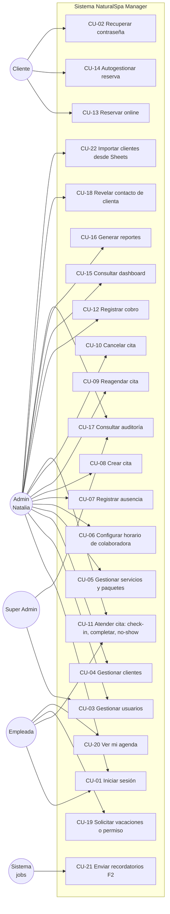

# 12–13. Casos de uso e historias de usuario

---

## 12. Casos de uso

### 12.1 Diagrama general



### 12.2 Casos de uso detallados

---

#### CU-01 · Iniciar sesión

| Campo | Detalle |
|---|---|
| **Actores** | Super Admin, Admin, Empleada, Cliente |
| **Precondición** | El usuario existe y está ACTIVO |
| **Disparador** | El usuario abre `/login` |
| **Flujo principal** | 1. Ingresa email y contraseña. 2. El sistema valida credenciales (Argon2id). 3. Crea la sesión y emite tokens. 4. Registra `LOGIN` en auditoría. 5. Redirige según el rol. |
| **Flujos alternos** | **A1** Credenciales inválidas → mensaje genérico, `failed_login_count++`, auditoría `LOGIN_FAILED`. **A2** 5 fallos → bloqueo de 15 min, email al titular, `ACCOUNT_LOCKED`. **A3** `must_change_password` → redirige a cambiar la contraseña antes de continuar. **A4** Usuario INACTIVO → mismo mensaje genérico. |
| **Postcondición** | Sesión activa registrada |
| **Reglas** | RF-AUTH-01, 05, 06, 12 |

---

#### CU-02 · Recuperar contraseña

| Campo | Detalle |
|---|---|
| **Actores** | Todos |
| **Flujo principal** | 1. "¿Olvidaste tu contraseña?" → ingresa el email. 2. El sistema responde siempre "Si el email existe, te enviamos un enlace". 3. Si existe: genera un token (256 bits), guarda el hash, expira en 30 min y envía el email. 4. El usuario abre el enlace y define una nueva contraseña. 5. El sistema invalida el token, revoca todas las sesiones y audita `PASSWORD_RESET`. |
| **Alternos** | Token vencido o usado → "El enlace expiró, solicita uno nuevo". |

---

#### CU-08 · Crear cita (backoffice)

| Campo | Detalle |
|---|---|
| **Actor** | Admin |
| **Precondición** | Servicio activo, colaboradora activa y habilitada para el servicio |
| **Flujo principal** | 1. Clic en un hueco de la agenda (colaboradora y hora precargadas). 2. Busca la clienta por nombre o teléfono (o la crea con nombre + teléfono). 3. Elige servicio o paquete. 4. El sistema muestra la duración, el precio y la validación en vivo. 5. Elige el origen (WhatsApp, teléfono, presencial). 6. "Crear cita". 7. El backend valida permisos, disponibilidad y transacción, y aplica la restricción `EXCLUDE`. 8. Estado CONFIRMADA, auditoría `CREATE`, email a la clienta (si tiene email), evento en tiempo real a la especialista. |
| **Alternos** | **A1** Slot ocupado (carrera) → 409 con 3 sugerencias de horario cercano. **A2** Fuera de horario → bloqueado; opción "Sobre-turno" con motivo (`appointments.overbook`). **A3** Clienta duplicada al crear → "¿Usar la ficha existente de María R. (+591 7•••21)?". **A4** Paquete → el asistente propone la primera combinación válida de colaboradoras y horarios. |
| **Postcondición** | Cita persistida, visible en la agenda de ADMIN y de la especialista asignada (y solo de ella) |
| **Reglas** | RF-AGE-03, 08, 09; §7.7 |

---

#### CU-09 · Reagendar cita

| Campo | Detalle |
|---|---|
| **Actores** | Admin; Cliente (desde el portal, dentro de la política) |
| **Flujo principal (Admin)** | 1. Arrastra la cita a otro horario o columna (o usa "Reagendar"). 2. El frontend valida en vivo (destino verde o rojo). 3. Se confirma con un diálogo: "Mover a Andrea, jue 16/10 10:00. ¿Notificar a la clienta? ☑". 4. `POST /reschedule` con `If-Match`. 5. Se actualizan los ítems, `reschedule_count++` y `version++`; se registran el historial (horario anterior y nuevo) y la auditoría `RESCHEDULE`. 6. Se notifica a la clienta y a las especialistas involucradas (la anterior y la nueva). |
| **Alternos** | **A1** `412 VERSION_CONFLICT` → "La cita cambió; recarga para ver la versión actual". **A2** Destino ocupado → no se suelta; muestra el motivo. |
| **Flujo (Cliente)** | 1. "Mis reservas" → Reagendar. 2. Selector de fecha y hora (misma especialista o "cualquiera"). 3. Confirmar. Validaciones: ≥ 12 h de anticipación y ≤ 2 reagendamientos. |

---

#### CU-10 · Cancelar cita

| Campo | Detalle |
|---|---|
| **Actores** | Admin; Cliente |
| **Flujo principal** | 1. "Cancelar cita". 2. Elige un motivo (obligatorio) y quién canceló (clienta o spa). 3. Confirma. 4. Estado CANCELADA, `cancelled_at`, `cancelled_by`; el horario se libera (trigger). 5. Auditoría `CANCEL` con el estado anterior. 6. Notificaciones. |
| **Alternos** | Clienta fuera de plazo → botón deshabilitado + "Contáctanos por WhatsApp". |
| **Postcondición** | La cita **sigue existiendo** con estado CANCELADA; aparece en los reportes de cancelación |

---

#### CU-11 · Atender cita (check-in, completar, no-show)

| Campo | Detalle |
|---|---|
| **Actores** | Empleada (sus citas); Admin |
| **Flujo principal** | 1. La especialista abre "Mi día" en su celular. 2. Toca la cita de las 15:00 (ve el nombre, el servicio, ⚠️ alergias y las preferencias). 3. "Iniciar" → EN_CURSO. 4. Al terminar, "Finalizar" → COMPLETADA (puede actualizar las preferencias de servicio). 5. Admin recibe "Lista para cobrar". |
| **Alternos** | **A1** La clienta no llegó: tras 15 min → "Marcar no asistió" → NO_SHOW; `clients.no_show_count++`. **A2** Error de marcado → solo Admin puede revertir, con motivo. |

---

#### CU-12 · Registrar cobro

| Campo | Detalle |
|---|---|
| **Actor** | Admin |
| **Flujo principal** | 1. En la cita COMPLETADA (o antes) → "Cobrar Bs 180". 2. Método: Efectivo / QR / Transferencia / Tarjeta. 3. Referencia (opcional; sugerida para QR). 4. Confirmar → `payments` + auditoría + actualización de KPIs. |
| **Alternos** | Pago dividido; descuento con motivo; anulación posterior con motivo. |

---

#### CU-13 · Reservar online

| Campo | Detalle |
|---|---|
| **Actor** | Cliente (nueva o registrada) |
| **Precondición** | Reservas online habilitadas; servicio reservable |
| **Flujo principal** | 1. Entra al link. 2. Elige el servicio. 3. Elige especialista o "Sin preferencia". 4. Elige la fecha (días sin cupo deshabilitados). 5. Elige la hora → hold de 10 min. 6. Inicia sesión o se registra (nombre, teléfono, email, contraseña y consentimientos) y verifica por OTP. 7. Revisa el resumen y la política → "Confirmar". 8. El sistema crea la cita (source ONLINE), envía el email con .ics y el link de gestión, y notifica a Natalia y a la especialista. |
| **Alternos** | **A1** Hold expirado → vuelve al paso 5 con aviso. **A2** Otra clienta tomó el slot entre el hold y la confirmación (caso extremo) → 409 + nuevas opciones. **A3** Tiene 3 reservas activas → "Ya tienes 3 reservas activas". **A4** Teléfono coincide con una clienta existente sin cuenta → se vincula tras verificar el OTP. |
| **Postcondición** | Cita CONFIRMADA (o PENDIENTE si Natalia exige aprobación) |

---

#### CU-15 · Consultar dashboard

| Campo | Detalle |
|---|---|
| **Actor** | Admin (global) · Empleada ("Mi día") |
| **Flujo** | 1. Entra a `/app/dashboard`. 2. Ve los 7 KPIs y las 4 gráficas del periodo por defecto (mes actual). 3. Cambia el periodo. 4. Hace clic en un KPI → navega al reporte filtrado (por ejemplo, No-show → reporte de no-show). |

---

#### CU-17 · Consultar auditoría ("¿quién borró la cita de María?")

| Campo | Detalle |
|---|---|
| **Actor** | Admin, Super Admin |
| **Flujo principal** | 1. Busca a la clienta "María" → pestaña Historial → la cita aparece con estado **CANCELADA** o **Eliminada** (nunca desaparece). 2. "Ver historial" → línea de tiempo: *Creada por Natalia · 02/10 18:22 (WhatsApp)* → *Reagendada por Natalia · 05/10 09:10: 15:00 → 16:30* → *Cancelada por {usuario real} · 07/10 20:41 · motivo "Clienta canceló"*. Las empleadas no tienen permiso para cancelar, así que el actor siempre es alguien autorizado (o la propia clienta desde el portal). 3. Abre el detalle → diff, IP y dispositivo. |
| **Alterno** | Desde `/app/auditoria` filtra por módulo = Citas, acción = Cancelar/Eliminar y rango de fechas. |
| **Resultado** | Respuesta exacta a **quién**, **qué**, **cuándo** y **desde dónde**. |

---

#### CU-18 · Revelar contacto de una clienta

| Campo | Detalle |
|---|---|
| **Actor** | Admin |
| **Flujo** | 1. En la ficha, el teléfono aparece como `+591 7••••••21` con un botón 👁 "Ver". 2. Clic → `POST /reveal-contact` → se muestra 60 s y se oculta. 3. Auditoría `VIEW_SENSITIVE` (quién, a qué clienta, cuándo). 4. Botón directo "Abrir WhatsApp" (usa el número sin mostrarlo en pantalla). |
| **Regla** | > 50 revelaciones por día → alerta al SUPER_ADMIN. |

---

#### CU-19 · Solicitar vacaciones o permiso

| Campo | Detalle |
|---|---|
| **Actor** | Empleada → Admin |
| **Flujo** | 1. "Mi horario" → "Solicitar ausencia". 2. Tipo, fechas u horas y motivo. 3. Estado SOLICITADA; Natalia recibe una notificación. 4. Natalia ve el impacto ("2 citas afectadas") → Aprueba o Rechaza. 5. Si aprueba: la ausencia bloquea la agenda y se abre el flujo de reasignación de las citas afectadas. 6. La empleada recibe el resultado. |

---

#### CU-21 · Enviar recordatorios (F2)

| Campo | Detalle |
|---|---|
| **Actor** | Sistema |
| **Flujo** | 1. Al confirmarse una cita, se programan jobs a T-24 h y T-2 h. 2. A T-24 h: WhatsApp de plantilla "Hola María, te esperamos mañana 15:00 para Masaje relajante con Andrea. [Confirmar] [Reagendar] [Cancelar]". 3. La respuesta llega por webhook → actualiza el estado y lo audita (actor CLIENT). 4. Si la cita se reagenda o cancela, los jobs se reprograman o eliminan. |
| **Alterno** | Falla de WhatsApp → reintento → fallback a email. |

---

#### CU-22 · Importar clientes desde Google Sheets

| Campo | Detalle |
|---|---|
| **Actor** | Admin (con apoyo del equipo técnico) |
| **Flujo** | 1. Sube el CSV. 2. Mapea columnas. 3. Vista previa: 1.230 filas válidas, 45 duplicadas (se proponen fusiones), 12 con teléfono inválido. 4. Confirma. 5. Import job en segundo plano con reporte descargable. |

---

## 13. Historias de usuario

**Formato:** *Como [rol], quiero [acción], para [beneficio].* · Criterios de aceptación en Gherkin · **Estimación** en puntos de historia (Fibonacci) · **Prioridad** MoSCoW · **Sprint** objetivo.

### Épica E1 — Autenticación y seguridad

| ID | Historia | Pts | Prio | Sprint |
|---|---|---|---|---|
| HU-01 | Como **usuario**, quiero iniciar sesión con email y contraseña para acceder a mis funciones. | 3 | M | S1 |
| HU-02 | Como **usuario**, quiero recuperar mi contraseña por email para no depender de Natalia. | 3 | M | S1 |
| HU-03 | Como **usuario**, quiero cambiar mi contraseña para mantener mi cuenta segura. | 2 | M | S1 |
| HU-04 | Como **Natalia**, quiero que una cuenta se bloquee tras intentos fallidos para evitar accesos por adivinación. | 2 | M | S1 |
| HU-05 | Como **Super Admin**, quiero que exista `admin@datly.local` desde la primera versión para probar el sistema de inmediato. | 1 | M | S0 |
| HU-06 | Como **Super Admin**, quiero gestionar roles y permisos para adaptar el acceso sin programar. | 5 | S | S1 |

**HU-01 — criterios de aceptación**

```gherkin
Escenario: Login exitoso de administradora
  Dado que existe el usuario "natalia@naturalspa.bo" activo con rol ADMIN
  Cuando ingresa su email y contraseña correctos
  Entonces accede al Dashboard
  Y se registra un evento LOGIN en auditoría con IP y dispositivo

Escenario: Login exitoso de empleada
  Dado que "andrea@naturalspa.bo" tiene rol EMPLEADA
  Cuando inicia sesión
  Entonces es redirigida a "Mi día"
  Y no ve en el menú Reportes, Auditoría, Usuarios ni Clientes

Escenario: Credenciales incorrectas
  Cuando ingresa una contraseña incorrecta
  Entonces ve "Email o contraseña incorrectos"
  Y el mensaje es idéntico si el email no existe

Escenario: Bloqueo por intentos
  Dado que falló 5 veces seguidas
  Cuando intenta una sexta vez con la contraseña correcta
  Entonces ve "Cuenta bloqueada temporalmente, intenta en 15 minutos"
```

**HU-05 — criterios de aceptación**

```gherkin
Escenario: Usuario de pruebas disponible tras la instalación
  Dado una base de datos recién migrada y con seed ejecutado
  Cuando inicio sesión con "admin@datly.local" y "Admin123*"
  Entonces accedo con el rol SUPER_ADMIN
  Y el usuario tiene nombre "Super Admin" y estado Activo

Escenario: Seed idempotente
  Cuando el seed se ejecuta dos veces
  Entonces existe un único usuario "admin@datly.local"
  Y su contraseña no se sobrescribe si fue cambiada
```

### Épica E2 — Agenda y citas

| ID | Historia | Pts | Prio | Sprint |
|---|---|---|---|---|
| HU-10 | Como **Natalia**, quiero ver la agenda del día con una columna por colaboradora para saber de un vistazo quién está ocupada. | 8 | M | S3 |
| HU-11 | Como **Natalia**, quiero crear una cita en menos de 30 segundos para atender WhatsApp rápidamente. | 8 | M | S3 |
| HU-12 | Como **Natalia**, quiero reagendar arrastrando la cita para ahorrar tiempo. | 5 | M | S3 |
| HU-13 | Como **Natalia**, quiero cancelar una cita indicando el motivo para entender por qué se cancelan. | 3 | M | S3 |
| HU-14 | Como **Natalia**, quiero que el sistema **impida** dos citas a la misma hora con la misma colaboradora para no tener conflictos. | 5 | M | S3 |
| HU-15 | Como **Natalia**, quiero ver el historial de cambios de cada cita para saber quién hizo qué. | 3 | M | S4 |
| HU-16 | Como **especialista**, quiero ver solo mis citas del día en el celular para organizarme sin ver las de mis compañeras. | 5 | M | S3 |
| HU-17 | Como **especialista**, quiero marcar una cita como iniciada, finalizada o no asistió para mantener la agenda al día. | 3 | M | S3 |
| HU-18 | Como **especialista**, quiero ver las alergias y preferencias de la clienta antes de atenderla para darle un servicio seguro y personalizado. | 2 | M | S3 |
| HU-19 | Como **Natalia**, quiero agendar un "Día de Novia" y que el sistema asigne colaboradoras y horarios para no calcularlo a mano. | 8 | M | S4 |
| HU-20 | Como **Natalia**, quiero vistas de semana y mes para planificar. | 5 | M | S4 |
| HU-21 | Como **especialista**, quiero ver en tiempo real si Natalia me asignó o movió una cita para no llevarme sorpresas. | 5 | S | S4 |

**HU-14 — criterios de aceptación**

```gherkin
Escenario: Bloqueo de solapamiento
  Dado que Andrea tiene una cita el 14/10 de 15:00 a 16:00 (+10 min de preparación)
  Cuando Natalia intenta crear otra cita para Andrea el 14/10 a las 15:30
  Entonces el sistema muestra "Andrea no está disponible a esa hora"
  Y sugiere los 3 horarios libres más cercanos

Escenario: Condición de carrera
  Dado que dos usuarios confirman el mismo horario de Andrea al mismo tiempo
  Cuando ambas peticiones llegan al servidor
  Entonces exactamente una cita se crea
  Y la otra recibe el error 409 "SLOT_TAKEN"

Escenario: Cita cancelada libera el horario
  Dado que la cita de 15:00 fue cancelada
  Cuando se crea una nueva cita para Andrea a las 15:00
  Entonces se crea correctamente
```

**HU-16 — criterios de aceptación**

```gherkin
Escenario: Privacidad de agenda
  Dado que Lucía tiene 5 citas y Andrea 6 citas hoy
  Cuando Lucía abre su agenda
  Entonces ve exactamente 5 citas
  Y ninguna información de las citas de Andrea

Escenario: Acceso directo a cita ajena
  Cuando Lucía solicita por URL o API la cita de Andrea
  Entonces recibe "No encontrado" (404)
  Y el intento queda registrado

Escenario: Paquete compartido
  Dado un Día de Novia con Katherine (facial) y Lucía (masaje)
  Cuando Lucía abre la cita
  Entonces ve solo su ítem (masaje) y el nombre de la clienta
  Y no ve el ítem de Katherine
```

### Épica E3 — Clientes y privacidad

| ID | Historia | Pts | Prio | Sprint |
|---|---|---|---|---|
| HU-30 | Como **Natalia**, quiero una ficha completa de cada clienta con historial, preferencias y alergias para dar un servicio personalizado. | 5 | M | S2 |
| HU-31 | Como **Natalia**, quiero que las empleadas **no** vean teléfonos ni correos para proteger mi base de clientes. | 5 | M | S2 |
| HU-32 | Como **Natalia**, quiero ver el contacto con un clic y que quede registrado para controlar quién accede. | 2 | S | S2 |
| HU-33 | Como **Natalia**, quiero que el sistema detecte clientas duplicadas para mantener la base limpia. | 3 | M | S2 |
| HU-34 | Como **Natalia**, quiero importar mis clientas desde Google Sheets para no empezar de cero. | 5 | M | S5 |
| HU-35 | Como **especialista**, quiero anotar las preferencias de la clienta al terminar para recordarlas la próxima vez. | 2 | S | S3 |

**HU-31 — criterios de aceptación**

```gherkin
Escenario: Empleada consulta ficha de su clienta
  Dado que María tiene cita hoy con Andrea
  Cuando Andrea abre la ficha de María
  Entonces ve nombre, alergias, preferencias e historial con ella
  Y no ve teléfono, email, observaciones internas ni montos

Escenario: Respuesta de API sin datos sensibles
  Cuando Andrea llama a GET /clients/{id}
  Entonces el JSON no contiene las claves "phone" ni "email"

Escenario: Clienta no asignada
  Dado que Carla nunca fue atendida por Andrea
  Cuando Andrea busca "Carla"
  Entonces no obtiene resultados
```

### Épica E4 — Servicios, paquetes y horarios

| ID | Historia | Pts | Prio | Sprint |
|---|---|---|---|---|
| HU-40 | Como **Natalia**, quiero crear y editar servicios con duración, precio y categoría para mantener el catálogo actualizado. | 3 | M | S2 |
| HU-41 | Como **Natalia**, quiero definir qué colaboradora hace cada servicio para que solo se agende a quien corresponde. | 2 | M | S2 |
| HU-42 | Como **Natalia**, quiero crear paquetes con varios servicios para vender el Día de Novia. | 5 | M | S4 |
| HU-43 | Como **Natalia**, quiero configurar el horario de cada colaboradora para que la disponibilidad sea real. | 5 | M | S2 |
| HU-44 | Como **Natalia**, quiero registrar vacaciones, permisos, bloqueos y feriados para que nadie reserve en esos momentos. | 5 | M | S2 |
| HU-45 | Como **Natalia**, al registrar una ausencia quiero ver las citas afectadas y reasignarlas para no fallarle a ninguna clienta. | 5 | M | S4 |
| HU-46 | Como **especialista**, quiero solicitar vacaciones desde la app para no hacerlo por WhatsApp. | 3 | S | S4 |

### Épica E5 — Reservas online

| ID | Historia | Pts | Prio | Sprint |
|---|---|---|---|---|
| HU-50 | Como **clienta**, quiero ver horarios disponibles reales y reservar sin escribir por WhatsApp. | 13 | M | S5 |
| HU-51 | Como **clienta**, quiero registrarme rápido (o entrar con mi cuenta) para reservar en menos de 2 minutos. | 5 | M | S5 |
| HU-52 | Como **clienta**, quiero recibir la confirmación por email con la opción de agregar a mi calendario para no olvidarme. | 3 | M | S5 |
| HU-53 | Como **clienta**, quiero ver, reagendar o cancelar mis reservas para no tener que llamar. | 5 | M | S5 |
| HU-54 | Como **Natalia**, quiero que me avisen de cada reserva online para estar al tanto. | 2 | M | S5 |
| HU-55 | Como **Natalia**, quiero definir la anticipación mínima y la política de cancelación para evitar abusos. | 2 | M | S5 |

**HU-50 — criterios de aceptación**

```gherkin
Escenario: Reserva exitosa con "Sin preferencia"
  Dado que Andrea y Lucía realizan "Masaje relajante"
  Y el 14/10 a las 10:00 Andrea está libre y Lucía ocupada
  Cuando la clienta elige Masaje relajante, Sin preferencia, 14/10 10:00 y confirma
  Entonces se crea la cita con Andrea, origen ONLINE, estado CONFIRMADA
  Y la clienta recibe un email de confirmación
  Y Natalia recibe una notificación

Escenario: Horarios no disponibles no se muestran
  Dado que Katherine está de vacaciones del 20 al 25/10
  Cuando una clienta busca Limpieza facial el 22/10
  Entonces el día aparece deshabilitado

Escenario: Hold expirado
  Dado que la clienta eligió 10:00 hace más de 10 minutos sin confirmar
  Cuando intenta confirmar
  Entonces ve "El horario se liberó, elige nuevamente"
```

### Épica E6 — Cobros, dashboard y reportes

| ID | Historia | Pts | Prio | Sprint |
|---|---|---|---|---|
| HU-60 | Como **Natalia**, quiero registrar el cobro de una cita en 2 clics para saber cuánto vendí. | 3 | M | S4 |
| HU-61 | Como **Natalia**, quiero hacer el cierre de caja diario para cuadrar efectivo y QR. | 3 | S | S6 |
| HU-62 | Como **Natalia**, quiero ver en el dashboard ventas, citas, ocupación, cancelaciones, no-show y reservas online para tomar decisiones sin hacer reportes a mano. | 8 | M | S6 |
| HU-63 | Como **Natalia**, quiero gráficas de ventas, servicios top, ocupación por colaboradora y clientas nuevas para ver tendencias. | 8 | M | S6 |
| HU-64 | Como **Natalia**, quiero reportes de ventas, servicios, clientes y personal exportables a Excel y PDF. | 8 | M | S6 |
| HU-65 | Como **especialista**, quiero ver cuántas citas atendí en el mes para seguir mi desempeño. | 2 | S | S6 |

**HU-62 — criterios de aceptación**

```gherkin
Escenario: Ventas del día
  Dado cobros hoy por Bs 180 (efectivo), Bs 250 (QR) y un cobro anulado de Bs 100
  Cuando Natalia abre el dashboard
  Entonces "Ventas del día" muestra Bs 430,00

Escenario: Tasa de no-show
  Dado 100 citas finalizadas en el periodo (completadas + no-show) de las cuales 8 son NO_SHOW
  Entonces el KPI No-show muestra 8 y 8,0 %

Escenario: Empleada no accede al dashboard global
  Cuando Andrea navega a /app/dashboard
  Entonces es redirigida a "Mi día"
  Y GET /dashboard/summary responde 403
```

### Épica E7 — Auditoría y usuarios

| ID | Historia | Pts | Prio | Sprint |
|---|---|---|---|---|
| HU-70 | Como **Natalia**, quiero que se registre quién creó, modificó o eliminó cada cita, con fecha y hora, para no volver a perder una reserva sin explicación. | 8 | M | S1–S3 |
| HU-71 | Como **Natalia**, quiero buscar en la auditoría por usuario, módulo, acción y fechas para investigar incidentes. | 5 | M | S4 |
| HU-72 | Como **Natalia**, quiero ver el valor anterior y el nuevo de cada cambio para entender exactamente qué pasó. | 3 | M | S4 |
| HU-73 | Como **Super Admin**, quiero que nadie pueda alterar la auditoría para que sea una prueba confiable. | 3 | M | S1 |
| HU-74 | Como **Natalia**, quiero crear, editar y desactivar usuarios del personal para controlar quién entra. | 5 | M | S1 |
| HU-75 | Como **Natalia**, quiero que al desactivar a una empleada pierda el acceso de inmediato para proteger la información. | 2 | M | S1 |

**HU-70 — criterios de aceptación**

```gherkin
Escenario: Registro de eliminación
  Dado una cita NS-2026-000123 para María el 14/10 15:00
  Cuando Natalia la elimina con motivo "Duplicada"
  Entonces la cita no aparece en la agenda
  Pero existe en la base de datos con deleted_at, deleted_by y delete_reason
  Y existe un registro de auditoría con usuario "Natalia", acción DELETE,
    módulo "appointments", fecha y hora, valor anterior (cita completa) y valor nuevo (deleted_at…)

Escenario: Inmutabilidad
  Cuando cualquier usuario o proceso intenta UPDATE o DELETE sobre audit_logs
  Entonces la base de datos rechaza la operación
```

**Total estimado del MVP:** ≈ 240 puntos de historia → con una velocidad de ≈ 40 pts/sprint (equipo de §18.2) = **6 sprints**.
