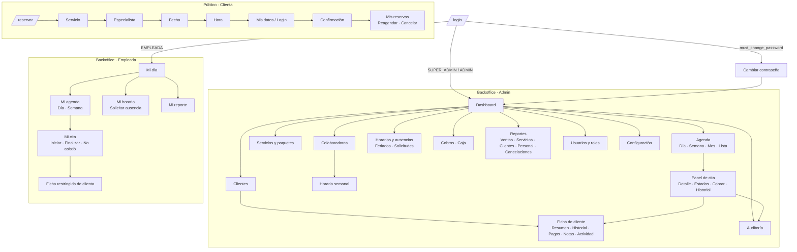

# 14–16. Flujo de navegación, wireframes, dashboard y diseño UX/UI

---

## 14. Flujo de navegación

### 14.1 Mapa de navegación por rol



### 14.2 Menú lateral (sidebar) por rol

| Ícono | Ítem | SUPER_ADMIN | ADMIN | EMPLEADA |
|---|---|:-:|:-:|:-:|
| 🏠 | Dashboard / Mi día | ✅ | ✅ | ✅ (Mi día) |
| 📅 | Agenda | ✅ | ✅ | ✅ (Mi agenda) |
| 👥 | Clientes | ✅ | ✅ | — |
| 💆 | Servicios | ✅ | ✅ | — |
| 🎁 | Paquetes | ✅ | ✅ | — |
| 👩‍⚕️ | Colaboradoras | ✅ | ✅ | — |
| 🕐 | Horarios | ✅ | ✅ | ✅ (Mi horario) |
| 💰 | Cobros | ✅ | ✅ | — |
| 📊 | Reportes | ✅ | ✅ | ✅ (Mi reporte) |
| 🛡️ | Auditoría | ✅ | ✅ | — |
| 👤 | Usuarios | ✅ | ✅ | — |
| ⚙️ | Configuración | ✅ | ✅ | — |

En **móvil**, el sidebar se reemplaza por una **barra inferior** de 4–5 ítems:
- **Admin:** Inicio · Agenda · **(+)** · Clientes · Más.
- **Empleada:** Mi día · Agenda · Horario · Perfil.

### 14.3 Principios de navegación

1. **Máximo 3 niveles** de profundidad.
2. Los detalles se abren en **paneles laterales** (*sheets*) sobre la lista o la agenda, sin perder el contexto.
3. **Búsqueda global** (`Ctrl/⌘ + K`): clientas, citas por código y acciones ("Nueva cita", "Ir a reportes").
4. **Acción primaria siempre visible:** botón "+ Nueva cita" en la topbar (escritorio) o FAB (móvil).
5. **Breadcrumbs** en pantallas de segundo nivel.
6. Estado de la URL: filtros y fecha de la agenda en query params (compartibles y recargables).

---

## 15. Wireframes en texto

### 15.1 Login

```
┌─────────────────────────────────────────────────────────────────────────┐
│                                                                         │
│   ┌───────────────────────────────┐  ┌───────────────────────────────┐  │
│   │                               │  │                               │  │
│   │   🌿 NaturalSpa               │  │   Bienvenida de nuevo         │  │
│   │                               │  │                               │  │
│   │   [ imagen ambiental spa ]    │  │   Email                       │  │
│   │                               │  │   ┌─────────────────────────┐ │  │
│   │   "Gestiona tu spa con        │  │   │ natalia@naturalspa.bo   │ │  │
│   │    calma."                    │  │   └─────────────────────────┘ │  │
│   │                               │  │   Contraseña                  │  │
│   │                               │  │   ┌─────────────────────┬───┐ │  │
│   │                               │  │   │ ••••••••••          │ 👁 │ │  │
│   │                               │  │   └─────────────────────┴───┘ │  │
│   │                               │  │   ¿Olvidaste tu contraseña?   │  │
│   │                               │  │                               │  │
│   │                               │  │   ┌─────────────────────────┐ │  │
│   │                               │  │   │      Iniciar sesión     │ │  │
│   │                               │  │   └─────────────────────────┘ │  │
│   └───────────────────────────────┘  └───────────────────────────────┘  │
│   (en móvil: solo la columna derecha con el logo arriba)                │
└─────────────────────────────────────────────────────────────────────────┘
```

### 15.2 Dashboard ejecutivo (escritorio)

```
┌──────────────┬──────────────────────────────────────────────────────────────────────────────┐
│ 🌿 NaturalSpa │  Dashboard                     🔍 Buscar (⌘K)     [+ Nueva cita]  🔔3  (N)▾ │
│              ├──────────────────────────────────────────────────────────────────────────────┤
│ ▸ Dashboard  │  Hola, Natalia 👋  Martes 14 de octubre      Periodo: [Este mes ▾] [Sede ▾]  │
│   Agenda     │                                                                              │
│   Clientes   │ ┌────────────┐┌────────────┐┌────────────┐┌────────────┐                     │
│   Servicios  │ │Ventas hoy  ││Ventas mes  ││Citas hoy   ││Ocupación   │                     │
│   Paquetes   │ │Bs 2.840    ││Bs 38.210   ││ 24         ││ 72 %       │                     │
│   Colabor.   │ │▲ 12,5 %    ││▲ 8,1 % vs  ││ 6✓ 2▶ 15◷ 1✗││▁▃▅▇ semana │                     │
│   Horarios   │ └────────────┘└────────────┘└────────────┘└────────────┘                     │
│   Cobros     │ ┌────────────┐┌────────────┐┌────────────┐                                   │
│   Reportes   │ │Cancelac.   ││No-show     ││Reservas    │                                   │
│   Auditoría  │ │ 17 · 6,2 % ││ 21 · 7,7 % ││online 96   │                                   │
│   Usuarios   │ │▼ 1,1 pp    ││▼ 3,4 pp    ││35 % ▲      │                                   │
│              │ └────────────┘└────────────┘└────────────┘                                   │
│ (sidebar     │ ┌──────────────────────────────────────────┐┌──────────────────────────────┐ │
│  oscuro      │ │ Ventas (últimos 30 días)       [Día|Sem] ││ Servicios más vendidos       │ │
│  #1F2A24)    │ │   ╭╮      ╭─╮                            ││ Masaje relajante ██████ 142  │ │
│              │ │ ╭─╯╰╮ ╭──╮╯ ╰╮  ╭╮   — actual            ││ Manicure         █████  118  │ │
│              │ │─╯   ╰─╯  ╰───╰──╯╰── ┄ anterior          ││ Pedicure         ████    96  │ │
│              │ │                                          ││ Limpieza facial  ███     71  │ │
│              │ └──────────────────────────────────────────┘│ Depilación       ██      55  │ │
│              │ ┌──────────────────────────┐┌──────────────┐└──────────────────────────────┘ │
│              │ │ Ocupación por colaborad. ││ Nuevas       │┌──────────────────────────────┐ │
│              │ │ Andrea    ████████░ 81 % ││ clientas     ││ Próximas citas hoy           │ │
│              │ │ Lucía     ██████░░░ 64 % ││  ▇           ││ 15:00 María R. · Masaje · An │ │
│              │ │ Katherine █████░░░░ 58 % ││ ▅▇ ▆  ▇      ││ 15:00 Sofía P. · Mani · Uñas1│ │
│ ───────────  │ │ Uñas 1    ███████░░ 74 % ││ S1 S2 S3 S4  ││ 15:30 Ana G. ⚠️ · Facial · Ka │ │
│ ⚙ Config.    │ │ Uñas 2    ██████░░░ 69 % ││              ││ [Ver agenda completa →]      │ │
│ (N) Natalia  │ └──────────────────────────┘└──────────────┘└──────────────────────────────┘ │
└──────────────┴──────────────────────────────────────────────────────────────────────────────┘
```

### 15.3 Dashboard (móvil, 375 px)

```
┌───────────────────────────┐
│ ☰  Dashboard      🔔  (N) │
├───────────────────────────┤
│ Hola, Natalia 👋          │
│ [Hoy] [Semana] [Mes]      │
│ ┌──────────┐┌──────────┐  │
│ │Ventas hoy││Citas hoy │  │
│ │Bs 2.840  ││ 24       │  │
│ │▲ 12 %    ││ 6✓ 15◷   │  │
│ └──────────┘└──────────┘  │
│ ┌──────────┐┌──────────┐  │
│ │Ocupación ││No-show   │  │
│ │ 72 %     ││ 7,7 %    │  │
│ └──────────┘└──────────┘  │
│  ← desliza: más KPIs →    │
│ ┌───────────────────────┐ │
│ │ Ventas 30 días        │ │
│ │ ╭─╮  ╭╮ ╭─            │ │
│ └───────────────────────┘ │
│ Próximas citas            │
│ 15:00 María R. · Andrea   │
│ 15:30 Ana G. ⚠️ · Kathe.   │
├───────────────────────────┤
│ 🏠   📅   (+)   👥   ⋯    │
└───────────────────────────┘
```

### 15.4 Agenda — vista Día (Admin, escritorio)

```
┌──────────────┬──────────────────────────────────────────────────────────────────────────────┐
│  (sidebar)   │ Agenda   ◀ Hoy ▶  Martes 14 oct 2026   [Día|Semana|Mes|Lista]  Filtros ▾  [+]│
│              ├──────┬─────────────┬─────────────┬─────────────┬─────────────┬───────────────┤
│              │      │ 🟢 Andrea    │ 🔵 Lucía     │ 🟣 Katherine │ 🟠 Uñas 1    │ 🟡 Uñas 2      │
│              │      │ 72 %        │ 60 %        │ 55 %        │ 80 %        │ 70 %          │
│              ├──────┼─────────────┼─────────────┼─────────────┼─────────────┼───────────────┤
│              │ 09:00│┌───────────┐│             │┌───────────┐│┌───────────┐│               │
│              │      ││Carla M. ✓ ││             ││Rosa T. ✓  │││Lía B. ✓💰 ││  ░░░░░░░░░░   │
│              │ 09:30││Descontrac.││             ││Limp.facial│││Manicure   ││  ░ Permiso ░  │
│              │      │└───────────┘│             ││           ││└───────────┘│  ░ 09–11   ░  │
│              │ 10:00│             │┌───────────┐│└───────────┘│┌───────────┐│  ░░░░░░░░░░   │
│              │      │             ││Paula S. 🌐││             ││Eva C. ▶   ││               │
│              │ 10:30│             ││Drenaje    ││             ││Pedicure   ││               │
│              │ ...  │             │└───────────┘│             │└───────────┘│               │
│              │ 13:00│░ Almuerzo ░ │░ Almuerzo ░ │░ Almuerzo ░ │░ Almuerzo ░ │░ Almuerzo ░   │
│              │ ...  │             │             │             │             │               │
│ ─── ahora ───│ 15:00│┌───────────┐│             │┌───────────┐│             │               │
│ (línea roja) │      ││María R. ◷ ││  [ + ]      ││Ana G. ⚠️ ◷ ││             │               │
│              │ 15:30││Masaje rel.││ (hover en   ││Limp.facial││             │               │
│              │      │└───────────┘│  hueco)     │└───────────┘│             │               │
│              ├──────┴─────────────┴─────────────┴─────────────┴─────────────┴───────────────┤
│              │ Leyenda: ◷ Confirmada  ▶ En curso  ✓ Completada  ✗ No-show  🌐 Online         │
│              │          💰 Pagada  ⚠️ Alergias  ░ No disponible                              │
└──────────────┴──────────────────────────────────────────────────────────────────────────────┘
```

### 15.5 Panel lateral de cita (Admin)

```
                                        ┌──────────────────────────────────────┐
                                        │ NS-2026-000418              [⋯] [✕] │
                                        │ ◷ CONFIRMADA   🌐 Reserva online     │
                                        ├──────────────────────────────────────┤
                                        │ 👤 María Rojas              [Ficha →]│
                                        │ 📞 +591 7••••••21 [👁 Ver] [WhatsApp]│
                                        │ ┌──────────────────────────────────┐ │
                                        │ │ ⚠️ Alergia: aceite de almendras   │ │
                                        │ └──────────────────────────────────┘ │
                                        │ 💆 Masaje relajante · 60 min         │
                                        │ 👩 Andrea                            │
                                        │ 🕒 Mar 14/10 · 15:00 – 16:00         │
                                        │ 💰 Bs 180,00 · Pendiente de pago     │
                                        │ 📝 "Primera vez" (nota de la clienta)│
                                        ├──────────────────────────────────────┤
                                        │ [▶ Iniciar] [✗ No asistió]           │
                                        │ [↔ Reagendar] [✎ Editar] [Cancelar]  │
                                        │ [💰 Cobrar Bs 180]                   │
                                        ├──────────────────────────────────────┤
                                        │ Historial                            │
                                        │ • Creada por la clienta (online)     │
                                        │   02/10 22:14                        │
                                        │ • Reagendada por Natalia             │
                                        │   05/10 09:10 · 14:00 → 15:00        │
                                        │ [Ver auditoría completa →]           │
                                        └──────────────────────────────────────┘
```

### 15.6 Nueva cita (panel lateral)

```
┌──────────────────────────────────────┐
│ Nueva cita                       [✕] │
├──────────────────────────────────────┤
│ Clienta *                            │
│ ┌──────────────────────────────┬───┐ │
│ │ 🔍 María                      │ + │ │
│ └──────────────────────────────┴───┘ │
│   María Rojas · +591 7•••21 · 14 vis.│
│   María Pérez · +591 6•••88 · nueva  │
│                                      │
│ ( Servicio ) ( Paquete )             │
│ ┌──────────────────────────────────┐ │
│ │ Masaje relajante · 60' · Bs 180 ▾│ │
│ └──────────────────────────────────┘ │
│ Colaboradora                         │
│ [Andrea ✓] [Lucía] [Cualquiera]      │
│ Fecha              Hora              │
│ [14/10/2026 📅]    [15:00 ▾]         │
│ ✅ Disponible                         │
│ Origen: (•)WhatsApp ( )Tel ( )Local  │
│ Notas internas                       │
│ [                                  ] │
├──────────────────────────────────────┤
│ Total: Bs 180,00                     │
│ [Cancelar]         [✓ Crear cita]    │
└──────────────────────────────────────┘
```

### 15.7 Mi día — Empleada (móvil)

```
┌───────────────────────────┐
│ Mi día            🔔  (A) │
├───────────────────────────┤
│ Hola, Andrea 🌿           │
│ Martes 14 oct             │
│ ┌───────────────────────┐ │
│ │ 6 citas · 5h 30m      │ │
│ │ Próxima: 15:00 (en 25')│ │
│ └───────────────────────┘ │
│                           │
│ ✓ 09:00 Carla M.          │
│   Descontracturante 60'   │
│                           │
│ ✓ 11:00 Julia F.          │
│   Drenaje linfático 60'   │
│ ─────── 13:00 Almuerzo ── │
│ ┌───────────────────────┐ │
│ │◷ 15:00 María R.   ⚠️   │ │
│ │  Masaje relajante 60' │ │
│ │  ⚠️ Alergia almendras  │ │
│ │  Prefiere presión     │ │
│ │  media, sin música    │ │
│ │ [ ▶ Iniciar ] [✗ No   │ │
│ │               asistió]│ │
│ └───────────────────────┘ │
│ ◷ 16:30 Lucía B.          │
│   Masaje relajante 60'    │
├───────────────────────────┤
│  🏠    📅    🕐    👤      │
└───────────────────────────┘
(sin teléfonos, sin montos, sin agendas ajenas)
```

### 15.8 Ficha de cliente (Admin)

```
┌──────────────┬──────────────────────────────────────────────────────────────────────┐
│  (sidebar)   │ Clientes › María Rojas                         [✎ Editar] [⋯]       │
│              ├──────────────────────────────────────────────────────────────────────┤
│              │ (MR) María Rojas   ⭐ VIP   Clienta desde mar 2023                   │
│              │ 📞 +591 7••••••21 [👁]  ✉ m••••@gmail.com [👁]  🎂 12/05             │
│              │ ┌────────────────────────────────────────────────────────────────┐   │
│              │ │ ⚠️ ALERGIAS: aceite de almendras · CONTRAINDIC.: embarazo 2º tri │   │
│              │ └────────────────────────────────────────────────────────────────┘   │
│              │ ┌─────────┐┌─────────┐┌─────────┐┌─────────┐┌─────────────────┐     │
│              │ │Visitas  ││Gasto    ││Ticket   ││No-show  ││Favorito         │     │
│              │ │ 14      ││Bs 2.310 ││Bs 165   ││ 1       ││Masaje · Andrea  │     │
│              │ └─────────┘└─────────┘└─────────┘└─────────┘└─────────────────┘     │
│              │ [Resumen] [Historial] [Pagos] [Notas] [Consentimientos] [Actividad]  │
│              │ ──────────────────────────────────────────────────────────────────── │
│              │ Preferencias: presión media, sin música, aceite neutro               │
│              │ Observaciones internas: prefiere sábados por la mañana               │
│              │                                                                      │
│              │ Próximas citas                                     [+ Nueva cita]    │
│              │ 14/10 15:00  Masaje relajante  Andrea   ◷ Confirmada   Bs 180        │
│              │ Últimas visitas                                                      │
│              │ 28/09 10:00  Drenaje linfático Lucía    ✓ Completada   Bs 200 💰      │
│              │ 14/09 15:00  Masaje relajante  Andrea   ✗ No-show      —             │
└──────────────┴──────────────────────────────────────────────────────────────────────┘
```

### 15.9 Reserva online (móvil) — pasos 1, 4 y 6

```
 Paso 1 · Servicio           Paso 4 · Hora               Paso 6 · Confirmación
┌─────────────────────────┐ ┌─────────────────────────┐ ┌─────────────────────────┐
│ 🌿 NaturalSpa           │ │ ← Masaje relajante      │ │         ✅               │
│ Reserva tu cita         │ │ ● ● ● ● ○ ○  (4 de 6)   │ │ ¡Reserva confirmada!    │
│ ● ○ ○ ○ ○ ○  (1 de 6)   │ │ Mar 14 de octubre       │ │                         │
│ 🔍 Buscar servicio      │ │ Especialista: Cualquiera│ │ NS-2026-000419          │
│ [Masajes][Facial][Uñas] │ │                         │ │ 💆 Masaje relajante     │
│ ┌─────────────────────┐ │ │ Mañana                  │ │ 👩 Andrea               │
│ │ [img] Masaje        │ │ │ [09:00][09:15][10:30]   │ │ 📅 Mar 14/10 · 10:00    │
│ │ relajante           │ │ │ [11:00][11:15]          │ │ 📍 Av. … Santa Cruz     │
│ │ 60 min · Bs 180   › │ │ │ Tarde                   │ │ 💰 Bs 180 (pago en spa) │
│ └─────────────────────┘ │ │ [14:00][15:30][16:00]   │ │                         │
│ ┌─────────────────────┐ │ │ [17:15][17:30]          │ │ [📅 Agregar a calendario]│
│ │ [img] Descontrac.   │ │ │                         │ │ [Ver mis reservas]      │
│ │ 60 min · Bs 200   › │ │ │ ⏱ Reservamos tu horario │ │                         │
│ └─────────────────────┘ │ │   por 10:00 minutos     │ │ Puedes cancelar o       │
│ ┌─────────────────────┐ │ │                         │ │ reagendar hasta 12 h    │
│ │ [img] Drenaje …   › │ │ │ [     Continuar     ]   │ │ antes.                  │
│ └─────────────────────┘ │ └─────────────────────────┘ │ [💬 WhatsApp del spa]   │
└─────────────────────────┘                             └─────────────────────────┘
```

### 15.10 Horario de colaboradora

```
┌──────────────────────────────────────────────────────────────────────────┐
│ Colaboradoras › Andrea › Horario                   Vigente desde [01/11] │
├──────────────────────────────────────────────────────────────────────────┤
│ Lun  ○ No trabaja                                                        │
│ Mar  ● [09:00]–[13:00]  [14:00]–[19:00]   [+ tramo]  [Copiar a… ▾]       │
│ Mié  ● [09:00]–[13:00]  [14:00]–[19:00]                                  │
│ Jue  ● [11:00]–[19:00]                                                   │
│ Vie  ● [09:00]–[13:00]  [14:00]–[19:00]                                  │
│ Sáb  ● [09:00]–[17:00]                                                   │
│ Dom  ○ No trabaja                                                        │
│                                                                          │
│ ⚠️ Este cambio deja fuera de horario 2 citas futuras  [Ver y resolver]   │
│                                              [Cancelar] [Guardar]        │
├──────────────────────────────────────────────────────────────────────────┤
│ Ausencias                                          [+ Nueva ausencia]    │
│ 🏖 Vacaciones   20/10 – 25/10   Aprobada                                 │
│ 🩺 Permiso      30/10 09:00–11:00  Solicitada  [Aprobar] [Rechazar]      │
└──────────────────────────────────────────────────────────────────────────┘
```

### 15.11 Auditoría

```
┌──────────────┬─────────────────────────────────────────────────────────────────────────┐
│  (sidebar)   │ Auditoría                                              [⤓ Exportar]    │
│              │ [📅 01/10–14/10] [Usuario ▾] [Módulo ▾] [Acción ▾] [🔍 NS-2026-000123] │
│              ├───────────────────┬────────────┬──────────┬────────┬───────────────────┤
│              │ Fecha y hora      │ Usuario    │ Acción   │ Módulo │ Detalle           │
│              ├───────────────────┼────────────┼──────────┼────────┼───────────────────┤
│              │ 14/10 09:12:04    │ Natalia·AD │ 🔴DELETE │ Citas  │ NS-…123 "Duplic." │
│              │ 13/10 18:40:51    │ Natalia·AD │ 🟡RESCHED│ Citas  │ 15:00 → 16:30     │
│              │ 13/10 18:02:10    │ Andrea·EM  │ 🔵STATUS │ Citas  │ CONF → COMPLETADA │
│              │ 13/10 17:55:33    │ Natalia·AD │ 🟣VIEW_S │ Client.│ Reveló tel. María │
│              │ 13/10 08:59:02    │ Lucía·EM   │ 🟢LOGIN  │ Auth   │ Chrome Android    │
│              └───────────────────┴────────────┴──────────┴────────┴───────────────────┘
│              │ ┌─────────────── Detalle ─────────────────────────────────────────────┐ │
│              │ │ RESCHEDULE · Cita NS-2026-000123 · 13/10/2026 18:40:51 (-04:00)     │ │
│              │ │ Usuario: Natalia (ADMIN) · IP 181.115.x.x · Chrome/Windows          │ │
│              │ │ Campo           Antes                   Después                     │ │
│              │ │ start_at        14/10 15:00        →    14/10 16:30                 │ │
│              │ │ staff           Andrea             →    Lucía                       │ │
│              │ │ version         3                  →    4                           │ │
│              │ │ Request ID: 01J9ZK…                                                 │ │
│              │ └─────────────────────────────────────────────────────────────────────┘ │
└──────────────┴─────────────────────────────────────────────────────────────────────────┘
```

### 15.12 Usuarios

```
┌──────────────┬─────────────────────────────────────────────────────────────────────┐
│  (sidebar)   │ Usuarios                               🔍 Buscar   [+ Nuevo usuario]│
│              │ [Todos] [Admin] [Empleadas] [Inactivos]                             │
│              ├─────────────────────┬──────────────────────┬─────────┬────────┬─────┤
│              │ Nombre              │ Email                │ Rol     │ Estado │     │
│              ├─────────────────────┼──────────────────────┼─────────┼────────┼─────┤
│              │ (SA) Super Admin    │ admin@datly.local    │ SUPER   │ 🟢     │ ⋯   │
│              │ (N) Natalia         │ natalia@…            │ ADMIN   │ 🟢     │ ⋯   │
│              │ (A) Andrea  🟢      │ andrea@…             │ EMPLEADA│ 🟢     │ ⋯   │
│              │ (L) Lucía   🔵      │ lucia@…              │ EMPLEADA│ 🟢     │ ⋯   │
│              │ (K) Katherine 🟣    │ katherine@…          │ EMPLEADA│ 🟢     │ ⋯   │
│              └─────────────────────┴──────────────────────┴─────────┴────────┴─────┘
│              │ ⋯ = Editar · Forzar cambio de contraseña · Cerrar sesiones ·         │
│              │     Desactivar · Ver actividad                                      │
└──────────────┴─────────────────────────────────────────────────────────────────────┘
```

---

## 16. Dashboard

### 16.1 KPIs: definición y fórmula

| KPI | Fórmula | Fuente | Comparación | Clic lleva a |
|---|---|---|---|---|
| **Ventas del día** | Σ `payments.amount` (COBRO − REEMBOLSO), `status = REGISTRADO`, `paid_at` = hoy (hora local) | `payments` | Mismo día de la semana anterior | Reporte de ventas (hoy) |
| **Ventas del mes** | Σ idem, del 1 del mes a hoy | `mv_daily_sales` | Mismo rango del mes anterior (MTD vs MTD) | Reporte de ventas (mes) |
| **Citas del día** | `count(appointments)` con `start_at` hoy, sin eliminadas, desglosadas por estado | `appointments` | — | Agenda de hoy |
| **Ocupación** | minutos reservados ÷ minutos disponibles × 100. *Reservados* = Σ duración de ítems en PENDIENTE, CONFIRMADA, EN_CURSO o COMPLETADA. *Disponibles* = horario laboral − ausencias − feriados | Motor de disponibilidad | Semana anterior | Reporte de personal |
| **Cancelaciones** | `count(CANCELADA)` en el periodo; % = canceladas ÷ total de citas del periodo | `appointments` | Periodo anterior (pp) | Reporte de cancelaciones |
| **No-show** | `count(NO_SHOW)`; % = NO_SHOW ÷ (COMPLETADA + NO_SHOW) | `appointments` | Periodo anterior (pp) | Reporte de no-show |
| **Reservas online** | `count(source = ONLINE)`; % sobre el total de citas creadas en el periodo | `appointments` | Periodo anterior | Reporte filtrado por origen |

> **Nota de definición:** el % de no-show se calcula sobre citas que debían ocurrir (completadas + no-show), no sobre el total incluyendo canceladas. Así se mide el ausentismo real.

### 16.2 Gráficas

| Gráfica | Tipo | Detalle | Interacción |
|---|---|---|---|
| **Ventas** | Área / línea | Serie diaria del periodo (línea continua) + periodo anterior (punteada). Toggle día/semana | Tooltip con monto y número de cobros; clic en un día → reporte de ese día |
| **Servicios más vendidos** | Barras horizontales | Top 10; toggle cantidad o ingreso | Clic → reporte de servicios filtrado |
| **Ocupación por colaboradora** | Barras horizontales con % | Color de cada colaboradora; línea de meta (75 %) | Clic → agenda de la colaboradora |
| **Nuevos clientes** | Columnas | Por semana (periodo ≤ 3 meses) o por mes; segmentado por origen (online / manual) | Clic → lista de clientas nuevas |
| *Próximas citas de hoy* | Lista | 5 próximas con estado y alerta de alergias | Clic → panel de cita |

### 16.3 Layout y comportamiento

- **Grid de 12 columnas** en escritorio: 4 KPIs × 3 col / 3 KPIs × 4 col; gráficas en 8 + 4 col.
- **Tablet:** 2 KPIs por fila. **Móvil:** 2 KPIs por fila con carrusel horizontal para el resto; gráficas a ancho completo.
- **Actualización:** KPIs del día en tiempo real (evento de cobro o cita → invalidación de caché); gráficas cada 5 min.
- **Estados:** esqueletos de carga (*skeletons*), estado vacío ("Aún no hay ventas hoy"), error con reintento.
- **Formatos:** `Bs 38.210` (separador de miles con punto, decimales con coma, según es-BO); porcentajes con 1 decimal; deltas con ▲ verde / ▼ rojo (en cancelaciones y no-show, bajar es verde).

### 16.4 Dashboard "Mi día" (Empleada)

| Bloque | Contenido |
|---|---|
| Resumen | Citas de hoy, horas agendadas, próxima cita con cuenta regresiva |
| Lista del día | Sus citas en orden con acciones de estado |
| Semana | Mini-calendario con la cantidad de citas por día |
| Mi mes | Citas atendidas y ocupación personal (sin montos, salvo que Natalia habilite comisiones en el futuro) |

### 16.5 Dashboard avanzado (Fase 3)

- Heatmap de ocupación por día de la semana × hora (detecta horas valle para promociones).
- Retención y cohortes (clientas que vuelven a los 30/60/90 días).
- Ticket promedio y servicios por visita.
- Pronóstico de demanda (media móvil / estacionalidad).
- Comparación multisede.
- Embudo de reservas online (visitas → paso 1 → … → confirmación).

---

## Diseño UX/UI

### A. Principios de UX

1. **Pocos clics:** cada tarea frecuente tiene un camino de ≤ 3–4 interacciones (crear cita, cobrar, marcar completada).
2. **Contexto sin navegar:** paneles laterales en lugar de páginas nuevas.
3. **Prevenir antes que corregir:** solo se muestran horarios válidos; los errores de disponibilidad se ven antes de guardar.
4. **Seguridad visible:** alergias en rojo; datos sensibles enmascarados con un ícono de candado.
5. **Lenguaje del negocio:** "Clienta", "Colaboradora", "Cita", "No asistió" (no "Registro", "Recurso", "Evento").
6. **Feedback inmediato:** *toasts* con "Deshacer" (5 s) en acciones reversibles como cambios de estado.
7. **Tolerancia a errores:** confirmación en acciones destructivas con el nombre concreto ("¿Cancelar la cita de María Rojas del 14/10 15:00?").
8. **Accesible:** WCAG 2.2 AA, navegación por teclado completa en la agenda, objetivos táctiles ≥ 44 px.

### B. Sistema de diseño (design tokens)

**Paleta — inspirada en naturaleza y bienestar, con estética CRM SaaS**

| Token | Hex | Uso |
|---|---|---|
| `--sidebar-bg` | `#1F2A24` | Sidebar oscuro (verde bosque casi negro) |
| `--sidebar-fg` | `#C9D6CE` | Texto del sidebar |
| `--sidebar-active` | `#2F4238` + borde `#8FB996` | Ítem activo |
| `--bg` | `#F7F8F6` | Fondo principal claro |
| `--surface` | `#FFFFFF` | Cards, paneles |
| `--border` | `#E4E8E3` | Bordes sutiles |
| `--text` | `#1B221E` | Texto principal |
| `--text-muted` | `#6B7770` | Texto secundario |
| `--primary` | `#4F7A5A` | Botones primarios, links (verde salvia profundo) |
| `--primary-hover` | `#3F6549` | |
| `--accent` | `#C9A27E` | Acento cálido (arena/terracota suave) |
| `--success` | `#2E9E6A` | Completada, deltas positivos |
| `--warning` | `#D9912B` | Pendiente, tolerancia de no-show |
| `--danger` | `#D2493F` | Cancelada, alergias, errores |
| `--info` | `#3C7DD9` | En curso, reservas online |

**Colores de colaboradoras** (agenda): 8 tonos pastel con contraste AA para el texto oscuro: `#A7D3B0`, `#A9C8EC`, `#CDB6E8`, `#F4C19C`, `#F2DD8C`, `#F3A9B8`, `#9ED8D3`, `#D6D0A8`.

**Modo oscuro:** tokens redefinidos (fondo `#121714`, superficie `#1A211D`). Opcional en F1 y completo en F2.

**Tipografía**

| Token | Valor |
|---|---|
| Familia | **Inter** (UI) · **Fraunces** o **DM Serif Display** (solo títulos de la página pública, toque "spa") |
| Escala | 12 / 14 (base) / 16 / 18 / 20 / 24 / 30 / 36 |
| KPIs | 28–32 px, peso 600, `tabular-nums` |

**Espaciado y forma**

- Base 4 px: 4, 8, 12, 16, 24, 32, 48.
- Radio: 8 px (inputs), 12 px (cards), 16 px (paneles), `full` (chips y avatares).
- Sombras: muy sutiles (`0 1px 2px rgb(0 0 0 / .05)`); elevación en hover para las tarjetas de cita.

**Componentes base (shadcn/ui):** Button, Input, Select, Combobox (buscador de clientas), DatePicker, Sheet (panel lateral), Dialog, Toast, Tabs, Badge (estados), Avatar, Card (KPI), DataTable, Command (⌘K), Tooltip, Skeleton, EmptyState, MaskedField (dato sensible con 👁), Can (permisos).

**Badges de estado de cita**

| Estado | Color | Ícono |
|---|---|---|
| PENDIENTE | warning (claro) | ⏳ |
| CONFIRMADA | primary (claro) | ◷ |
| EN_CURSO | info | ▶ |
| COMPLETADA | success | ✓ |
| CANCELADA | gris + tachado | ⊘ |
| NO_SHOW | danger | ✗ |

### C. Microinteracciones clave

- **Drag & drop en la agenda:** fantasma semitransparente; destinos válidos resaltados en verde e inválidos en rojo con tooltip del motivo; al soltar, diálogo de confirmación con "Notificar a la clienta ☑".
- **Hold de reserva:** contador circular de 10:00 visible en el paso 4–6.
- **Cambio de estado:** swipe en móvil (→ Iniciar / Finalizar) además de botones.
- **Revelar contacto:** el dato aparece 60 s con barra de progreso y se vuelve a ocultar.
- **Tiempo real:** una cita nueva o movida hace un *pulse* suave de 2 s.

### D. Contenido y microcopy (ejemplos)

| Situación | Texto |
|---|---|
| Slot ocupado | "Andrea ya tiene una cita a esa hora. ¿Te sirve 16:15 o prefieres a Lucía a las 15:00?" |
| Cancelación fuera de plazo (clienta) | "Faltan menos de 12 horas para tu cita. Para cambios, escríbenos por WhatsApp 💬" |
| Estado vacío (agenda empleada) | "No tienes citas hoy. ¡Disfruta tu día! 🌿" |
| Eliminar cita | "Esta cita quedará registrada en la auditoría. Indica el motivo:" |

---

## Estrategia mobile

### Decisión: **PWA mobile-first** (Fase 1–2) → evaluar app nativa en Fase 3

| Criterio | PWA | App nativa (React Native/Expo) |
|---|---|---|
| Costo de desarrollo | 1 código base | +40–60 % |
| Tiempo al mercado | Inmediato | +6–8 semanas |
| Distribución | Link / "Agregar a pantalla de inicio" | App Store / Play Store (revisión, cuentas) |
| Push notifications | ✅ Android · ✅ iOS 16.4+ (PWA instalada) | ✅ |
| Offline | Lectura de la agenda del día (service worker) | Completo |
| Adecuado para 6 usuarias internas + clientas ocasionales | ✅ **Suficiente** | Excesivo hoy |

### Implementación

1. **Mobile-first real:** los componentes se diseñan primero a 360–390 px; los breakpoints `sm 640`, `md 768`, `lg 1024`, `xl 1280` agregan columnas.
2. **Patrones móviles:** barra de navegación inferior; FAB "+"; paneles a pantalla completa; selects nativos para fecha y hora; teclado numérico para teléfonos (`inputmode="tel"`).
3. **Agenda móvil:** la vista por defecto es **Lista** (más legible que la grilla). Vista Día con swipe horizontal entre colaboradoras (Admin) o entre días (Empleada).
4. **PWA:** `manifest.webmanifest` (nombre, íconos 192/512, `theme_color` #1F2A24, `display: standalone`); service worker con estrategia *stale-while-revalidate* para la agenda del día y *network-only* para escrituras.
5. **Push (F2):** Web Push (VAPID) para "Nueva cita asignada" y "Cita movida" a especialistas; "Recordatorio" a clientas con la PWA instalada.
6. **Rendimiento en 4G:** JS inicial < 170 KB gzip en la página pública; imágenes AVIF/WebP responsivas; fuentes con `font-display: swap`; SSR + streaming.
7. **Seguridad móvil:** sin datos sensibles en el caché offline (el service worker excluye `/clients/*` y `/reveal-contact`); cierre de sesión remoto; bloqueo por inactividad.
8. **Pruebas:** dispositivos reales de gama media (Android 10+, 3 GB RAM) usados por el personal, más iPhone para clientas; Lighthouse ≥ 90 en Performance y Accessibility.

**Criterio para pasar a app nativa (F3):** > 40 % de las reservas vienen de clientas recurrentes que pedirían una app, necesidad de funciones nativas (Apple Pay, widgets) o decisión de comercializar el SaaS con marca propia en tiendas.
