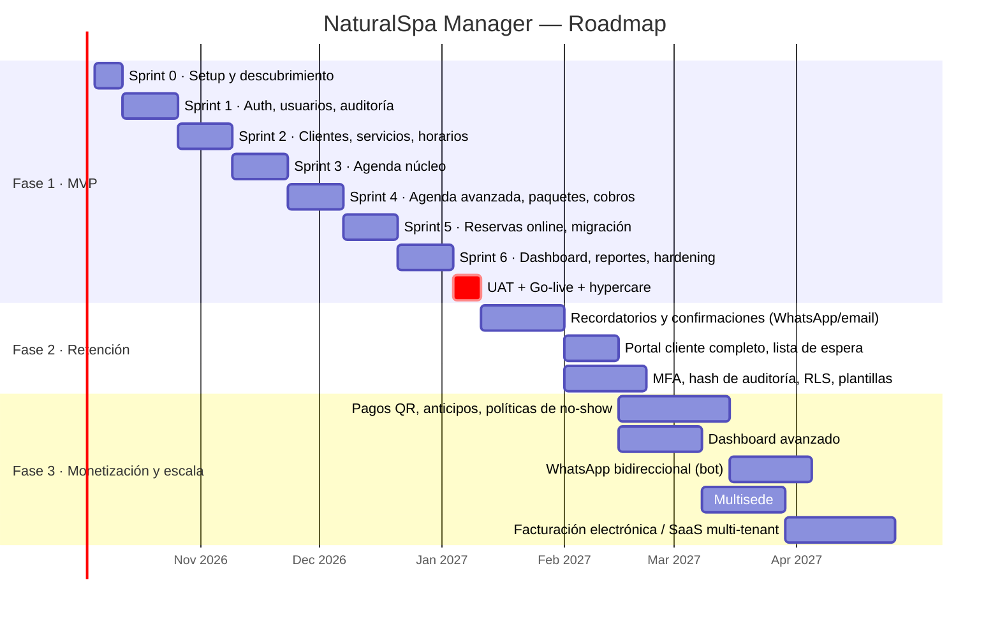

# MVP detallado · 17. Roadmap por fases · 18. Plan de desarrollo

---

## MVP detallado (Fase 1)

### Objetivo del MVP

**Reemplazar Google Sheets en el día a día de NaturalSpa**, resolviendo desde el primer día los problemas de pérdida de citas, privacidad, fuga de clientes, reservas manuales y reportes. Los recordatorios automáticos (no-show) llegan en la Fase 2.

### Alcance: qué entra

| # | Módulo | Incluye en el MVP | Deja para después |
|---|---|---|---|
| 1 | **Login y seguridad** | Login, logout, recuperar y cambiar contraseña, bloqueo por intentos, 4 roles, permisos granulares, sesiones revocables, usuario `admin@datly.local` | MFA (F2), SSO |
| 2 | **Dashboard** | 7 KPIs, 4 gráficas, filtro de periodo, "Próximas citas", "Mi día" para empleadas | Dashboard avanzado, heatmap, cohortes (F3) |
| 3 | **Usuarios** | CRUD, desactivación con revocación, forzar cambio de contraseña, perfil de colaboradora | Roles personalizados desde la UI por ADMIN (F2) |
| 4 | **Clientes** | Ficha completa, historial, alergias, preferencias, deduplicación, enmascaramiento, revelación auditada, importación CSV, fusión, exportación controlada | Etiquetas automáticas avanzadas, anonimización self-service (F2) |
| 5 | **Servicios** | CRUD, categorías, buffer, colaboradoras habilitadas, reservable online, imagen | Precio por colaboradora (F2) |
| 6 | **Paquetes** | CRUD con ítems secuenciales o paralelos, agendamiento multi-colaboradora | Bonos y sesiones prepagadas (F3) |
| 7 | **Agenda** | Día (por colaboradora), semana, mes, lista; crear, editar, reagendar (drag & drop), cancelar, estados, sobre-turno, soft delete, historial, tiempo real, anti doble reserva | Lista de espera (F2), cabinas activas (según Q1) |
| 8 | **Horarios** | Horario del negocio, horario semanal por colaboradora con vigencias, vacaciones, permisos, festivos, bloqueos, solicitudes y aprobación, resolución de citas afectadas | Turnos rotativos automáticos |
| 9 | **Reservas online** | Página pública responsive, 6 pasos, disponibilidad real, hold, registro o login, OTP por email, confirmación por email + .ics, mis reservas (reagendar y cancelar con política) | OTP por WhatsApp, anticipos (F2/F3) |
| 10 | **Cobros** | Registrar, pago dividido, descuento, anulación, cierre de caja | Pagos online, facturación (F3) |
| 11 | **Reportes** | Ventas, servicios, clientes, personal, cancelaciones y no-show; exportación XLSX/PDF; mi reporte | Envío programado (F2) |
| 12 | **Auditoría** | Registro completo e inmutable, pantalla con filtros y diff, historial por entidad | Hash encadenado y verificación (F2) |
| 13 | **Notificaciones** | Emails transaccionales, notificaciones internas | Recordatorios y WhatsApp (F2) |
| 14 | **Configuración** | Datos del negocio, políticas de reserva y cancelación, privacidad | Plantillas editables (F2) |
| 15 | **Transversal** | PWA instalable, responsive, backups, monitoreo, CI/CD, staging | — |

### Qué NO entra en el MVP (y por qué)

| Excluido | Motivo |
|---|---|
| Recordatorios automáticos por WhatsApp | Requieren verificación de Meta Business y aprobación de plantillas (2–4 semanas de trámite en paralelo). **Se inicia el trámite en el Sprint 0** para tenerlo listo en F2 |
| Pagos online y anticipos | Requieren contrato con pasarela y validación del flujo con Natalia |
| Multisede | Una sola sede hoy; el modelo de datos ya lo soporta |
| App nativa | La PWA cubre la necesidad |
| Facturación electrónica SIN | Requiere definición fiscal con el contador de Natalia |
| Comisiones | Pregunta abierta Q7 |

### Criterios de salida del MVP (Definition of Done del release)

- [ ] Todas las historias "M" de los sprints 1–6 aceptadas por el PO y validadas por Natalia en staging (UAT).
- [ ] Matriz de permisos automatizada en verde (100 % de endpoints × 4 roles).
- [ ] Test de concurrencia: 50 intentos simultáneos sobre el mismo slot → exactamente 1 cita.
- [ ] E2E Playwright de los flujos críticos en verde (escritorio + móvil).
- [ ] Pentest básico (OWASP ZAP + revisión manual de autorización) sin hallazgos altos o críticos.
- [ ] Datos migrados desde Google Sheets y verificados por muestreo con Natalia.
- [ ] Backups y restauración probados.
- [ ] Monitoreo y alertas activos.
- [ ] Capacitación realizada (Natalia 2 h, especialistas 30 min cada una).
- [ ] Contraseña del usuario de pruebas cambiada en producción (verificación automática).

---

## 17. Roadmap por fases

> Las fechas son ilustrativas (inicio supuesto: lunes 5 de octubre de 2026) y se ajustan en el kick-off.

### Fase 1 — MVP "Orden y control" (semanas 1–13)

**Resultado:** Google Sheets queda obsoleto; agenda confiable, privada y auditada; reservas online; reportes automáticos.

| Hito | Semana | Entregable |
|---|---|---|
| H0 Kick-off | 0 | Preguntas abiertas resueltas (Q1–Q12), diseño UI validado |
| H1 Base segura | 3 | Login, usuarios, roles y auditoría funcionando en staging |
| H2 Catálogo y horarios | 5 | Servicios, clientes y horarios cargados con datos reales |
| H3 Agenda usable | 7 | **Natalia empieza a usar la agenda en staging en paralelo con Sheets** |
| H4 Operación completa | 9 | Paquetes, cobros, historial |
| H5 Autoservicio | 11 | Reservas online + migración de datos |
| H6 Go-live | 13 | Producción + hypercare de 2 semanas |

### Fase 2 — "Cero ausencias" (≈ 6–8 semanas)

| Funcionalidad | Impacto esperado |
|---|---|
| Recordatorio 24 h y 2 h por WhatsApp (plantilla) con botones Confirmar / Reagendar / Cancelar; fallback a email | No-show de 10–20 % a **< 8 %** |
| Confirmación automática (estado "Confirmada por la clienta") | Natalia sabe quién viene |
| Portal cliente completo: historial, favoritos, "repetir reserva", perfil y preferencias de comunicación | Más recurrencia |
| Lista de espera con aviso automático al liberarse un horario | Recupera cancelaciones |
| OTP por WhatsApp | Menos fricción que el email |
| MFA para ADMIN, hash encadenado de auditoría, RLS en PostgreSQL | Seguridad reforzada |
| Plantillas editables, reporte semanal automático por email | Autonomía de Natalia |
| Push notifications (PWA) para especialistas | Avisos inmediatos de cambios |

### Fase 3 — "Crecer" (≈ 10–14 semanas)

| Funcionalidad | Detalle |
|---|---|
| **Pagos online** | QR interoperable (vía pasarela local o banco) y tarjeta; conciliación por webhook |
| **Anticipos** | Configurables por servicio, paquete o clienta con historial de no-show (ej. 30 % para el Día de Novia); política de devolución |
| **Dashboard avanzado** | Heatmap, cohortes, retención, pronóstico, embudo online |
| **Multisede** | Selector de sede, colaboradoras por sede, reportes consolidados y comparativos, rol RECEPCIÓN por sede |
| **WhatsApp bidireccional** | Bot: consulta de precios y horarios, reserva guiada, derivación a humano; bandeja compartida |
| **Facturación electrónica** | Integración con el sistema de facturación del SIN (vía proveedor autorizado), si Natalia lo requiere |
| **SaaS multi-tenant** | Onboarding de nuevos spas, planes, facturación de suscripción, dominio y marca por cliente |
| **Marketing** | Campañas segmentadas (cumpleaños, inactivas > 90 días), cupones, programa de fidelidad |
| **Comisiones** | Cálculo por colaboradora y servicio (si aplica) |

---

## 18. Plan de desarrollo

### 18.1 Metodología

- **Scrum** con sprints de 2 semanas; Sprint 0 de 1 semana para el setup.
- Ceremonias: planning (2 h), daily (15 min), review **con Natalia** (1 h, demo en staging), retrospectiva (1 h).
- Tablero: GitHub Projects o Jira. Flujo: *Backlog → Ready → In progress → Code review → QA → Done*.
- **Definition of Ready:** historia con criterios Gherkin, diseño (si tiene UI), permisos definidos y eventos de auditoría identificados.
- **Definition of Done (historia):** código revisado (1 aprobación), tests unitarios e integración, autorización probada por rol, auditoría verificada, responsive verificado en 375 px y 1440 px, desplegado en staging, aceptado por el PO.

### 18.2 Equipo recomendado

| Rol | Dedicación | Responsabilidades |
|---|---|---|
| Tech Lead / Arquitecto full stack | 100 % | Arquitectura, motor de disponibilidad, seguridad, code review, DevOps |
| Desarrollador/a backend | 100 % | Módulos de dominio, API, jobs, reportes |
| Desarrollador/a frontend | 100 % | Backoffice, agenda, dashboard, página de reservas, PWA |
| UX/UI Designer | 50 % (S0–S3), 25 % después | Design system, prototipos en Figma, pruebas de usabilidad con Natalia y las especialistas |
| QA | 50 % | Plan de pruebas, E2E, matriz de permisos, pruebas exploratorias |
| Product Owner | 25 % | Backlog, prioridades, relación con Natalia, UAT |

**Velocidad estimada:** ~40 puntos por sprint → 240 puntos del MVP en 6 sprints.
**Alternativa de bajo presupuesto:** 1 full stack senior + 1 full stack semi-senior + diseño freelance → **16–18 semanas**.

### 18.3 Plan por sprint

#### Sprint 0 — Setup y descubrimiento (1 semana)

| Tarea | Responsable |
|---|---|
| Taller con Natalia: resolver las preguntas Q1–Q12; relevar precios, duraciones y horarios reales | PO + UX |
| Monorepo, CI/CD, entornos local y staging, Docker Compose | Tech Lead |
| Esquema de BD inicial + migraciones + seed (roles, permisos, **admin@datly.local**) | Backend |
| Design system (tokens, componentes base) y prototipo navegable de agenda y dashboard | UX + Frontend |
| Iniciar la verificación de Meta Business / WhatsApp (para F2) y el dominio | PO |
| ADRs: monolito modular, auth propia, EXCLUDE constraint | Tech Lead |

#### Sprint 1 — Seguridad, usuarios y auditoría (HU-01…06, 70, 73–75)

- Auth completa (login, refresh rotativo, logout, recuperar y cambiar contraseña, bloqueo).
- Guards `@RequirePermission` + políticas de alcance + `<Can>` en el frontend.
- **AuditInterceptor + extensión de Prisma** (captura del antes y el después) + tabla inmutable.
- CRUD de usuarios + perfil de colaboradora.
- Layout del backoffice (sidebar oscuro, topbar, navegación móvil).
- Matriz automatizada de permisos (base).

#### Sprint 2 — Clientes, servicios y horarios (HU-30…33, 40, 41, 43, 44)

- Clientes: ficha, enmascaramiento, revelación auditada, deduplicación, serialización por rol.
- Servicios y categorías; colaboradoras habilitadas.
- Horario del negocio, horario semanal por colaboradora, ausencias, festivos y bloqueos.
- **Motor de disponibilidad v1** (servicio simple) con ≥ 40 tests unitarios de casos borde.

#### Sprint 3 — Agenda núcleo (HU-10…14, 16…18, 35)

- Vistas Día (por colaboradora) y Lista; panel de cita.
- Crear, editar, cancelar y reagendar (drag & drop) con validación en vivo.
- `EXCLUDE` constraint + manejo de 409 con sugerencias.
- Máquina de estados; acciones de la especialista; "Mi día".
- Test de concurrencia en CI.
- **Hito H3:** Natalia empieza el piloto en staging, en paralelo con Sheets.

#### Sprint 4 — Agenda avanzada, paquetes y cobros (HU-15, 19…21, 42, 45, 46, 60)

- Vistas Semana y Mes; tiempo real (WebSocket con salas por alcance).
- Paquetes con asignación multi-colaboradora (motor v2).
- Historial de la cita; soft delete y restauración.
- Solicitudes de ausencia; resolución de citas afectadas.
- Cobros (registrar, dividir, anular).
- Pantalla de auditoría con filtros y diff (HU-71, 72).

#### Sprint 5 — Reservas online y migración (HU-34, 50…55)

- Página pública SSR (6 pasos), holds en Redis, OTP por email, registro y consentimientos.
- Email de confirmación + .ics + enlace de gestión.
- Mis reservas (reagendar y cancelar con política).
- Asistente de importación CSV; **primera migración de prueba con datos reales**.
- PWA (manifest, service worker).

#### Sprint 6 — Dashboard, reportes y hardening (HU-61…65)

- Dashboard: 7 KPIs + 4 gráficas; vistas materializadas y caché.
- Reportes (5) + exportaciones XLSX/PDF auditadas; cierre de caja.
- Hardening de seguridad: cabeceras, CSP, rate limits, revisión OWASP, escaneo ZAP.
- Pruebas de carga (k6), accesibilidad (axe) y Lighthouse.
- Runbooks: despliegue, restauración de backup, incidente de seguridad.

#### Semana 13 — UAT, go-live y hypercare

| Día | Actividad |
|---|---|
| L | UAT final con Natalia (guion de 25 escenarios) |
| M | Capacitación: Natalia (2 h), especialistas (30 min c/u, en su celular, con la PWA instalada) |
| X | Migración final desde Sheets (cierre de Sheets a las 19:00; migración nocturna; verificación) |
| J | **Go-live** (martes a jueves recomendado; evitar sábado, el día de mayor carga) |
| V–… | Hypercare de 2 semanas: soporte prioritario, ajustes rápidos, métricas de adopción |

**Plan de rollback:** Sheets queda en **solo lectura** (no se elimina) durante 30 días. Si ocurre un incidente crítico, se exporta la agenda vigente del sistema a CSV y se vuelve temporalmente a Sheets.

### 18.4 Estrategia de migración de datos

| Paso | Detalle |
|---|---|
| 1. Inventario | Revisar las hojas actuales con Natalia: columnas, formatos, calidad |
| 2. Limpieza | Normalizar teléfonos (+591), detectar duplicados, separar nombre y apellido, corregir emails |
| 3. Mapeo | Hoja clientes → `clients`; agenda futura → `appointments` (solo citas futuras; las pasadas como histórico opcional, `source = MIGRACION`) |
| 4. Ensayo | Importación en staging + revisión por muestreo (50 clientas y todas las citas futuras) |
| 5. Corte | Congelar Sheets → exportar → importar → verificar conteos → habilitar el sistema |
| 6. Auditoría | Todas las filas importadas quedan con `created_by = sistema de migración` y auditoría `IMPORT` |

### 18.5 Estrategia de calidad (pirámide de pruebas)

| Nivel | Herramienta | Qué cubre | Meta |
|---|---|---|---|
| Unitarias | Vitest | Motor de disponibilidad, máquina de estados, políticas de alcance, cálculo de KPIs, enmascaramiento | ≥ 85 % en dominio |
| Integración | Supertest + Testcontainers (Postgres y Redis reales) | Endpoints, transacciones, `EXCLUDE`, triggers de auditoría, RLS | ≥ 70 % backend |
| Autorización | Matriz generada automáticamente | Cada endpoint × cada rol × propio/ajeno | 100 % |
| Concurrencia | Script paralelo en CI | Doble reserva imposible | 0 duplicados |
| E2E | Playwright (Chrome escritorio + Pixel 5 + iPhone 13 emulados) | Login, crear, reagendar y cancelar cita, reservar online, cobrar, ver auditoría | Flujos críticos |
| Accesibilidad | axe-core en E2E | WCAG AA | 0 violaciones serias |
| Rendimiento | k6 + Lighthouse CI | p95 API, LCP de la página pública | Metas de RNF-PER |
| Seguridad | OWASP ZAP (baseline), `pnpm audit` / Snyk, revisión manual | OWASP Top 10 | 0 altos o críticos |
| Usabilidad | Pruebas moderadas con Natalia y 2 especialistas (S3, S5) | Tareas clave cronometradas | Metas de RNF-USA |

### 18.6 Estimación de esfuerzo

| Bloque | Semanas-persona (aprox.) |
|---|---|
| Setup, CI/CD, infraestructura | 2 |
| Auth, IAM, auditoría | 4 |
| Clientes, servicios, paquetes | 4 |
| Horarios + motor de disponibilidad | 5 |
| Agenda (UI + backend + tiempo real) | 7 |
| Reservas online + portal | 5 |
| Cobros, dashboard, reportes | 5 |
| QA, hardening, migración, go-live | 5 |
| UX/UI (diseño) | 5 |
| **Total MVP** | **≈ 42 semanas-persona** (≈ 13 semanas calendario con el equipo de §18.2) |

### 18.7 Riesgos y mitigación

| Riesgo | Prob. | Impacto | Mitigación |
|---|---|---|---|
| Resistencia al cambio del personal | Media | Alto | Involucrar a las especialistas en las pruebas de usabilidad; la app les da privacidad (beneficio para ellas); capacitación en su propio celular |
| Datos de Sheets de mala calidad | Alta | Medio | Asistente de importación con validación y ensayo previo |
| Cambios de alcance durante el desarrollo | Media | Medio | Backlog priorizado, cambios solo entre sprints, F2/F3 como "estacionamiento" |
| Retraso en la aprobación de WhatsApp (Meta) | Media | Medio (F2) | Iniciar el trámite en S0; fallback a email |
| Complejidad de paquetes multi-colaboradora | Media | Medio | Motor v2 aislado y testeado; en el peor caso, agendamiento de paquetes asistido manualmente en el MVP |
| Conectividad del local | Baja | Alto | PWA con caché de lectura; datos móviles de respaldo |
| Dependencia de una sola persona técnica | Media | Alto | Documentación, ADRs, runbooks, code review cruzado |
| Licencia de FullCalendar Premium | Baja | Bajo | Presupuestarla o usar la alternativa con componente propio (decisión en S0) |

### 18.8 Presupuesto operativo mensual estimado (post go-live)

| Concepto | USD/mes (aprox.) |
|---|---|
| Hosting (API + worker + web) | 20–50 |
| PostgreSQL gestionado (con backups y PITR) | 15–50 |
| Redis gestionado | 0–15 |
| Email transaccional (< 3.000/mes) | 0–10 |
| Monitoreo (Sentry y uptime, capas gratuitas o básicas) | 0–30 |
| Dominio + Cloudflare | ~2 |
| WhatsApp Business API (F2) | Según conversaciones (≈ 600 recordatorios/mes con tarifa de utilidad; consultar la tarifa vigente de Meta para Bolivia) |
| **Total F1** | **≈ 40–150** |
