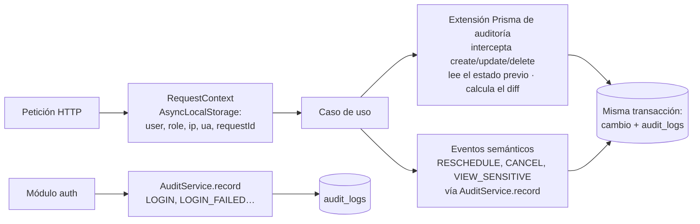

# 19. Consideraciones de seguridad · 20. Sistema de auditoría

---

## 19. Consideraciones de seguridad (estrategia de seguridad)

### 19.1 Modelo de amenazas (resumen STRIDE)

| Amenaza | Escenario en NaturalSpa | Control principal |
|---|---|---|
| **S**poofing (suplantación) | Una empleada usa la cuenta de Natalia; robo de sesión | Contraseñas fuertes + Argon2id, bloqueo por intentos, refresh rotativo con detección de reutilización, MFA para ADMIN (F2), alerta por login desde un dispositivo nuevo |
| **T**ampering (manipulación) | Alguien modifica o borra una cita y "limpia" el rastro | Soft delete, auditoría append-only protegida por triggers y privilegios de BD, hash encadenado (F2) |
| **R**epudiation (repudio) | "Yo no cancelé esa cita" | Auditoría con usuario, IP, dispositivo, request id y sesión |
| **I**nformation disclosure (fuga) | Empleada exporta o copia teléfonos; IDOR para ver citas ajenas | RBAC + alcance en consultas, serialización por rol, 404 en recursos ajenos, rate limiting, sin exportación para empleadas |
| **D**enial of service | Bots que reservan todos los horarios | Rate limiting, OTP en la primera reserva, máximo de reservas activas, WAF/CDN, holds con TTL |
| **E**levation of privilege | Una empleada se asigna el rol ADMIN manipulando la petición | Permisos resueltos en el servidor, reglas de "no auto-elevación", validación de roles asignables, pruebas de la matriz |

### 19.2 Autenticación

| Control | Implementación |
|---|---|
| Hash de contraseñas | **Argon2id** (m = 64 MB, t = 3, p = 1), *pepper* en el gestor de secretos |
| Política | ≥ 8 caracteres con mayúscula, minúscula, número y símbolo; bloqueo de contraseñas comunes o filtradas (lista local tipo HIBP *k-anonymity*); sin reutilizar las últimas 3 |
| Tokens | Access JWT de 15 min firmado con **EdDSA** (claves rotables con `kid`); refresh opaco de 256 bits, **hasheado** en la BD, rotativo, con familia y detección de reutilización |
| Cookies | `__Host-` prefix, `HttpOnly`, `Secure`, `SameSite=Strict` |
| CSRF | Cookie de refresh `SameSite=Strict` + endpoint de refresh que exige el header `X-Requested-With`; el resto de la API usa Bearer (no cookies) |
| Bloqueo | 5 fallos → 15 min; notificación al titular; auditoría |
| Recuperación | Token de un solo uso de 30 min, hasheado; respuesta uniforme (anti enumeración); revoca todas las sesiones al usarse |
| Sesiones | Lista visible por el usuario; cierre remoto; revocación inmediata al desactivar (lista de revocación en Redis consultada por el guard) |
| MFA (F2) | TOTP (Google Authenticator) obligatorio para SUPER_ADMIN y ADMIN; códigos de recuperación |
| Inactividad | Personal: 8 h (configurable); pantalla de bloqueo en PWA tras 15 min sin uso (opcional) |

### 19.3 Autorización

- Principio de **mínimo privilegio** y **denegación por defecto**: un endpoint sin `@RequirePermission` **falla el build** (regla de lint o test que recorre los metadatos de los controladores).
- Alcance aplicado **en la consulta** (no se filtra en memoria después de leer).
- IDs UUID no secuenciales, pero la seguridad **no depende** de que sean impredecibles.
- WebSocket: el servidor asigna las salas según el token; se re-autoriza en cada reconexión.
- Defensa en profundidad con RLS de PostgreSQL (F2).

### 19.4 Protección de datos

| Dato | Clasificación | Protección |
|---|---|---|
| Contraseñas, tokens, secretos MFA | Crítico | Hash (Argon2id, SHA-256) o cifrado AES-256-GCM a nivel de aplicación; nunca en logs |
| Teléfono y email de clientas | Confidencial | Acceso solo con permiso; enmascarado; revelación auditada; excluido de logs, de la caché offline y de las notificaciones al personal |
| Alergias y contraindicaciones | Sensible (salud) | Visible solo para ADMIN y la especialista asignada; auditado; cifrado de columna recomendado en F2 |
| Montos, ventas | Confidencial de negocio | Solo ADMIN o SUPER_ADMIN |
| Auditoría | Evidencia | Append-only, backups separados, retención de 5 años |

- **En tránsito:** TLS 1.2+ (preferente 1.3), HSTS con `preload`, sin contenido mixto.
- **En reposo:** cifrado del volumen de la BD y de los backups (proveedor gestionado), cifrado del object storage; exportaciones con URL firmada de 15 min y borrado a las 24 h.
- **Cifrado de columnas (F2):** `phone_e164`, `email` y `allergies` cifrados con AES-256-GCM (envelope encryption con KMS), más un *blind index* (HMAC) para búsqueda exacta y deduplicación.

> **Por qué el cifrado de columna no es la defensa principal contra la fuga interna:** una empleada que usa la aplicación ve lo que la aplicación le muestra. Lo que protege la base de clientes es **no mostrarle** los datos (autorización + serialización + ausencia de exportación). El cifrado protege ante el robo de un backup o un acceso directo a la BD.

### 19.5 Seguridad de la aplicación (OWASP Top 10)

| Riesgo OWASP | Control |
|---|---|
| A01 Broken Access Control | RBAC + alcance + tests de la matriz + 404 en recursos ajenos |
| A02 Cryptographic Failures | Argon2id, TLS, cifrado en reposo, gestión de claves en KMS |
| A03 Injection | Prisma (consultas parametrizadas); SQL crudo solo con parámetros; validación Zod en todas las entradas |
| A04 Insecure Design | Modelado de amenazas, soft delete, restricción `EXCLUDE`, holds |
| A05 Security Misconfiguration | Cabeceras (Helmet): CSP estricta con nonces, `X-Content-Type-Options`, `Referrer-Policy: strict-origin-when-cross-origin`, `Permissions-Policy`, `frame-ancestors 'none'`; Swagger deshabilitado en producción; errores sin stack traces |
| A06 Vulnerable Components | Dependabot + `pnpm audit` / Snyk en CI; actualización mensual |
| A07 Identification & Auth Failures | §19.2 |
| A08 Software & Data Integrity | Lockfile, CI con imágenes firmadas, revisión obligatoria de PR, protección de la rama `main` |
| A09 Logging & Monitoring Failures | Auditoría + logs estructurados + alertas (§19.7) |
| A10 SSRF | Sin fetch a URLs controladas por el usuario; lista blanca para webhooks salientes |

**Otros controles:** sanitización de texto enriquecido (no se usa HTML en notas; se escapa todo); límite de tamaño de peticiones (1 MB; archivos hasta 5 MB con verificación de tipo MIME real); subida de imágenes reprocesadas (se eliminan metadatos EXIF).

### 19.6 Seguridad de la infraestructura

- Base de datos en red privada, sin IP pública; acceso de administración por bastión o túnel con MFA.
- Usuarios de BD separados (`migrator`, `app`, `readonly`) con privilegios mínimos; `app` no puede `DELETE` en tablas críticas ni `UPDATE`/`DELETE` en auditoría.
- Secretos en el gestor del proveedor (AWS Secrets Manager / Doppler); rotación semestral.
- Cloudflare: WAF con reglas OWASP, protección DDoS y *bot management* en `/reservar` y `/auth`.
- Backups: diario completo + PITR de 7 días; copia semanal en otra región o cuenta; **prueba de restauración trimestral**.
- Accesos del equipo técnico a producción: nominales, con MFA, registrados y revisados trimestralmente.

### 19.7 Monitoreo y respuesta a incidentes

**Alertas automáticas (a SUPER_ADMIN y al responsable técnico):**

| Evento | Umbral |
|---|---|
| Logins fallidos | > 20 por hora en la organización |
| Revelaciones de contacto | > 50 al día por usuario |
| Consultas de fichas de clientas | > 100 por hora por usuario |
| Exportaciones | Cualquiera fuera del horario laboral |
| Reutilización de refresh token | Cualquiera |
| Errores 5xx | > 1 % en 5 min |
| Jobs en dead-letter | Cualquiera |
| Login de SUPER_ADMIN desde un país nuevo | Cualquiera |

**Plan de respuesta a incidentes (runbook):** 1) Detectar y clasificar. 2) Contener (revocar sesiones, desactivar usuario, bloquear IP). 3) Investigar con la auditoría. 4) Erradicar y recuperar. 5) Comunicar a Natalia y, si hay datos personales comprometidos, a las clientas afectadas. 6) Post-mortem sin culpables con acciones preventivas.

### 19.8 Privacidad y cumplimiento

- Política de privacidad y términos en lenguaje claro; versión registrada en `client_consents`.
- Consentimientos separados: tratamiento de datos (obligatorio para reservar) y comunicaciones de marketing (opcional).
- Derechos ARCO: acceso (exportar mis datos desde el portal, F2), rectificación (perfil), cancelación y oposición (anonimización).
- Minimización: no se piden datos innecesarios (CI o dirección no son obligatorios).
- Recomendación: cláusulas de confidencialidad en los contratos del personal y acuerdo de encargado de tratamiento entre NaturalSpa y el proveedor tecnológico.

### 19.9 Usuario de pruebas obligatorio: manejo seguro

| Entorno | Tratamiento de `admin@datly.local` / `Admin123*` |
|---|---|
| Local | Creado por seed, contraseña tal cual |
| Staging | Creado por seed, contraseña tal cual; staging protegido por Cloudflare Access (solo el equipo y Natalia) |
| Producción | Creado por seed (**requisito cumplido**), con `must_change_password = true`. El pipeline ejecuta un *smoke test* post-deploy que **falla y alerta** si `Admin123*` sigue siendo válida 24 h después del go-live. Se recomienda activar MFA en esta cuenta en F2 y usar cuentas nominales para el equipo técnico |

---

## 20. Sistema de auditoría

### 20.1 Objetivo

Responder con certeza a: **¿quién hizo qué, sobre qué, cuándo, desde dónde, y cómo estaba antes y después?** Resuelve directamente el problema P1 ("la cita desapareció").

### 20.2 Qué se registra

| Categoría | Acciones (`action`) |
|---|---|
| Datos | `CREATE`, `UPDATE`, `DELETE` (soft), `RESTORE`, `MERGE`, `ANONYMIZE`, `IMPORT` |
| Citas | `RESCHEDULE`, `STATUS_CHANGE`, `CANCEL`, `OVERBOOKING`, `REVERT_STATUS` |
| Cobros | `PAYMENT_REGISTERED`, `PAYMENT_VOIDED`, `CASH_CLOSED` |
| Acceso | `LOGIN`, `LOGIN_FAILED`, `LOGOUT`, `ACCOUNT_LOCKED`, `SESSION_REVOKED`, `SESSION_HIJACK_SUSPECTED`, `ACCESS_DENIED` (403/404 por alcance) |
| Credenciales | `PASSWORD_CHANGED`, `PASSWORD_RESET_REQUESTED`, `PASSWORD_RESET`, `FORCE_PASSWORD_RESET`, `MFA_ENABLED`, `MFA_DISABLED` |
| Permisos | `ROLE_CHANGED`, `PERMISSION_GRANTED`, `PERMISSION_REVOKED`, `USER_DEACTIVATED`, `USER_ACTIVATED` |
| Datos sensibles | `VIEW_SENSITIVE` (revelar contacto), `EXPORT`, `EXPORT_DOWNLOADED` |
| Configuración | `SETTINGS_UPDATED`, `SCHEDULE_UPDATED`, `EXCEPTION_*`, `HOLIDAY_*` |
| Sistema | `AUTO_CANCELLED` (hold o pendiente expirado), `REMINDER_SENT`, `CLIENT_CONFIRMED_VIA_WHATSAPP` (F2) |

**No se audita** la lectura rutinaria (listar agenda, abrir una cita propia); generaría ruido sin valor. **Sí** se audita la lectura de datos sensibles y los accesos denegados.

### 20.3 Estructura del registro

| Campo | Ejemplo | Requisito del cliente |
|---|---|---|
| `occurred_at` | `2026-10-13T22:40:51.123Z` (se muestra 13/10/2026 18:40:51) | **Fecha** y **hora** |
| `actor_user_id`, `actor_name`, `actor_role` | Natalia · ADMIN | **Usuario** |
| `action` | `RESCHEDULE` | **Acción** |
| `module` | `appointments` | **Módulo** |
| `entity_type`, `entity_id`, `entity_label` | Appointment · uuid · `NS-2026-000123` | Qué registro |
| `old_values` | `{"start_at":"…15:00","staff":"Andrea","version":3}` | **Valor anterior** |
| `new_values` | `{"start_at":"…16:30","staff":"Lucía","version":4}` | **Valor nuevo** |
| `changed_fields` | `["start_at","staff_id","version"]` | Resumen rápido |
| `reason` | "Clienta pidió cambio por WhatsApp" | Contexto |
| `ip`, `user_agent`, `session_id`, `request_id` | 181.115.x.x · Chrome Android | Desde dónde |

**Redacción automática:** `password_hash`, tokens, `mfa_secret_enc` y cualquier campo marcado `@sensitive` se reemplazan por `"[REDACTED]"` en `old_values` y `new_values`. El teléfono y el email de clientas se guardan **enmascarados** en el diff (el cambio queda evidenciado sin duplicar el dato en claro).

### 20.4 Cómo se captura (arquitectura)



1. **Contexto de petición:** un middleware guarda en `AsyncLocalStorage` el usuario, rol, IP, user agent, sesión y request id.
2. **Captura automática (red de seguridad):** una extensión de Prisma registra toda escritura sobre los modelos auditables, leyendo el estado anterior dentro de la **misma transacción**. Si la auditoría falla, la operación se revierte: **no existe un cambio sin su registro**.
3. **Eventos semánticos:** los casos de uso registran acciones de negocio con significado (`RESCHEDULE` en lugar de un `UPDATE` genérico) y el motivo.
4. **Actor sistema:** jobs y webhooks se registran con `actor_type = SYSTEM` y el nombre del proceso.

```ts
// Ejemplo de uso explícito dentro de un caso de uso
await this.audit.record({
  action: 'RESCHEDULE',
  module: 'appointments',
  entity: { type: 'Appointment', id: appt.id, label: appt.code },
  oldValues: { startAt: before.startAt, staffId: before.staffId },
  newValues: { startAt: after.startAt, staffId: after.staffId },
  reason: cmd.reason,
}, tx);
```

### 20.5 Inmutabilidad e integridad

| Capa | Control |
|---|---|
| Aplicación | No existen endpoints ni métodos de repositorio para modificar o borrar auditoría |
| Base de datos (privilegios) | El usuario `naturalspa_app` solo tiene `INSERT` y `SELECT` sobre `audit_logs` |
| Base de datos (triggers) | `BEFORE UPDATE OR DELETE` y `BEFORE TRUNCATE` → excepción (bloquea incluso al dueño de la tabla, salvo que deshabilite triggers, algo que solo puede hacer `migrator` y que queda registrado en los logs de PostgreSQL) |
| Integridad criptográfica (F2) | **Hash encadenado:** `hash = SHA-256(prev_hash ‖ canonical_json(registro))`. Lo calcula un worker de "sellado" en orden de `id`, cada minuto. Endpoint `/audit-logs/verify` que recalcula la cadena y detecta cualquier alteración o hueco |
| Anclaje externo (F2, opcional) | Cada día se publica el hash del último registro en un almacenamiento WORM (S3 Object Lock) |
| Backups | Retención separada para la auditoría |

### 20.6 Consulta

- Pantalla `/app/auditoria` (ver wireframe §15.11): filtros por fecha, usuario, módulo, acción, entidad y texto; paginación por cursor; detalle con diff visual.
- Historial contextual: botón "Historial" en cita, clienta, usuario y servicio → `GET /audit-logs/entity/{type}/{id}`.
- Línea de tiempo legible en la cita:
  - *Creada por María (clienta) · Reserva online · 02/10 22:14*
  - *Reagendada por Natalia · 05/10 09:10 · 14:00 → 15:00*
  - *Cancelada por Natalia · 13/10 18:40 · "Clienta enferma"*
- Consultas SQL de soporte (runbook):

```sql
-- ¿Quién eliminó o canceló la cita NS-2026-000123?
SELECT occurred_at AT TIME ZONE 'America/La_Paz' AS fecha_local,
       actor_name, actor_role, action, reason, old_values, new_values, ip
FROM audit_logs
WHERE entity_type = 'Appointment' AND entity_label = 'NS-2026-000123'
ORDER BY occurred_at;

-- Todo lo que hizo un usuario en un rango
SELECT occurred_at, action, module, entity_label, changed_fields
FROM audit_logs
WHERE actor_user_id = :userId AND occurred_at BETWEEN :from AND :to
ORDER BY occurred_at DESC;
```

### 20.7 Rendimiento y retención

- Volumen estimado: ~200–300 registros por día → ~100.000 por año; carga trivial.
- Particionado mensual; índices por entidad, actor y módulo. Consultas típicas < 100 ms.
- Retención en caliente de 5 años (configurable); después se desprenden las particiones, se exportan a Parquet en almacenamiento frío y se conserva su hash.
- Escritura síncrona dentro de la transacción (consistencia fuerte). Si en el futuro el volumen lo exige, se pasa a outbox + worker, manteniendo la garantía.

### 20.8 Cómo este diseño resuelve "la cita desaparecida"

| Antes (Sheets) | Ahora |
|---|---|
| La fila se borraba y no había rastro | La cita **no se puede borrar físicamente**: solo cancelar o eliminar lógicamente, con motivo obligatorio |
| Cualquiera podía editar | Solo ADMIN crea, mueve o cancela; las empleadas solo cambian el estado de **sus** citas |
| No se sabía quién ni cuándo | Cada acción registra usuario, rol, fecha, hora, IP, dispositivo, antes y después |
| El historial de versiones de Sheets era difícil de leer | Línea de tiempo en lenguaje natural dentro de la cita y buscador de auditoría |
| El registro podía alterarse | Registro inmutable (privilegios + triggers + hash encadenado) |
